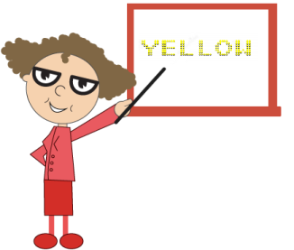

# Character Settings in JavaScript DigitalGauge

## Appearance

You can customize the character using [`character settings`](../api/ejdigitalgauge#members:items-charactersettings)The opacity of the character is adjustable with the help of [`opacity`](../api/ejdigitalgauge#members:items-charactersettings-opacity) property. The space between two characters are adjusted with [`spacing`](../api/ejdigitalgauge#members:items-charactersettings-spacing) property as like in the segment settings.






  $(function () {
        // For Digital Gauge rendering
        $("#DigitalGauge1").ejDigitalGauge({
            width: 800,
            items: [{
                // For setting text
                value: " Syncfusion ",
                characterSettings: {
                    // For setting character opacity
                    opacity: 0.3,
                    // For setting character spacing
                    spacing: 3
                }
            }]
        })
    });



Execute the above code examples to render the **Digital****Gauge** as follows.

## Count and Type

The number of text to be displayed can be limited by the attribute called [`count`](../api/ejdigitalgauge#members:items-charactersettings-count). In **Digital Gauge** five different [`types`](../api/ejdigitalgauge#members:items-charactersettings-types) of characters are supported. They are as follows, 

  * EightCrossEightDotMatrix

  * SevenSegment

  * FourteenSegment

  * SixteenSegment 

  * EightCrossEightSquareMatrix.







  $(function () {
        // For Digital Gauge rendering
        $("#DigitalGauge1").ejDigitalGauge({
            width: 800,
            items: [{
                // For setting text
                value: "1234567890",
                segmentSettings: {
                    // For setting segment length
                    length: 8,
                    // For setting segment width
                    width: 1
                },
                characterSettings: {
                    // For setting character count
                    count: 10,
                    // For setting segment spacing
                    spacing: 10,

                    // For setting character type
                    type: "sevensegment",
                }
            }]
        })
    });



Execute the above code examples to render the **Digital****Gauge** as follows.

## Text Positioning

The text in the **Digital****Gauge** is positioned with [`position`](../api/ejdigitalgauge#members:items-position) object. This object contains two attributes such as [`x`](../api/ejdigitalgauge#members:items-position-x) and [`y`](../api/ejdigitalgauge#members:items-position-y). The [`x`](../api/ejdigitalgauge#members:items-position-x) variable positions the text in the horizontal axis and the [`y`](../api/ejdigitalgauge#members:items-position-y) variable positions the text in the vertical axis.







  $(function () {
        // For Digital Gauge rendering
        $("#DigitalGauge1").ejDigitalGauge({
            width: 800,
            height:300,
            frame: {
                backgroundImageUrl: "Board1.jpg"
            },
            items:[{
                // For setting text
                value: "YELLOW",
                // For setting segment color
                segmentSettings: { color: "Yellow" },
                position:{
                    // For setting segment x location
                    x:80,
                    // For setting segment y location
                    y:10
                }
            }]
        });
    });



Execute the above code examples to render the **Digital****Gauge** as follows.

## Shadow Effects

You can add the shadow effects for text using following properties.

* You can enable/disable the blurring effect for the shadows of the text using [`shadow blur`](../api/ejdigitalgauge#members:items-shadowblur) property.

* You can specify the color of the text shadow using [`shadow color`](../api/ejdigitalgauge#members:items-shadowcolor) property.

* You can set the [`x-offset`](../api/ejdigitalgauge#members:items-shadowoffsetx) value for the shadow of the text, indicating the location where it needs to be displayed.

* You can set the [`y-offset`](../api/ejdigitalgauge#members:items-shadowoffsety) value for the shadow of the text, indicating the location where it needs to be displayed.







 $(function () {
        // For Digital Gauge rendering
        $("#DigitalGauge1").ejDigitalGauge({
            width: 800,
            items: [{
                //For setting Text
                value: "WELCOME",
                //For setting segment length and width
                segmentSettings: {
                    length: 3,
                    width: 3
                },
                //For setting shadow color
                shadowColor: "yellow",
                //For setting shadow Blur
                shadowBlur: 20,
                //For setting horizontal offset
                shadowOffsetX: 15,
                //For setting vertical offset
                shadowOffsetY: 15,
            }]
        });
    });



Execute the above code examples to render the **Digital****Gauge** as follows.

## Font Customization

You can customize the [`font`](../api/ejdigitalgauge#members:items-font) of the text as per your requirement. To customize the font, you have to set [`enableCustomFont`](../api/ejdigitalgauge#members:enablecustomfont). Following font customization options are available.

* [`Font-family`](../api/ejdigitalgauge#members:items-font-fontfamily)- used to set the font-family of the text.

* [`Font-style`](../api/ejdigitalgauge#members:items-font-fontstyle)- used to set the font-style of the text.

* [`Font-size`](../api/ejdigitalgauge#members:items-font-size)- used to set the font-size of the text.



 
 


