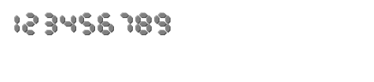
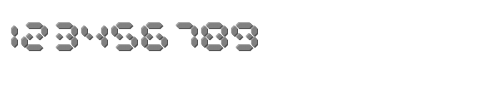
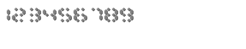
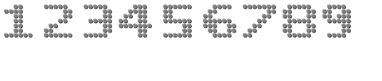
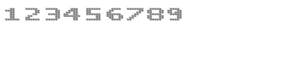

# JavaScript DigitalGauge Overview

Digital Gauge for Essential Studio encompasses the visualization of the segmented display of both the 7-segment numeric values and the 14-segment alphanumeric characters. It can display the following five kinds of character types:

* Seven Segment

* Fourteen Segment

* Sixteen Segment

* EightCrossEightDotMatrix

* EightCrossEightSquareMatrix

There are several other properties available in Digital Gauge which enable you to perform various customizations such as changing the space between the characters, segment width, segment length, spacing between the segments, and other customizations.

 **Key Features**

* **Character Types** – Provide support for five different character types.

* **Background Image** - Provide support to add images as the background for the Digital Gauge.

* **Custom Font** - Provide support to enable the custom font for text within the Digital Gauge.

