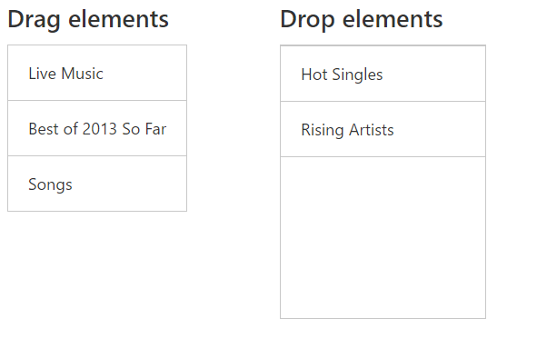

# Drag and Drop List elements:

You can drag an element from list view and drop this into another element. The below code illustrates how to drag element from list view 



	    
<h4>Drag  elements</h4>
    	     

                  <ul id="draggable">
	                  <li data-ej-text="Hot Singles" class="drag"></li>
                      <li data-ej-text="Rising Artists" class="drag"></li>
                      <li data-ej-text="Live Music" class="drag"></li>
                      <li data-ej-text="Best of 2013 So Far" class="drag"></li>
	                  <li data-ej-text="Songs" class="drag"></li>
                </ul>
             

          

	
<h4>Drop elements</h4>
		

	 

    
    




	 



	
     $(function () {
          $("#defaultlistbox").ejListView();
	      $(".drag").ejDraggable({helper: function (event) {
                    return $(event.element); // Object of the Draggable element.	
                }
            });
			
	      $("#listitem").ejDroppable({
              drop: function (event, ui) {
                event.dropTarget.append(event.dragElement);
                event.dropTarget.ejListView();
                $("#listitem").find("li").attr("style","position:relative;left:0px;top:0px;list-style-type:none");
                $("#listitem").find("li").removeClass("e-state-active").addClass("e-state-default");
                }
            });
        });



Before Drag:

After Drag:

