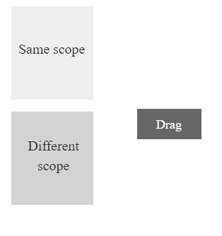
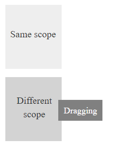
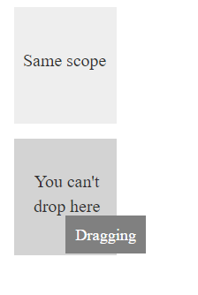
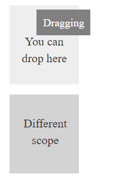

# Functionalities

## Delay Drag

You can set the required distance the mouse should travel in order to initiate a drag using [distance](https://help.syncfusion.com/api/js/ejdraggable#members:distance) property.



    

       
Drag

    

     
 




    $(function () {
	   $("#draggable-item").ejDraggable({
	       distance:5,
	        helper: function (event) {
	           return $(event.element);
               }
			});
         }); 



## Cursor Distance

You can set the offset for dragging helper with respect to the mouse cursor using [cursorAt](https://help.syncfusion.com/api/js/ejdraggable#members:cursorat) property.



    

        <!-- draggable element-->
        

            Drag Me
        

    

    

        <!-- droppable target element-->
        

            Drop Here
        

    

     




         jQuery(function ($){
            $("#dragElement").ejDraggable({
                helper: function (event) {
                    return $(event.element); // Object of the Draggable element.
                },
	            cursorAt:{ top: 0, left: 0 },
			
            });

            $("#dropContainer").ejDroppable({
                // Drop event for change the container text while dropping element.
                drop: function (event, ui) {
                    event.dropTarget.text("Element Dropped..!");
                }
				
            });
        });

 


## Drag On Tap Hold 

In order to drag an element during tapHold in mobile devices set the dragOnTaphold to true 



         jQuery(function ($){
            $("#dragElement").ejDraggable({
                helper: function (event) {
                    return $(event.element); // Object of the Draggable element.
                },
	            dragOnTaphold:true
			
            });

        });



## Restrict Drop

You can group draggable and droppable elements using [scope](https://help.syncfusion.com/api/js/ejdraggable#members:scope) property. You can define a scope value for both drag and drop elements and the elements will be dragged and dropped based on that.The draggable element with a different scope value will not be accepted by the droppable element

The below code illustrates how to use scope for grouping elements



     

        
Same scope

        
Different scope

        
Drag

    

    




      $("#draggable").ejDraggable({
        helper: function (event) {
            return $(event.element);
        },
        drag: function (event) {
            event.target.textContent = "Dragging";
            $(".text3").css("margin-left", "7px");
            $("#draggable").css("background", "grey");
        },
        scope: "scope1"
    });

    $(".scope1").ejDroppable({
        scope: "scope1",
        over: function (event, ui) {
            $(".text1")[0].innerText = "You can drop here"
        },
        drop: function (event, ui) {
            event.dropTarget.text("");
            $(".text3")[0].innerText = "Dropped!"
            $("#draggable").css("color", "white");
            $("#draggable").css("background", "#666");
        }
    });

    $(".scope2").ejDroppable({
        over: function (event, ui) {
            $(".text2")[0].innerText = "You can't drop here"
        }
    });		  


Before Drag:

During Drag:

When Drag element is over the non-scope element

When Drag element is over the scope element

After Drop:

