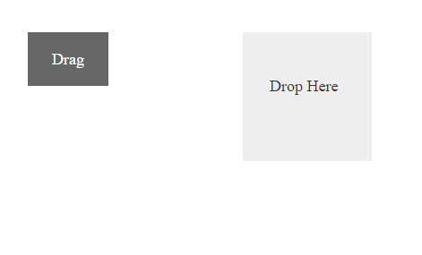
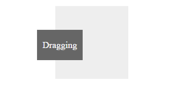

# Getting Started with Javascript Draggable and Droppable

The external script dependencies of the Drag and Drop are,

* [jQuery 1.7.1](http://jquery.com/) and later versions.

And the internal script dependencies of the Drag and Drop are:

<table>
	<tr>
		<th>File </th>
		<th>Description / Usage </th>
	</tr>
	<tr>
		<td>ej.core.min.js</td>
		<td>Must be referred always before using all the JS controls.</td>
	</tr>
	<tr>
		<td>ej.draggable.min.js</td>
		<td>Main file for Drag and Drop</td>
	</tr>
</table>

For getting started you can use the ‘ej.web.all.min.js’ file, which encapsulates all the 'ej' controls and frameworks in one single file.  

For themes, you can use the ‘ej.web.all.min.css’ CDN link from the snippet given. To add the themes in your application, please refer [this link](https://help.syncfusion.com/js/theming-in-essential-javascript-components#adding-specific-theme-to-your-application).

## Configure the sample

Create a new HTML file and add [CDN](https://help.syncfusion.com/js/cdn) links to the [JavaScript](https://help.syncfusion.com/js/dependencies) and [CSS](https://help.syncfusion.com/js/theming-in-essential-javascript-components) dependencies to your project.



    <!DOCTYPE html>

    <html>

    <head>

        <meta name="viewport" content="width=device-width, initial-scale=1.0" charset="utf-8" />

        <!-- style sheet for default theme(flat azure) -->

        <link href="http://cdn.syncfusion.com/{{ site.releaseversion }}/js/web/flat-azure/ej.web.all.min.css"
              rel="stylesheet" />

        <!--scripts-->

        

        

    </head>

    <body>

        <!--Place div element to perform Drag and Drop-->

        

    </body>

    </html>



N>  In production, we highly recommend you to use our [custom script generator](https://help.syncfusion.com/js/custom-script-generator#) to create custom script file with required controls and its dependencies only. Also to reduce the file size further please use [GZip compression](https://developers.google.com/web/fundamentals/performance/optimizing-content-efficiency/optimize-encoding-and-transfer?hl=en#text-compression-with-gzip) in your server. 

## Initialize Drag And Drop

You can make any Html elements to be draggable or droppable by using ejDraggable and ejDroppable.This section explains how to perform drag using [drag](https://help.syncfusion.com/api/js/ejdraggable#events:drag) event and drop using [drop](https://help.syncfusion.com/api/js/ejdroppable#events:drop) by using html elements

 
	
	 

        <!-- draggable element-->
        

            Drag
        

		
    

    

        <!-- droppable target element-->
        

            Drop Here
        

    

    
		

	
	
	
           jQuery(function ($){
            $("#dragElement").ejDraggable({
                helper: function (event) {
                    return $(event.element); // Object of the Draggable element.
                },
                drag:function(event)
				{
                event.target.textContent="Dragging";
				}
            });

            $("#dropContainer").ejDroppable({
                // Drop event for change the container text while dropping element.
                drop: function (event, ui) {
                    event.dropTarget.text("Dropped..!");
                }
            });
         });	
			


Output of the above code will be as shown below:

Before Dragging:

During Drag:

After Dragging:

## Helper

Helper will return the object of corresponding draggable element. You can drag the element by using [helper](https://help.syncfusion.com/api/js/ejdraggable#events:helper) event. 

	

      $("#draggable-item").ejDraggable({
	      helper:function (event) {
	           return $(event.element);
                   },
	      clone:true
	     });



## Set Boundaries 

You can restrict the movement of draggable element within a specified area using [dragArea](https://help.syncfusion.com/api/js/ejdraggable#members:dragarea) property. 

The below code explains how to make the movement constrained to the container boundaries. 
	


    

    
Drag

    

    


	
	
	
    $(function () {
	   $("#draggable-item").ejDraggable({
	   dragArea:"#draggable-container",
	   helper:function (event) {
	         return $(event.element);
            }
			});
    }); 



The drag element cannot be moved outside this boundary.

