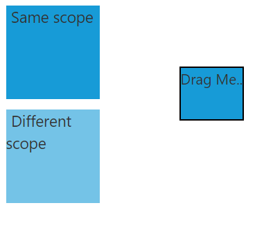
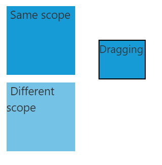
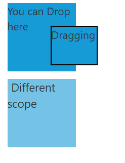

# Grouping Drag and Drop Elements

You can group draggable and droppable elements using [scope](https://help.syncfusion.com/api/js/ejdraggable#members:scope) property. You can define a scope value for both drag and drop elements and the elements will be dragged and dropped based on that.The draggable element with a different scope value will not be accepted by the droppable element

The below code illustrates how to use scope for grouping elements



    

        
Same scope

        
Different scope

        
Drag Me..

    

    





     $("#draggable").ejDraggable({
           helper: function(event) {
	            return $(event.element);
              },
	         drag:function(event)
	        {
	         event.target.textContent="Dragging";
	         },
	     scope: "scope1"
        });

      $(".scope1").ejDroppable({
              scope: "scope1",
	         over:function(event,ui)
	             {
	                  event.target.textContent="You can Drop here";
	             },
             drop: function (event, ui) {
              event.dropTarget.text("Same scope");
		      event.dragElement.text("Greatjob..");
            }
       });

          $(".scope2").ejDroppable();
		  


Before Drag:

During Drag:

When Drag element is over the drop element

After Drop:

