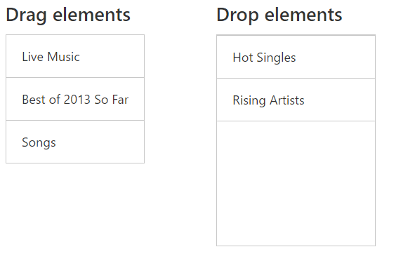

# How To

## Move Between Lists

You can drag an element from list view and drop this into another element. The below code illustrates how to drag element from list view 



	   

        

            

                

                    

                        <h4>Drag elements</h4>
                        

                            <ul id="draggable">
                                <li data-ej-text="Hot Singles" class="drag"></li>
                                <li data-ej-text="Rising Artists" class="drag"></li>
                                <li data-ej-text="Live Music" class="drag"></li>
                                <li data-ej-text="Best of 2013 So Far" class="drag"></li>
                                <li data-ej-text="Songs" class="drag"></li>
                            </ul>
                        

                    

                    

                        <h4>Drop elements</h4>
                        

                    

                

            

        

    

    
    




	 



	
       $(function () {
            var cloneElement;
            $("#defaultListBox").ejListView();
            $(".drag").ejDraggable({
                helper: function (event) {
                    proxy = $(event.element).closest('.e-lv.e-js').data('ejListView');
                    cloneElement = $(event.element);
                    cloneElement.addClass("clone");
                    return _clonedElement.appendTo($("body"));

                },

            });

            $("#listItem").ejDroppable({
                drop: function (event, ui) {
                    if (event.target.id == "listItem") {
                        event.dropTarget.append(event.dragElement);
                        event.dropTarget.ejListView();
                    }
                    else
                        ui.draggable[0].remove();
                    $("#listItem").find("li").attr("style", "position:relative;left:0px;top:0px;list-style-type:none");
                    $("#listItem").find("li").removeClass("e-state-active").addClass("e-state-default");
                    if ($('.e-list-container').find('ul li').length == 0) $('.e-list-container').css('border-top', '0px')
                }
            });

        });

        });



Before Drag:

After Drag:

## Get Drag Element

You can get the dragged element from the args of [drag](https://help.syncfusion.com/api/js/ejdraggable#events:drag) event. The below code explains how to get the draggable element using drag event.



    

      
Drag

    

    
     



	$(function () {
	   $("#draggable-item").ejDraggable({
	      dragArea:"#draggable-container",
	      helper:function (event) {
	         return $(event.element);
            },
	     drag:function(args)
	      {
	       console.log(args.element);
	      }
	   });
    }); 



## Order of Events 

The events will be triggered in the following order during Drag and Drop

* [DragStart](https://help.syncfusion.com/api/js/ejdraggable#events:dragstart) -Fires when Draggable action starts.

* **Drag** - Fires when the element is being dragged.

* [DragStop](https://help.syncfusion.com/api/js/ejdraggable#events:dragstop) -Fires when the Draggable action stops.

* **Over** -Fires when the element is Dragged over the Droppable element

* **Drop** -Fires when the element is dropped.

* **Out**- Fires when Drag element is moved out of Droppable target



    

        <!-- draggable element-->
        

            Drag
        

		
    

    

        <!-- droppable target element-->
        

            Drop Here
        

    



   

    





     jQuery(function ($) {
            $("#dragElement").ejDraggable({
                helper: function (event) {
                    return $(event.element); // Object of the Draggable element.
                },
                dragStart: function (event) {
                    console.log("DragStart event is fired");
                },
                drag: function (event) {
                    console.log("Drag event is fired");
                },
                dragStop: function (event) {
                    console.log("DragStop event is fired");
                }
            });

            $("#dropContainer").ejDroppable({
                drop: function (event, ui) {
                    event.dropTarget.text("");
                    event.dragElement.text("Dropped..!");
                    console.log("Drop event is fired");

                },
                out: function (event) {
                    console.log("Out event is fired");
                },
                over: function (event) {
                    console.log("Over event is fired");
                }

            });
        });



The output of above code will be as shown below:

