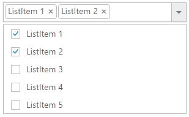

# Checkbox

DropDownList displays checkboxes to the left of each item when you set [showCheckbox](https://help.syncfusion.com/api/js/ejdropdownlist#members:showcheckbox) property to true. It allows you to select more than one item at a time from DropDownList. Popup list stays open until the user finishes selection. When you click on an item’s text or checkbox then the checkbox checked status get change.



     <input type="text" id="dropdown1" />
     




    $(function() {
        var items = [{
            text: "ListItem 1",
            value: "item1"
        }, {
            text: "ListItem 2",
            value: "item2"
        }, {
            text: "ListItem 3",
            value: "item3"
        }, {
            text: "ListItem 4",
            value: "item4"
        }, {
            text: "ListItem 5",
            value: "item5"
        }];
        $('#dropdown1').ejDropDownList({
            dataSource: items,
            fields: {
                text: "text",
                value: "value"
            },
            showCheckbox: true
        });
    });



N> if you want to showcase the DropDownList with default checked items on data binding, specify selected field with Boolean values.



     <input type="text" id="dropdown1" />
     



	
    $(function() {
        var items = [{
            text: "ListItem 1",
            value: "item1",
            selected: true
        }, {
            text: "ListItem 2",
            value: "item2",
            selected: false
        }, {
            text: "ListItem 3",
            value: "item3",
            selected: true
        }, {
            text: "ListItem 4",
            value: "item4",
            selected: false
        }, {
            text: "ListItem 5",
            value: "item5",
            selected: false
        }];
        $('#dropdown1').ejDropDownList({
            width: 300,
            dataSource: items,
            fields: {
                text: "text",
                value: "value",
                selected: "selected"
            },
            showCheckbox: true
        });
    });



## Selection Modes

The [multiSelectMode](https://help.syncfusion.com/api/js/ejdropdownlist#members:multiselectmode) property enables you to make multiple selections in the following two ways:

* Delimiter 
* Visual Mode

I> “multiSelectMode” property accepts both the **string** and **ej.MultiSelectMode** enum value.

### Delimiter

Each checked item’s text is appended to the textbox with delimiter “,” by default. This is enabled by assigning **“delimiter”** (string) or **ej.MultiSelectMode.Delimiter** (enum) value to multiSelectMode property. You can customize the delimiter option by using [delimiterChar](https://help.syncfusion.com/api/js/ejdropdownlist#members:delimiterchar) property.



     <input type="text" id="dropdown1" />
     



	
    $(function() {
        var items = [{
            text: "ListItem 1",
            value: "item1"
        }, {
            text: "ListItem 2",
            value: "item2"
        }, {
            text: "ListItem 3",
            value: "item3"
        }, {
            text: "ListItem 4",
            value: "item4"
        }, {
            text: "ListItem 5",
            value: "item5"
        }];
        $('#dropdown1').ejDropDownList({
            width: 300,
            dataSource: items,
            fields: {
                text: "text",
                value: "value"
            },
            showCheckbox: true,
            multiSelectMode: ej.MultiSelectMode.Delimiter,
            delimiterChar: "-"
        });
    });
	



### Visual Mode

When you enable this option in DropDownList widget, each checked item’s text is appended to the text box in a box model layout. This is enabled by assigning **“visualmode”** (string) or **ej.MultiSelectMode.VisualMode** (enum) value to multiSelectMode property.



     <input type="text" id="dropdown1" />
     



   
	$(function() { 
            var items = [{
                text: "ListItem 1",
                value: "item1"
            }, {
                text: "ListItem 2",
                value: "item2"
            }, {
                text: "ListItem 3",
                value: "item3"
            }, {
                text: "ListItem 4",
                value: "item4"
            }, {
                text: "ListItem 5",
                value: "item5"
            }];
        $('#dropdown1').ejDropDownList({
            width: 300,
            dataSource: items,
            fields: {
                text: "text",
                value: "value"
            },
            showCheckbox: true,
            multiSelectMode: ej.MultiSelectMode.VisualMode
        });
    });



## Check/Uncheck All

You can check/uncheck all the list items at run time by using [checkAll](https://help.syncfusion.com/api/js/ejdropdownlist#methods:checkall) and [uncheckAll](https://help.syncfusion.com/api/js/ejdropdownlist#methods:uncheckall) method. By default no item will be in checked state. 



     <input type="text" id="dropdown1" />
     



  
        var target;
        
		$(function() { 
            var items = [{
                text: "ListItem 1",
                value: "item1"
            }, {
                text: "ListItem 2",
                value: "item2"
            }, {
                text: "ListItem 3",
                value: "item3"
            }, {
                text: "ListItem 4",
                value: "item4"
            }, {
                text: "ListItem 5",
                value: "item5"
            }];
        $('#dropdown1').ejDropDownList({
            dataSource: items,
            fields: {
                text: "text",
                value: "value"
            },
            showCheckbox: true
        });
        
        target = $('#dropdown1').data("ejDropDownList");
        
        $("#toggle").ejToggleButton({
            "change": "onCheckUncheckAll",
            "defaultText": "Check All",
            "activeText": "Uncheck All"
        });
    });

    function onCheckUncheckAll(args) {
        if (args.isChecked) target.checkAll();
        else target.unCheckAll();
    }

