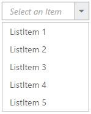
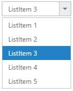
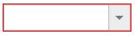

# Customization

## Adding watermark text

It provides the short description of the expected value in dropdown and will display the text until any item is selected. You can set this text using [watermarkText](https://help.syncfusion.com/api/js/ejdropdownlist#members:watermarktext) property.



     <input type="text" id="dropdown1" />
     



	
    $(function() {
        var items = [{
            text: "ListItem 1",
            value: "item1"
        }, {
            text: "ListItem 2",
            value: "item2"
        }, {
            text: "ListItem 3",
            value: "item3"
        }, {
            text: "ListItem 4",
            value: "item4"
        }, {
            text: "ListItem 5",
            value: "item5"
        }];
        $('#dropdown1').ejDropDownList({
            dataSource: items,
            fields: {
                text: "text",
                value: "value"
            },
            watermarkText: "Select an Item"
        });
    });



## Applying Rounded Corner

You can use [showRoundedCorner](https://help.syncfusion.com/api/js/ejdropdownlist#members:showroundedcorner) property to add rounded borders to the input and popup elements. By default, rounded corner property is disabled in DropDownList.



     <input type="text" id="dropdown1" />
     



  
    $(function() {
        var items = [{
            text: "ListItem 1",
            value: "item1"
        }, {
            text: "ListItem 2",
            value: "item2"
        }, {
            text: "ListItem 3",
            value: "item3"
        }, {
            text: "ListItem 4",
            value: "item4"
        }, {
            text: "ListItem 5",
            value: "item5"
        }];
        $('#dropdown1').ejDropDownList({
            dataSource: items,
            fields: {
                text: "text",
                value: "value"
            },
            showRoundedCorner: true
        });
    });



I> The browser support details for rounded corner is given [here](http://www.w3schools.com/cssref/css3_pr_border-radius.asp).

## Enable/Disable the widget

The [enabled](https://help.syncfusion.com/api/js/ejdropdownlist#members:enabled) property is used to indicate whether the widget can respond to the user interaction or not. You can disable it by assigning false to this property. When the widget is disabled state, you cannot interact with the control.

N> you can also use [enable()](https://help.syncfusion.com/api/js/ejdropdownlist#methods:enable)  or [disable()](https://help.syncfusion.com/api/js/ejdropdownlist#methods:disable)  public methods.



     <input type="text" id="dropdown1" />
     




    $(function() {
        var items = [{
            text: "ListItem 1",
            value: "item1"
        }, {
            text: "ListItem 2",
            value: "item2"
        }, {
            text: "ListItem 3",
            value: "item3"
        }, {
            text: "ListItem 4",
            value: "item4"
        }, {
            text: "ListItem 5",
            value: "item5"
        }];
        $('#dropdown1').ejDropDownList({
            dataSource: items,
            fields: {
                text: "text",
                value: "value"
            },
            enabled: false
        });
    });
	


N> you can disable/enable the single or multiple list items by using [disableItemsByIndices](https://help.syncfusion.com/api/js/ejdropdownlist#methods:disableitemsbyindices) and [enableItemsByIndices](https://help.syncfusion.com/api/js/ejdropdownlist#methods:enableitemsbyindices) property.

## Applying HTML Attributes

Additional HTML attributes can be applied to the widget by using [htmlAttributes](https://help.syncfusion.com/api/js/ejdropdownlist#members:htmlattributes) property. The valid attributes such as name, required, read-only and disabled are directly applied to the input element of DropDownList, and other attributes such as style, class will be applied to the outer wrapper element of DropDownList. Please refer to the [How-to](https://help.syncfusion.com/js/dropdownlist/howto#apply-html-attributes-such-as-color-and-class-directly-to-the-input-element-rather-than-the-outer-wrapper-element-of-dropdownlist) section.

N>when you add an item dynamically to the widget, you can specify the HTML attributes in the [addItem()](https://help.syncfusion.com/api/js/ejdropdownlist#methods:additem) method parameters.



     <input type="text" id="dropdown1" />
     



	
    $(function() {
        var items = [{
            text: "ListItem 1",
            value: "item1"
        }, {
            text: "ListItem 2",
            value: "item2"
        }, {
            text: "ListItem 3",
            value: "item3"
        }, {
            text: "ListItem 4",
            value: "item4"
        }, {
            text: "ListItem 5",
            value: "item5"
        }];
        $('#dropdown1').ejDropDownList({
            dataSource: items,
            fields: {
                text: "text",
                value: "value"
            },
            htmlAttributes: {
                style: "border:1px solid red;"
            }
        });
    });



