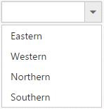
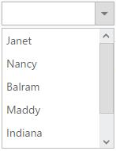
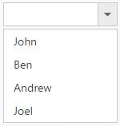

# Data Binding

To populate data in the DropDownList widget, define [dataSource](https://help.syncfusion.com/api/js/ejdropdownlist#members:datasource) property with associated fields. In DropDownList, can bind either local array or OData, WebApi and other [RESTful](https://en.wikipedia.org/wiki/Representational_state_transfer) services.

## Fields

The below listed fields are the data collection fields which maps fields for the data items of the DropDownList. 

<table>
    <tr>
        <th>
            Properties
             
        </th>
        <th>
            Description
             
        </th>
    </tr>
    <tr>
        <td>
            [dataSource](https://help.syncfusion.com/api/js/ejdropdownlist#members:datasource)
             
        </td>
        <td>
            The data source contains the list of data for generating the popup list items.
             
        </td>
    </tr>
    <tr>
        <td>
            [query](https://help.syncfusion.com/api/js/ejdropdownlist#members:query)
             
        </td>
        <td>
            It specifies the query to retrieve the data from the online server.
             
        </td>
    </tr>
    <tr>
        <td>
            [fields](https://help.syncfusion.com/api/js/ejdropdownlist#members:fields)
             
        </td>
        <td>
            It specifies the mapping fields for the data items of the DropDownList widget.
             
        </td>
    </tr>
    <tr>
        <td>
            [id](https://help.syncfusion.com/api/js/ejdropdownlist#members:fields-id)
             
        </td>
        <td>
            It specifies the ID of the tag.
             
        </td>
    </tr>
    <tr>
        <td>
            [text](https://help.syncfusion.com/api/js/ejdropdownlist#members:fields-text)
             
        </td>
        <td>
            It specifies the text content of the tag.
             
        </td>
    </tr>
    <tr>
        <td>
            [value](https://help.syncfusion.com/api/js/ejdropdownlist#members:fields-value)
             
        </td>
        <td>
            It specifies the value of the tag.
             
        </td>
    </tr>
    <tr>
        <td>
            [groupBy](https://help.syncfusion.com/api/js/ejdropdownlist#members:fields-groupby)
             
        </td>
        <td>
            It is used to categorize the items based on a specific field.
             
        </td>
    </tr>
    <tr>
        <td>
            [imageUrl](https://help.syncfusion.com/api/js/ejdropdownlist#members:fields-imageurl)
             
        </td>
        <td>
            It defines the image location.
             
        </td>
    </tr>
    <tr>
        <td>
            [imageAttributes](https://help.syncfusion.com/api/js/ejdropdownlist#members:fields-imageattributes)
             
        </td>
        <td>
            It defines the image attributes such as height, width, styles, etc.
             
        </td>
    </tr>
    <tr>
        <td>
            [spriteCssClass](https://help.syncfusion.com/api/js/ejdropdownlist#members:fields-spritecssclass)
             
        </td>
        <td>
            It defines the sprite CSS for the image tag.
             
        </td>
    </tr>
    <tr>
        <td>
            [htmlAttributes](https://help.syncfusion.com/api/js/ejdropdownlist#members:htmlattributes)
             
        </td>
        <td>
            It defines the HTML attributes such as class and styles for an item.
             
        </td>
    </tr>
    <tr>
        <td>
            [selected](https://help.syncfusion.com/api/js/ejdropdownlist#members:fields-selected)
             
        </td>
        <td>
            This field defines the tag value to be selected initially. Corresponding field mapped has Boolean values to select the list items on control creation. The data with value true in this field is selected automatically when the control is initialized with checkbox.
             
        </td>
    </tr>
    <tr>
        <td>
            [tableName](https://help.syncfusion.com/api/js/ejdropdownlist#members:fields-tablename)
             
        </td>
        <td>
            It defines the table name for the tag value or displays text while rendering remote data.
             
        </td>
    </tr>
</table>

## Local Data

Define a JSON array and initialize the widget with [dataSource](https://help.syncfusion.com/api/js/ejdropdownlist#members:datasource) property. Specify the column names in the [fields](#Fields) property.

N> The columns are bounded automatically when the fields are specified with the default names like id, text, etc...



	<input type="text" id="dropdown1" />
    




    	.imgId {
        	margin: 0;
        	padding: 3px 10px 3px 3px;
        	border: 0 none;
        	width: 60px;
        	height: 60px;
        	float: none;
    	}




	
    $(function() {
        var List = [{
            text: "Erik Linden",
            role: "Representative",
            country: "England",
            img: "images/Employee/3.png",
            attr: {
                class: "imgId"
            }
        }, {
            text: "John Linden",
            role: "Representative",
            country: "Norway",
            img: "images/Employee/6.png",
            attr: {
                class: "imgId"
            }
        }, {
            text: "Louis",
            role: "Representative",
            country: "Australia",
            img: "images/Employee/7.png",
            attr: {
                class: "imgId"
            }
        }, {
            text: "Lawrence",
            role: "Representative",
            country: "India",
            img: "images/Employee/8.png",
            attr: {
                class: "imgId"
            }
        }];
        $('#dropdown1').ejDropDownList({
            dataSource: List,
            fields: {
                text: "text",
                value: "country",
                groupBy: "role",
                imageUrl: "img",
                imageAttributes: "attr"
            },
            width: "200px"
        });
    });	



N> Images for this sample are available in (installed location)\Syncfusion\Essential Studio\{{ site.releaseversion }}\JavaScript\samples\web\themes\images 
I> htmlAttributes and imageAttributes should have JSON type value and sample for spriteCSSClass field is available in [here](http://jsplayground.syncfusion.com/Sync_px3jew3i) 
	
The JSON array to the [dataSource](https://help.syncfusion.com/api/js/ejdropdownlist#members:datasource) property can also be provided as an instance of the [ej.DataManager](https://help.syncfusion.com/api/js/ejdatamanager). When the JSON array is passed as an instance of [ej.DataManager](https://help.syncfusion.com/api/js/ejdatamanager), the [ej.JsonAdaptor](https://help.syncfusion.com/js/datamanager/data-adaptors#json-adaptor) will be used to manipulate the DropDownList data source. The following code explains this behavior,



	<input type="text" id="dropdown1" />
	


	
  
    $(function() {
        var items = [{
            text: "ListItem 1",
            value: "item1"
        }, {
            text: "ListItem 2",
            value: "item2"
        }, {
            text: "ListItem 3",
            value: "item3"
        }, {
            text: "ListItem 4",
            value: "item4"
        }, {
            text: "ListItem 5",
            value: "item5"
        }];
  
        //Passing as instance to the DataManager 
        $('#dropdown1').ejDropDownList({
            dataSource: ej.DataManager(items)
        });
  
    });



## Binding Remote Data Service

To bind remote data to the DropDownList, assign a service data as an instance of `ejDataManager` to the `dataSource` property.

### OData

OData is a standardized protocol for creating and consuming data. Provide the [OData service](http://www.odata.org/) URL directly to the "ej.DataManager" class and then you can assign it to DropDownList "dataSource".



     <input type="text" id="dropdown1" />
     




    $(function() {
        var dataManager = ej.DataManager("http://mvc.syncfusion.com/Services/Northwnd.svc/Orders");
        $('#dropdown1').ejDropDownList({
            dataSource: dataManager,
            fields: {
                text: "ShipCountry",
                value: "OrderID"
            }
        });
    });       


           
          
## OData Version 4
The OData v4 is an improved version of OData protocols and the Data Manager can also retrieve and consume data from [ODatav4](http://www.odata.org/) services.

By using URL property of “ej.DataManager” bind OData Version 4 Service link and specify adaptor as ej.ODataV4Adaptor.



     <input type="text" id="dropdown1" />
     




    $(function() {
        var dataManager = ej.DataManager({
            url: "http://services.odata.org/V4/Northwind/Northwind.svc/Regions/",
            adaptor: new ej.ODataV4Adaptor()
        });
        $('#dropdown1').ejDropDownList({
            dataSource: dataManager,
            fields: {
                text: "RegionDescription",
                value: "RegionID"
            }
        });
    });
  

           
           

N> Events associated with remote data bind is listed [here](https://help.syncfusion.com/api/js/ejdropdownlist#events). 

## WebAPI Binding

Using [ej.WebApiAdaptor](https://help.syncfusion.com/js/datamanager/data-adaptors#webapi-adaptor), bind WebApi service’s data to DropDownList. The data from WebApi service must be returned as an object that has property “Items” with its value as data source and another property “Count” with its value as dataSource’s total records count.



     <input type="text" id="dropdown1" />
     




    $(function() {
        $("#dropdown1").ejDropDownList({
            dataSource: ej.DataManager({
                url: "/api/Orders",
                adaptor: new ej.WebApiAdaptor()
            }),
            fields: {
                text: "Name",
                value: "EmployeeID"
            }
        });
    });





    public class OrdersController : ApiController
    {
        NorthwindDataContext db = new NorthwindDataContext();
        
        // GET API/<controller>       
        public PageResult<EmployeePhoto> Get(ODataQueryOptions opts)
        {
            List<EmployeePhoto> photo = db.EmployeePhotos.ToList();            

            return new PageResult<EmployeePhoto>(photo as IEnumerable<EmployeePhoto>, null, photo.Count);
        }
    } 



## ASP.NET Web Method Binding

The data can retrieve data from ASP.NET Web methods by making use of the WebMethod Adaptor of ejDataManager.

The WebMethod Adaptor is used to bind data source from remote services and code behind methods. 
By using “[WebMethodAdaptor](https://help.syncfusion.com/js/datamanager/getting-started)” we can bind data from WebService to the DropDownList control and also we need to include “ScriptService” Attribute to WebService in order to enable request from client-side.



     Please select... 
    <input type="text" id="myList" />
    




    [System.Web.Script.Services.ScriptService]
    public class WebService1 : System.Web.Services.WebService
    {

        [WebMethod]
        public object Get()
        {

            List<Employee> Data = new List<Employee>();
            Data.Add(new Employee
            {
                Name = "Erik Linden",
                Role = "Executive"
                
            });
            Data.Add(new Employee
            {
                Name = "John Linden",
                Role = "Representative"
                
            });
            Data.Add(new Employee
            {
                Name = "Louis",
                Role = "Representative"
                
            });
            Data.Add(new Employee
            {
                Name = "Lawrence",
                Role = "Executive"
                
            });
            dynamic count = Data.Count;
            return new
            {
                result = Data,
                count = count
            };

        }
        public class Employee
        {
            public string Name { get; set; }
            public string Role { get; set; }
            
        }
    }
    




    
    


Use the above code example to use WebMethod adaptor and bind the data to the DropDownList with the help of [query](https://help.syncfusion.com/api/js/ejdropdownlist#members:query) property.

## MVC controller Action Binding

The data can retrieve from MVC controller. This can be achieved by using the UrlAdaptor of ej.DataManager.

Defines the List of Employee Data and converted into JSON object. 



    using System.Web.Script.Serialization;
    public partial class DropdownlistController: Controller
    {
        public ActionResult DropdownlistFeatures()
        {
            return View();
         } 
        public class Employee
        {
            public string Name { get; set; }
            public string Role { get; set; }
        }
        public JsonResult getData()
        {
            List<Employee> Data = new List<Employee>();
            Data.Add(new Employee
            {
                Name = "Erik Linden",
                Role = "Executive"
            });
            Data.Add(new Employee
            {
                Name = "John Linden",
                Role = "Representative"
            });
            Data.Add(new Employee
            {
                Name = "Louis",
                Role = "Representative"
            });
            Data.Add(new Employee
            {
                Name = "Lawrence",
                Role = "Executive"
            });
            var jsonSerializer = new JavaScriptSerializer();
            return Json(jsonSerializer.Serialize(Data));
        }
    }
    


In client side, specify the URL of Data to url property and specify the type of Adaptor in adaptor property of DataManager and initialize the DropDownList with [dataSource](https://help.syncfusion.com/api/js/ejdropdownlist#members:datasource) property. Specify the column names in the [fields](https://help.syncfusion.com/api/js/ejdropdownlist#members:fields) property.



    
 Select an Employee

    <input id="List"/>
    
    



## Other Restful web services

The [Custom Adaptor](https://help.syncfusion.com/js/datamanager/data-adaptors#custom-adaptor) concept of "ej.DataManager" allows to customize or generate your own adaptor which is used to process "query" and "result" data. 
When using remote data binding, the adaptor of "ej.DataManager" plays vital role in processing queries to make them suitable to sends along with data request and also process the response data from the server.



     <input type="text" id="dropdown1" />
     



  
    $(function() {
        //custom adaptor

        var customAdaptor = new ej.Adaptor().extend({
            insert: function(dataObj, data) {
                return dataObj.dataSource.json.push(data);
            },
            processQuery: ej.JsonAdaptor.prototype.processQuery
                // reused process query from JSON adaptor
        });
  
        window.dropdownData = [{
            FirstName: "John",
            LastName: "Abraham"
        }, {
            FirstName: "Ben",
            LastName: "Nick"
        }, {
            FirstName: "Andrew",
            LastName: "Clarke"
        }];
  
        var dataManager = new ej.DataManager(window.dropdownData);
  
        // assigning custom adaptor to datamanager
        dataManager.adaptor = new customAdaptor(); 
  
  		// insert from custom adaptor usage
        dataManager.insert({
            FirstName: "Joel",
            LastName: "Nick"
        });
  
        $('#dropdown1').ejDropDownList({
            dataSource: dataManager,
            fields: {
                text: "FirstName",
                value: "LastName"
            }
        });
  
    });



## Virtual Scrolling 

To improve the performance when displaying large data set, you can use [allowVirtualScrolling](https://help.syncfusion.com/api/js/ejdropdownlist#members:allowvirtualscrolling) and [virtualScrollMode](https://help.syncfusion.com/api/js/ejdropdownlist#members:virtualscrollmode) property. This retrieves only a fixed amount of list items and loads remaining data on scrolling. The items will be fetched via AJAX request.

This supports two modes of virtualization. They are,

* Normal Mode
* Continuous Mode

I> 1. Sorting and Grouping is not supported with Virtual Scrolling
I> 2. “virtualScrollMode” property accepts both the string and ej.VirtualScrollMode enum value.

### Normal Mode

It loads the data on scrolling the list of items. This can be achieved by setting [normal](https://help.syncfusion.com/api/js/ejdropdownlist#members:virtualscrollmode) value to the "virtualScrollMode" property.



     <input type="text" id="dropdown1" />
     



  
        $(function() { 
            var dataManager = ej.DataManager({
                url: "http://mvc.syncfusion.com/services/Northwnd.svc/Orders"
            });
            
        $('#dropdown1').ejDropDownList({
            dataSource: dataManager,
            fields: {
                text: "ShipName",
                value: "ShipCountry"
            },
            allowVirtualScrolling: true,
            virtualScrollMode: ej.VirtualScrollMode.Normal,
            itemsCount: 7
        });
    });



### Continuous Mode

It loads the set of items when the scroller reaches at the end. This behaves like infinity scrolling. So when scroll reaches the end, it will fetch the remaining set of items and bind with your DropDownList. This can be achieved by setting [continuous](https://help.syncfusion.com/api/js/ejdropdownlist#members:virtualscrollmode) value to the "virtualScrollMode" property.

N> In both modes, set of items will be fetched based on the count specified in the [itemsCount](https://help.syncfusion.com/api/js/ejdropdownlist#members:itemscount) property and next set of items will be loaded on scrolling.



     <input type="text" id="dropdown1" />
     



    
       $(function() {        
        var dataManager = ej.DataManager({
            url: "http://mvc.syncfusion.com/services/Northwnd.svc/Orders"
       });
        
        $('#dropdown1').ejDropDownList({
            dataSource: dataManager,
            fields: {
                text: "ShipName",
                value: "ShipCountry"
            },
            allowVirtualScrolling: true,
            virtualScrollMode: ej.VirtualScrollMode.Continuous,
            itemsCount: 7
            });
        });
     


