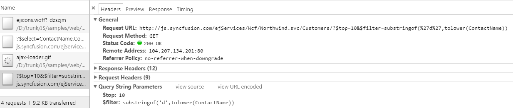

# Search

Items are searched based on the keyed in values to the textbox. There are two types of searches,

* Incremental Search
* Filter Search

## Incremental Search

Selects the item in the popup list based on the keyed in value. If the time taken to type exceeds 1000 milliseconds then filtered items will be reset based on the current input value.For this search, [enableIncrementalSearch](https://help.syncfusion.com/api/js/ejdropdownlist#members:enableincrementalsearch) property must be enabled. By default this mode of search is enabled. Incremental search can be case sensitive or case insensitive. To make case sensitive, you can use [caseSensitiveSearch](https://help.syncfusion.com/api/js/ejdropdownlist#members:casesensitivesearch) property.



    <input type="text" id="dropdown1" />
                




     $(function() {
        var items = [{
            text: "Adams",
            value: "emp1"
        }, {
            text: "James",
            value: "emp2"
        }, {
            text: "Maria",
            value: "emp3"
        }, {
            text: "Jessica",
            value: "emp4"
        }, {
            text: "Jenneth",
            value: "emp5"
        }];
        $('#dropdown1').ejDropDownList({
            dataSource: items,
            fields: {
                text: "text",
                value: "value"
            },
            enableIncrementalSearch: true,
            caseSensitiveSearch: true
        });
    });
	


## Filter search

You can quickly locate specific item within a large data source by filtering matches with a search box. A text box appears in the popup list for searching when [enableFilterSearch](https://help.syncfusion.com/api/js/ejdropdownlist#members:enablefiltersearch) property is enabled. By default, filtering returns the matched items list based on text in search textbox. 
You can configure the search filter by using [filterType](https://help.syncfusion.com/api/js/ejdropdownlist#members:filtertype) property. There is two types of filter options,

* Starts With 
* Contains

N> Items are filtered based on “contains” filter type by default.



    <input type="text" id="dropdown1" />
                




    $(function() {
        var items = [{
            text: "Adams",
            value: "emp1"
        }, {
            text: "James",
            value: "emp2"
        }, {
            text: "Maria",
            value: "emp3"
        }, {
            text: "Jessica",
            value: "emp4"
        }, {
            text: "Jenneth",
            value: "emp5"
        }];
        $('#dropdown1').ejDropDownList({
            dataSource: items,
            fields: {
                text: "text",
                value: "value"
            },
            enableFilterSearch: true,
            filterType: "startsWith"
        });
    });
    


## Server Filtering

Server filtering for displaying only a fixed amount of dataset from the whole dataset. In general, DropDownList displays just the data returned from the server. This feature is convenient for you to apply when the user does not want to see the whole dataset in the popup wrapper.
[enableServerFiltering](https://help.syncfusion.com/api/js/ejdropdownlist#members:enableServerFiltering) If set to true, the filtering operations performed in the remote service and returns the result.



    

        
Select a Customer Name

        <input type="text" id="customerList" />
    

    



This sample raises the query on Customer service. Returns ContactName records for customers with ContactName containing the string “d”.

