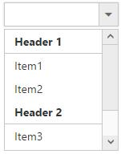

# Functionalities

## Selection

By default only one item can be selected from the popup list. For multiple selection, you have to enable [checkboxes](Checkbox). The selected item consist of active class (“e-active”) to differentiate it from other items.

### Using value or text

To select an item initially you can pass the item’s value via [value](http://help.syncfusion.com/js/api/ejdropdownlist#members:value) property or [selectItemByValue](http://help.syncfusion.com/js/api/ejdropdownlist#members:selectitembyvalue) method. To achieve this DropDownList widget must be initiated with the associate value. 



     <input type="text" id="dropdown1" />
     




    $(function() {
        var items = [{
            text: "ListItem 1",
            value: "item1"
        }, {
            text: "ListItem 2",
            value: "item2"
        }, {
            text: "ListItem 3",
            value: "item3"
        }, {
            text: "ListItem 4",
            value: "item4"
        }, {
            text: "ListItem 5",
            value: "item5"
        }];
        $('#dropdown1').ejDropDownList({
            dataSource: items,
            fields: {
                text: "text",
                value: "value"
            },
            value: "item3"
        });
    });



N> To retrieve the selected item’s li elements and value you can use [getSelectedItem](http://help.syncfusion.com/js/api/ejdropdownlist#methods:getselecteditem), [getSelectedValue](http://help.syncfusion.com/js/api/ejdropdownlist#methods:getselectedvalue) methods respectively.



     <input type="text" id="dropdown1" />
     



	
    $(function() {
        var items = [{
            text: "ListItem 1",
            value: "item1"
        }, {
            text: "ListItem 2",
            value: "item2"
        }, {
            text: "ListItem 3",
            value: "item3"
        }, {
            text: "ListItem 4",
            value: "item4"
        }, {
            text: "ListItem 5",
            value: "item5"
        }];
        $('#dropdown1').ejDropDownList({
            dataSource: items,
            fields: {
                text: "text",
                value: "value"
            },
            selectedIndex: 0
        });
        var obj = $('#dropdown1').data("ejDropDownList");
        //the below given code will return the li element of the selected item
        console.log(obj.getSelectedItem());
        //the below given code will return the JSON object of the selected item
        console.log(JSON.parse(obj.getSelectedValue()));
    });
	


### Using indices

You can select a single or more than one item by passing index values to the properties [selectedIndex](http://help.syncfusion.com/js/api/ejdropdownlist#members:selectedindex) or [selectedIndices](http://help.syncfusion.com/js/api/ejdropdownlist#members:selectedindices) respectively. Index starts from 0 here.



     <input type="text" id="dropdown1" />
     



	
    $(function() {
        var items = [{
            text: "ListItem 1",
            value: "item1"
        }, {
            text: "ListItem 2",
            value: "item2"
        }, {
            text: "ListItem 3",
            value: "item3"
        }, {
            text: "ListItem 4",
            value: "item4"
        }, {
            text: "ListItem 5",
            value: "item5"
        }];
        $('#dropdown1').ejDropDownList({
            dataSource: items,
            fields: {
                text: "text",
                value: "value"
            },
            selectedIndex: 1
        });
    });



I> To use "selectedIndices" property, you should enable either showCheckbox or multiSelectMode property First.



     <input type="text" id="dropdown1" />
     



	
    $(function() {
        var items = [{
            text: "ListItem 1",
            value: "item1"
        }, {
            text: "ListItem 2",
            value: "item2"
        }, {
            text: "ListItem 3",
            value: "item3"
        }, {
            text: "ListItem 4",
            value: "item4"
        }, {
            text: "ListItem 5",
            value: "item5"
        }];
        $('#dropdown1').ejDropDownList({
            dataSource: items,
            fields: {
                text: "text",
                value: "value"
            },
            showCheckbox: true,
            selectedIndices: [1, 2]
        });
		
    });



### Unselect items

Similarly, you can unselect a single or multiple items by using [unselectItemByValue](http://help.syncfusion.com/js/api/ejdropdownlist#methods:unselectitembyvalue) or [unselectItemByIndices](http://help.syncfusion.com/js/api/ejdropdownlist#methods:unselectitembyindices) or [unselectItemByText](http://help.syncfusion.com/js/api/ejdropdownlist#methods:unselectitembytext) methods. This will remove the selection state of the corresponding data item from the popup list and textbox. 



            <input type="text" id="dropdown1" />

            <input type="button" value="Unselect" onclick="unselect()" />

     




    var obj;

    $(function() {
      var items = [{
          text: "ListItem 1",
          value: "item1"
      }, {
          text: "ListItem 2",
          value: "item2"
      }, {
          text: "ListItem 3",
          value: "item3"
      }, {
          text: "ListItem 4",
          value: "item4"
      }, {
          text: "ListItem 5",
          value: "item5"
      }];
      $('#dropdown1').ejDropDownList({
          width: 300,
          dataSource: items,
          fields: {
              text: "text",
              value: "value"
          },
          showCheckbox: true,
          selectedIndices: [1, 2, 3]
      });
      obj = $('#dropdown1').data("ejDropDownList");
      console.log("Selected Item's Text - " + obj.option("text"));
      console.log("selected Item's Value - " + obj.option("value"));
    });

    function unselect() {
      obj.unselectItemByValue("item2");
      obj.unselectItemByIndices(2);
      obj.unselectItemByText("ListItem 4");
    }			



## Grouping

The DropDownList items can be categorized by using a specific field in the popup list. This is enabled by using [groupBy](http://help.syncfusion.com/js/api/ejdropdownlist#members:fields-groupby) field on data source binding. By default grouping is disabled in DropDownList.
The below given example explains the behavior of grouping with JSON array binding.



            <input type="text" id="dropdown1" />

                




	$(function() {
	    var skillset = [{
	        skill: "Cabbage",
	        category: "Leafy and Salad"
	    }, {
	        skill: "Pea",
	        category: "Leafy and Salad"
	    }, {
	        skill: "Spinach",
	        category: "Leafy and Salad"
	    }, {
	        skill: "Wheatgrass",
	        category: "Leafy and Salad"
	    }, {
	        skill: "Yarrow",
	        category: "Leafy and Salad"
	    }, {
	        skill: "Chickpea",
	        category: "Beans"
	    }, {
	        skill: "Green bean",
	        category: "Beans"
	    }, {
	        skill: "Horse gram",
	        category: "Beans"
	    }, {
	        skill: "Peanut",
	        category: "Beans"
	    }, {
	        skill: "Pigeon pea",
	        category: "Beans"
	    }, {
	        skill: "Garlic",
	        category: "Bulb and Stem"
	    }, {
	        skill: "Garlic Chives",
	        category: "Bulb and Stem"
	    }, {
	        skill: "Lotus root",
	        category: "Bulb and Stem"
	    }, {
	        skill: "Nopal",
	        category: "Bulb and Stem"
	    }, {
	        skill: "Onion",
	        category: "Bulb and Stem"
	    }, {
	        skill: "Shallot",
	        category: "Bulb and Stem"
	    }, {
	        skill: "Beetroot",
	        category: "Root and Tuberous"
	    }, {
	        skill: "Carrot",
	        category: "Root and Tuberous"
	    }, {
	        skill: "Ginger",
	        category: "Root and Tuberous"
	    }, {
	        skill: "Potato",
	        category: "Root and Tuberous"
	    }, {
	        skill: "Radish",
	        category: "Root and Tuberous"
	    }, {
	        skill: "Turmeric",
	        category: "Root and Tuberous"
	    }];
	    $('#dropdown1').ejDropDownList({
	        width: 150,
	        popupHeight: 300,
	        watermarkText: "Select a vegetable",
	        dataSource: skillset,
	        fields: {
	            text: "skill",
	            groupBy: "category"
	        }
	    });
	});



N> Grouping has restrictions in the following scenarios,
N> 1.  It is not supported on using HTML "select" element with predefined set of options
N> 2.  When using UL-LI elements you need to use “e-category” class in li element to specify it as the grouping header. The following code will explain this behavior,



            <input type="text" id="dropdown1" />
                




	$(function() {
	    $('#dropdown1').ejDropDownList({
	        targetID: "dropdownitems"
	    });
	});         
    


I> Virtual scrolling is not supported with Grouping.

## Sorting

Sorting is enabled to order to display the items alphabetically in either ascending or descending order. By default the items is displayed in the initialized order, use [enableSorting](http://help.syncfusion.com/js/api/ejdropdownlist#members:enablesorting) property to automatically sort strings based on text field value. You can assign either “ascending” or “descending” string values to the [sortOrder](http://help.syncfusion.com/js/api/ejdropdownlist#members:sortorder) property to sort out the list items. By default ascending order is followed when "sortOrder" property is not specified. 



            <input type="text" id="dropdown1" />
                




	$(function() {
	    var items = [{
	        text: "ListItem 1",
	        value: "item1"
	    }, {
	        text: "ListItem 5",
	        value: "item5"
	    }, {
	        text: "ListItem 4",
	        value: "item4"
	    }, {
	        text: "ListItem 2",
	        value: "item2"
	    }, {
	        text: "ListItem 3",
	        value: "item3"
	    }, ];
	    $('#dropdown1').ejDropDownList({
	        dataSource: items,
	        fields: {
	            text: "text",
	            value: "value"
	        },
	        enableSorting: true,
	        sortOrder: "ascending"
	    });
	});             
  


I> Virtual scrolling is not supported with Sorting.

## Cascading

This works for series of DropDownList in which items are filtered based on the previous DropDownList‘s selection. Cascading is performed based on the value field and this field should be bounded with a foreign key. To perform cascading, specify the child DropDownList’s id in [cascadeTo](http://help.syncfusion.com/js/api/ejdropdownlist#members:cascadeto) property and use delimiter (“,”) to specify more than one child DropDownList.

Configuring the data items for cascading to the series of DropDownList is demonstrated below



    

    	

        	Select Group
        	<input id="groupslist" type="text" />
    	

    	

        	Select Country
        	<input id="countrylist" type="text" />
    	

	

                




    $(function() {
        //first dropdown
        var groups = [{
            parentId: 'a',
            text: "Group A"
        }, {
            parentId: 'b',
            text: "Group B"
        }, {
            parentId: 'c',
            text: "Group C"
        }, {
            parentId: 'd',
            text: "Group D"
        }, {
            parentId: 'e',
            text: "Group E"
        }];
        //second dropdown
        var countries = [{
            value: 11,
            parentId: 'a',
            text: "Algeria"
        }, {
            value: 12,
            parentId: 'a',
            text: "Armenia"
        }, {
            value: 13,
            parentId: 'a',
            text: "Bangladesh"
        }, {
            value: 14,
            parentId: 'a',
            text: "Cuba"
        }, {
            value: 15,
            parentId: 'b',
            text: "Denmark"
        }, {
            value: 16,
            parentId: 'b',
            text: "Egypt"
        }, {
            value: 17,
            parentId: 'c',
            text: "Finland"
        }, {
            value: 18,
            parentId: 'c',
            text: "India"
        }, {
            value: 19,
            parentId: 'c',
            text: "Malaysia"
        }, {
            value: 20,
            parentId: 'd',
            text: "New Zealand"
        }, {
            value: 21,
            parentId: 'd',
            text: "Norway"
        }, {
            value: 22,
            parentId: 'd',
            text: "Poland"
        }, {
            value: 23,
            parentId: 'e',
            text: "Romania"
        }, {
            value: 24,
            parentId: 'e',
            text: "Singapore"
        }, {
            value: 25,
            parentId: 'e',
            text: "Thailand"
        }, {
            value: 26,
            parentId: 'e',
            text: "Ukraine"
        }];
        $('#groupslist').ejDropDownList({
            dataSource: groups,
            fields: {
                text: "text",
                value: "parentId"
            },
            cascadeTo: 'countrylist'
        });
        $('#countrylist').ejDropDownList({
            dataSource: countries,
            enabled: false
        });
    });



You can also bind the data source to the cascading DropDownList dynamically using [cascade](http://help.syncfusion.com/js/api/ejdropdownlist#events:cascade) event as demonstrated below,



    

    

        Select Group
        <input id="groupslist" type="text" />
    

    

        Select Country
        <input id="countrylist" type="text" />
    

    

        Select Players
        <input id="playerslist" type="text" />
    

	

                



  
    $(function() {
        //first dropdown
        var groups = [{
            parentId: 'a',
            text: "Group A"
        }, {
            parentId: 'b',
            text: "Group B"
        }];
        $('#groupslist').ejDropDownList({
            dataSource: groups,
            fields: {
                text: "text",
                value: "parentId"
            },
            cascadeTo: "countrylist,playerslist",
            cascade: 'onChange'
        });
        $('#countrylist').ejDropDownList({
            enabled: false
        });
        $('#playerslist').ejDropDownList({
            enabled: false
        });
    });

    function onChange(args) {
        var countries = [{
            parentId: 'a',
            text: "Algeria"
        }, {
            parentId: 'a',
            text: "Armenia"
        }, {
            parentId: 'a',
            text: "Bangladesh"
        }, {
            parentId: 'a',
            text: "Cuba"
        }, {
            parentId: 'b',
            text: "Denmark"
        }, {
            parentId: 'b',
            text: "Egypt"
        }];

        var players = [{
            parentId: 'a',
            text: "Adams"
        }, {
            parentId: 'a',
            text: "Clarke"
        }, {
            parentId: 'b',
            text: "Brett"
        }, {
            parentId: 'b',
            text: "James"
        }];

        var obj2 = $('#countrylist').data("ejDropDownList");
        obj2.option({
            "dataSource": countries,
            "enabled": true
        });

        var obj3 = $('#playerslist').data("ejDropDownList");
        obj3.option({
            "dataSource": players,
            "enabled": true
        });
    }
		


## Search

Items are searched based on the keyed in values to the textbox. There are two types of searches,

* Incremental Search
* Filter Search

### Incremental Search

Selects the item in the popup list based on the keyed in value. If the time taken to type exceeds 1000 milliseconds then filtered items will be reset based on the current input value. By default this mode of search is enabled. Incremental search can be case sensitive or case insensitive. To make case sensitive, you can use [caseSensitiveSearch](http://help.syncfusion.com/js/api/ejdropdownlist#members:casesensitivesearch) property.



    <input type="text" id="dropdown1" />
                




     $(function() {
        var items = [{
            text: "Adams",
            value: "emp1"
        }, {
            text: "James",
            value: "emp2"
        }, {
            text: "Maria",
            value: "emp3"
        }, {
            text: "Jessica",
            value: "emp4"
        }, {
            text: "jenneth",
            value: "emp5"
        }];
        $('#dropdown1').ejDropDownList({
            dataSource: items,
            fields: {
                text: "text",
                value: "value"
            },
            enableIncrementalSearch: true,
            caseSensitiveSearch: true
        });
    });
	


### Filter search

You can quickly locate specific item within a large data source by filtering matches with a search box. A text box appears in the popup list for searching when [enableFilterSearch](http://help.syncfusion.com/js/api/ejdropdownlist#members:enablefiltersearch) property is enabled. By default, filtering returns the matched items list based on text in search textbox. 
You can configure the search filter by using [filterType](http://help.syncfusion.com/js/api/ejdropdownlist#members:filtertype) property. There is two types of filter options,

* Starts With 
* Contains

N> Items are filtered based on “contains” filter type by default.



    <input type="text" id="dropdown1" />
                




    $(function() {
        var items = [{
            text: "Adams",
            value: "emp1"
        }, {
            text: "James",
            value: "emp2"
        }, {
            text: "Maria",
            value: "emp3"
        }, {
            text: "Jessica",
            value: "emp4"
        }, {
            text: "jenneth",
            value: "emp5"
        }];
        $('#dropdown1').ejDropDownList({
            dataSource: items,
            fields: {
                text: "text",
                value: "value"
            },
            enableFilterSearch: true,
            filterType: "startsWith"
        });
    });
    


## Validation

You can validate the DropDownList value on form submission by applying “validationRules” and “validationMessage” to the DropDownList. 

N> [jquery.validate.min](http://cdn.syncfusion.com/js/assets/external/jquery.validate.min.js) script file should be referred for validation, for more details, refer [here](http://jqueryvalidation.org/documentation).

### Validation Rules

The validation rules help you to verify the selected text by adding validation attributes to the input element. This can be set by using [validationRules](http://help.syncfusion.com/js/api/ejdropdownlist#members:validationrules) property.

### Validation Messages 

You can set your own custom error message by using [validationMessage](http://help.syncfusion.com/js/api/ejdropdownlist#members:validationmessage) property. To display the error message, specify the corresponding annotation attribute followed by the message to display.

N> jQuery predefined error messages to that annotation attribute will be shown when this property is not defined. The below given example explain this behavior of ‘required’ attribute,

When you initialize the DropDownList widget, it creates an input hidden element which is used to store the selected items value. Hence, the validation is performed based on the value stored in this hidden element.

Required field and min value validation is demonstrated in the below given example.



    <form id="form1">
    	<input type="text" id="dropdown1" />
   
    	<input type="submit" value="Validate" />
	</form>
                



	
    $.validator.setDefaults({
        ignore: [],
        errorClass: 'e-validation-error', // to get the error message on jquery validation
        errorPlacement: function (error, element) {
            $(error).insertAfter(element.closest(".e-widget"));
        }
        // any other default options and/or rules
    });
    //If necessary, we can create custom rules as below. here method defined for min
    $.validator.addMethod("min",
        function (value, element, params) {
            if (!/Invalid|NaN/.test(value)) {
                return parseInt(value) > params;
            }
        }, 'Must be greater than 30.');
    $(function() {
        var items = [{
            text: "10",
            value: 10
        }, {
            text: "20",
            value: 20
        }, {
            text: "30",
            value: 30
        }, {
            text: "40",
            value: 40
        }, {
            text: "50",
            value: 50
        }];
        $('#dropdown1').ejDropDownList({
            dataSource: items,
            fields: {
                text: "text",
                value: "value"
            },
            validationRules: {
                required: true,
                min: 30
            },
            validationMessage: {
                required: "* Required",
                min: "Select > 30"
            }
        });
    });
	


