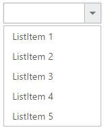

# Getting Started with JavaScript DropDownList

The external script dependencies of the DropDownList widget are,

* [jQuery 1.7.1](http://jquery.com/) and later versions.
* [jQuery.easing](http://gsgd.co.uk/sandbox/jquery/easing/) - to support the animation effects.

And the internal script dependencies of the DropDownList widget are:

<table>
	<tr>
		<th>File </th>
		<th>Description / Usage </th>
	</tr>
	<tr>
		<td>ej.core.min.js</td>
		<td>Must be referred always before using all the JS controls.</td>
	</tr>
	<tr>
		<td>ej.data.min.js</td>
		<td>Used to handle data operation and should be used while binding data to JS controls.</td>
	</tr>
	<tr>
		<td>ej.dropdownlist.min.js</td>
		<td>The dropdownlist’s main file</td>
	</tr>
	<tr>
		<td>ej.checkbox.min.js</td>
		<td>Should be referred when using checkbox functionalities in DropDownList.</td>
	</tr>
	<tr>
		<td>ej.scroller.min.js</td>
		<td>Should be referred when using scrolling in DropDownList.</td>
	</tr>
	<tr>
		<td>ej.draggable.min.js</td>
		<td>Should be referred when using popup resize functionality in DropDownList.</td>
	</tr>
</table>

For getting started you can use the ‘ej.web.all.min.js’ file, which encapsulates all the 'ej' controls and frameworks in one single file.  

For themes, you can use the ‘ej.web.all.min.css’ CDN link from the snippet given. To add the themes in your application, please refer [this link](https://help.syncfusion.com/js/theming-in-essential-javascript-components#adding-specific-theme-to-your-application).

## Preparing HTML document

Create a new HTML file and add [CDN](https://help.syncfusion.com/js/cdn) links to the [JavaScript](https://help.syncfusion.com/js/dependencies) and [CSS](https://help.syncfusion.com/js/theming-in-essential-javascript-components) dependencies to your project.



    <!DOCTYPE html>

    <html>

    <head>

        <meta name="viewport" content="width=device-width, initial-scale=1.0" charset="utf-8" />

        <!-- style sheet for default theme(flat azure) -->

        <link href="http://cdn.syncfusion.com/{{ site.releaseversion }}/js/web/flat-azure/ej.web.all.min.css"
              rel="stylesheet" />

        <!--scripts-->

        

        

        

    </head>

    <body>

        <!--Place input element to create DropDownList-->

        

    </body>

    </html>



 N>  In production, we highly recommend you to use our [custom script generator](https://help.syncfusion.com/js/custom-script-generator#) to create custom script file with required controls and its dependencies only. Also to reduce the file size further please use [GZip compression](https://developers.google.com/web/fundamentals/performance/optimizing-content-efficiency/optimize-encoding-and-transfer?hl=en#text-compression-with-gzip) in your server. 

## Creating DropDownList

The DropDownList can be created from a HTML ‘select’ element with the HTML 'id' attribute and pre-defined options set to it. To create the DropDownList, you should call the 'ejDropDownList' jQuery plug-in function.

    
	
	<select id="dropdown1">
	
		<option value="item1">ListItem 1</option>
			
		<option value="item2">ListItem 2</option>
					
		<option value="item3">ListItem 3</option>
				
		<option value="item4">ListItem 4</option>
				
		<option value="item5">ListItem 5</option>
				
	</select>
			
	
	
		
	
		$(function () {
				
			$('#dropdown1').ejDropDownList();
					
		});				
	
			
	

## Populating data

The DropDownList can be bounded to both local array and remote data services using [ej.DataManager](https://help.syncfusion.com/js/datamanager/overview). You can use [DataManager](https://help.syncfusion.com/js/datamanager/overview) component to serve data from the data services based on the query provided. To bind data to DropDownList widget, the [dataSource](https://help.syncfusion.com/api/js/ejdropdownlist#members:datasource) property should be assigned with the instance of 'ej.DataManager'.
 
N> ODataAdaptor is the default adaptor for DataManager. On binding to other web services, proper [data adaptor](https://help.syncfusion.com/js/datamanager/data-adaptors) needs to be set on 'adaptor' option of DataManager. 
	
	

	<input type="text" id="dropdown1" />
	
	
	
		
	
	 $(function () {
            // declaration
            Customers = [
                 { id: "1", text: "ALFKI" }, { id: "2", text: "ANATR" }, { id: "3", text: "ANTON" },
                 { id: "4", text: "AROUT" }, { id: "5", text: "BERGS" }, { id: "6", text: "BLAUS" }
            ];
            $('#dropdown1').ejDropDownList({
                dataSource: ej.DataManager(Customers),
                fields: { id: "id", text: "text", value: "text" }
            });
        });
	});		
	

	
	

## Setting Dimensions

DropDownList dimensions can be set using [width](https://help.syncfusion.com/api/js/ejdropdownlist#members:width) and [height](https://help.syncfusion.com/api/js/ejdropdownlist#members:height) API.
	
	
	
	<input type="text" id="dropdown1" />
	
	
	
		
	
	$(function () {
			
		$('#dropdown1').ejDropDownList({
			
			width: 300,
			
			height: 50
		});
	});		
	
	

**Setting dimensions to Popup list**

[PopupWidth](https://help.syncfusion.com/api/js/ejdropdownlist#members:popupwidth) and [popupHeight](https://help.syncfusion.com/api/js/ejdropdownlist#members:popupheight) can be used to create a fixed size popup list.

	

	<input type="text" id="dropdown1" />

	
	
	
	
	
	$(function () {
	
		// declaration
		
		var items = [{ text: "ListItem 1", value: "item1" },
		
			{ text: "ListItem 2", value: "item2" },
					
			{ text: "ListItem 3", value: "item3" },
					
			{ text: "ListItem 4", value: "item4" },
				
			{ text: "ListItem 5", value: "item5" }];
					
		$('#dropdown1').ejDropDownList({
		
			dataSource: items,
			
			fields: { text: "text", value: "value" },
			
			width: 500,
			
			height: 50,
			
			popupHeight: 200,
			
			popupWidth: 300
			
		});
		
	});
	
	
	
## Setting and Getting Value

You can select single or multiple values from DropDownList widget. To assign a value initially to the DropDownList, you can use [value](https://help.syncfusion.com/api/js/ejdropdownlist#members:value) property.

N> To select multiple items based on index, refer [here](functionalities#selection).

	

	<input type="text" id="dropdown1" />

	
	
		
	
	$(function () {
		
		var items = [{ text: "ListItem 1", value: "item1" },
		
			{ text: "ListItem 2", value: "item2" },
			
			{ text: "ListItem 3", value: "item3" },
				
			{ text: "ListItem 4", value: "item4" },
				
			{ text: "ListItem 5", value: "item5" }];
				
				
		$('#dropdown1').ejDropDownList({
					
			dataSource: items,
				
			fields: { text: "text", value: "value" },
				
			value: "item3"
		});
			
		var obj = $('#dropdown1').data("ejDropDownList");
				
		console.log("Selected Item's Text - " + obj.option("text"));
				
		console.log("selected Item's Value - " + obj.option("value"));       
				
	}); 
    

	

