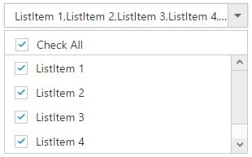
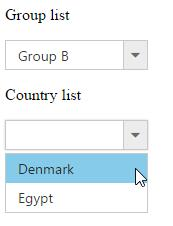
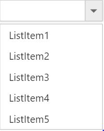
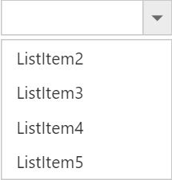
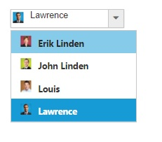
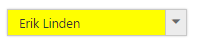
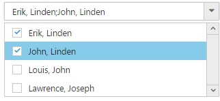
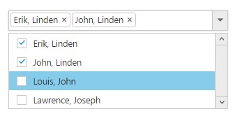
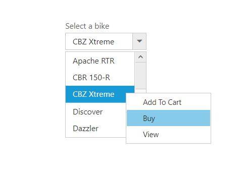

# How To

## Set focus to control initially?

[Access key](https://en.wikipedia.org/wiki/Access_key) property can be added in input element to set focus. Here focus is set by using access key + "j".



     <input type="text" id="dropdown1" />
     




        $(function () {
            var items = [
              { text: "ListItem 1", value: "item1" },
	          { text: "ListItem 2", value: "item2" },
		      { text: "ListItem 3", value: "item3" },
		      { text: "ListItem 4", value: "item4" },
		      { text: "ListItem 5", value: "item5" }
            ];
            $('#dropdown1').ejDropDownList({
                dataSource: items,
                fields: { text: "text", value: "value" }
            });
        //Control focus key
        $(document).on("keydown", function (e) {
            if (e.altKey && e.keyCode === 74) { // j- key code.
                $("#dropdown1_wrapper").focus();
            }
          });
       });
 


## Clear the text of DropDownList input?

To clear the text of the DropDownList input, you can use [clearText](https://help.syncfusion.com/api/js/ejdropdownlist#methods:cleartext) method.

## Add an item dynamically to the DropDownList?

You can use [addItem](https://help.syncfusion.com/api/js/ejdropdownlist#methods:additem) method to add single or multiple items dynamically to the popup list. You can define all the possible values that is supported by field property such as text, value, id, HTML attributes, selected, image and its associated attributes such as alt, width, and height etc..,

Adding text and value is demonstrated in the below given sample,



     <input type="text" id="dropdown1" />
     




       $(function () {
            var items = [
              { text: "ListItem 1", value: "item1" },
	          { text: "ListItem 2", value: "item2" },
		      { text: "ListItem 3", value: "item3" },
		      { text: "ListItem 4", value: "item4" },
		      { text: "ListItem 5", value: "item5" }
            ];
            $('#dropdown1').ejDropDownList({
                dataSource: items,
                fields: { text: "text", value: "value" }
            });

            $('#dropdown1').ejDropDownList("addItem", { text: "New Text", value: "text1" });

        });



## Disable/ Enable the DropDownList widget?

You can enable or disable the DropDownList widget using "enabled" property or methods. Detailed information is given [here](customization#enabledisable-the-widget).

## Control the popup visibility via methods in script showPopup ()/hidePopup ()?

By default popup list is shown on DropDownList button click but you can display the list initially by enabling the [showPopupOnLoad](https://help.syncfusion.com/api/js/ejdropdownlist#members:showpopuponload) property. You can also use [showPopup ()](https://help.syncfusion.com/api/js/ejdropdownlist#methods:showpopup) or [hidePopup ()](https://help.syncfusion.com/api/js/ejdropdownlist#methods:hidepopup) methods at run time to display or hide the popup list.

## Retrieve the selected item data from select event via arguments?

Bind the [select](https://help.syncfusion.com/api/js/ejdropdownlist#events:select) event and you can retrieve the value from args.value. 



     <input type="text" id="dropdown1" />
     




        $(function () {
            var items = [
              { text: "ListItem 1", value: "item1" },
	          { text: "ListItem 2", value: "item2" },
		      { text: "ListItem 3", value: "item3" },
		      { text: "ListItem 4", value: "item4" },
		      { text: "ListItem 5", value: "item5" }
            ];
            $('#dropdown1').ejDropDownList({
                dataSource: items,
                fields: { text: "text", value: "value" },
                select: function (args) {
                    console.log("Value is " + args.value);
                }
            });
        });



The following screenshot will exhibit the select event arguments details,

## Append custom HTML in DropDownList popup outside the scroller part?

Create a custom HTML element and insert it after popup wrapper. Detailed sample is given [here](http://jsplayground.syncfusion.com/ey2mpity)

## Add check all option in popup list?

You can use [headerTemplate](https://help.syncfusion.com/api/js/ejdropdownlist#members:headertemplate) property to add any HTML element. Code snippet to add check all option using [change](https://help.syncfusion.com/api/js/ejdropdownlist#events:change) event is given below,



     <input type="text" id="dropdown1" />
	 




        .temp {
            height: 30px;
            display: block;
            padding-left: 13px;
            padding-top: 5px;
            border-bottom: 1px solid #c8c8c8;
        }
        .e-chkbox-wrap .e-text {
            font-size: 14px;
            padding-left: 10px;
        }

     




     var flag;
     $(function () {
        var items = [
            { text: "ListItem 1", value: "item1" },
            { text: "ListItem 2", value: "item2" },
            { text: "ListItem 3", value: "item3" },
            { text: "ListItem 4", value: "item4" },
            { text: "ListItem 5", value: "item5" }
        ];
        $('#dropdown1').ejDropDownList({
            width: 300,
            dataSource: items,
            fields: { text: "text", value: "value" },
            showCheckbox: true,
            change: "Check",
            headerTemplate: "
<input id ='check' type='checkbox'/>
"
        });
        $("#check").ejCheckBox({ text: "Check All", change: "Change" });
    });
    function Change(args) {
        if (!flag) {
            var drop = $("#dropdown1").ejDropDownList("instance");
            if (args.isChecked) drop.checkAll();
            else drop.uncheckAll();
        }
    }
    function Check(args) {
        var drop = $("#dropdown1").ejDropDownList("instance");
        var instance = $("#check").data("ejCheckBox");

        if (!args.isChecked) {
            flag = true; //set flag variable to avoid triggering of checkbox change during check change.
            instance.setModel({ checked: false }); //uncheck check All when any one of the item is unchecked.
            flag = false;

        }
        if (drop.getSelectedItem().length == drop.getListData().length) //get selected items length
        {
            instance.setModel({ checked: true }); //check check All checkbox when all items in list are selected.
        }

    }



The following screenshot exhibits the output of the above code,

Refer to the sample [here](https://jsplayground.syncfusion.com/tm4z5vej)

## To Cascade DropDownLists with different field names
By default cascading is performed based on the Value field, so that it needs to be same with cascaded DropDownList. If you need to cascade 2 DropDownLists with different field names and same values in it, you can achieve it using cascadeQuery and [cascade](https://help.syncfusion.com/api/js/ejdropdownlist#events:cascade "") event. Define the cascade event for the DropDownList from which you need to filter the datasource for the other DropDownList. 
Refer the following code blocks below



    
Group list

    <input id="groupsList" type="text" value="Group A" />
    
Country list

    <input id="countryList" type="text" />



In the cascade event arguments, modify the cascadeQuery which has the filtering query for the cascading DropDownList with your customized query.  So to filter the datasource based on the different field names, pass an ej.Query() which want to execute for cascade DropDownList.

**Javascript**



    $(function () {
            // declaration
            var groups = [
                { parentId: 'a', text: "Group A" },
                { parentId: 'b', text: "Group B" },
                { parentId: 'c', text: "Group C" },
                { parentId: 'd', text: "Group D" },
                { parentId: 'e', text: "Group E" }
            ];
            //first level child
            var countries = [
                { value: 11, id: 'a', text: "Algeria" },
                { value: 12, id: 'a', text: "Armenia" },
                { value: 15, id: 'b', text: "Denmark" },
                { value: 16, id: 'b', text: "Egypt" },
                { value: 17, id: 'c', text: "Finland" },
                { value: 18, id: 'c', text: "India"},
                { value: 19, id: 'c', text: "Malaysia" },
                { value: 20, id: 'd', text: "New Zealand" },
                { value: 21, id: 'd', text: "Norway" },
                { value: 22, id: 'd', text: "Poland" },
                { value: 23, id: 'e', text: "Romania" },
                { value: 26, id: 'e', text: "Ukraine" }
            ];

            var group = $('#groupsList').ejDropDownList({
                dataSource: groups,
                fields: { value: "parentId", text: "text" },
                cascadeTo: 'countryList',
                text: "Group A",
                cascade: "cascadeEvent",
            }).data("ejDropDownList");
            var country = $('#countryList').ejDropDownList({
                dataSource: countries,
                fields: { value: "value", text: "text" },
            }).data("ejDropDownList");
        });

        function cascadeEvent(args) {
            args.requiresDefaultFilter = false; // restrict the built-in mapping for cascading dropdown

            args.cascadeQuery = ej.Query().where("id", "equal", args.cascadeValue); // query to filter value based id 
        }



## To reorder the selected items and assign it to the top of popup list
Consider a DropDownList enabled with Virtual Scrolling, Filter search and Checkbox. This allows you to search through the list items and select multiple items. Selected items will be maintained in the DropDownList textbox but randomly shown in the pop up. 
To arrange the selected items and move it to the top of popup list, we need to get the sorted list of selected items and add it to the existing popup list items from popup close event. 
Initialize a DropDownList control with allowVirtualScrolling, enableFilterSearch and showCheckbox. 


    
    <input type="text" id="dropdown1" />
    


**Javascript**



    var BikeList = [
       { id: "bk1", text: "Apache RTR" }, { id: "bk2", text: "CBR 150-R" }, { id: "bk3", text: "CBZ Xtreme" }, { id: "bk4", text: "Discover" }, { id: "bk5", text: "Dazzler" }, { id: "bk6", text: "Flame" }, { id: "bk7", text: "Fazer" }, { id: "bk8", text: "FZ-S" }, { id: "bk9", text: "Pulsar" }, { id: "bk10", text: "Shine" }, { id: "bk11", text: "R15" }, { id: "bk12", text: "Unicorn" }, { id: "bk14", text: "Kawasaki Ninja" }, { id: "bk15", text: "Ducati StreetFighter" }, { id: "bk16", text: "Aprilia TUONO" } ];   
            $(function () {
                obj = $("#dropdown1").ejDropDownList({
                    fields: { id: "id", text: "text", value: "text" },
                    dataSource: BikeList,
                    enableFilterSearch: true,
                    allowVirtualScrolling: true,
                    virtualScrollMode:"continuous",
                    itemsCount: 10,
                    showCheckbox: true,
                    popupHide: "close",
                    popupHeight: "200px",
                    width: "250px",
                }).data("ejDropDownList");
                obj._updateSelectedIndexByValue = function () { }
            });



In the [popupHide](https://help.syncfusion.com/api/js/ejdropdownlist#events:popuphide) event, get the DropDownList control object and reorder the selected items.



    function close(args) {
        //Followed below steps to reorder the selected item at top of the list
        var obj = $("#dropdown1").data("ejDropDownList");
        var items = obj.model.selectedItems.slice(0); // get the selected items
        items.sort(function (a, b) { return a - b; }); // numeric sorting for selected indices
        reorder(obj, items);
    }

    function reorder(obj, items) {
        var selectedLi = [], selectedData = [], newSelectedIndex = [], count = 0;
        var totalLi = obj.ultag.children("li"); // get the existing list items
        var totalData = obj.getListData(); // get the existing list items
        for (var m = 0; m <items.length; m++) {                   
            newSelectedIndex.push(m); // store the selected items to an array
            if(items[m] !=m)
                $(obj.ultag.children("li")[items[m]]).insertBefore(obj.ultag.children("li").eq(m)); // insert it to the ul li available in DropDownList
        }
        for (var n = items.length - 1; n >= 0; n--) {
            selectedData.push(totalData[items[n]]);
            totalData.splice(items[n], 1);  // generate new data excluding the previously selected items              
        }
        selectedData.reverse();                        
        obj._listItem(selectedData.concat(totalData)); // combine the new data and existing dataSource with excluded items
        obj.uncheckAll();
        obj.option("selectedIndices", newSelectedIndex);   // reset the select indices value since they are reorder to top            
    }



## To enable filter search for virtual items that are not visible on the page when virtualScrollMode is continuous
By default when virtualScrolling is enabled, filterSearch will work only for the elements available at that moment. To enable searching for the complete datasource bound to DropDownList, we need to manually configure the search query using [search](https://help.syncfusion.com/api/js/ejdropdownlist#events:search) event and corresponding changes for it. 
Initialize a DropDownList control with allowVirtualScrolling, enableFilterSearch and showCheckbox. 


   
    var query1 = ej.Query().select("ContactName");
    var dataObj = ej.DataManager({ "url": "http://mvc.syncfusion.com/services/Northwnd.svc/Customers" });
    var selectedItemsOnSearch = [];

    $(function () {
        window.dropObj = $("#dataBind_remote").ejDropDownList({
            dataSource: dataObj,
            query: query1,
            fields: { "text": "ContactName", "value": "ContactName" },
            enableFilterSearch: true,
            allowVirtualScrolling: true,
            virtualScrollMode: "continuous",
            itemsCount: 10,
            showCheckbox: true,
            popupHide: "close",
            popupHeight: "200px",
            width: "250px",
            search: "onSearch",
            actionBegin: "onBegin",
            change: "onChange",
            create: "onCreate"
        }).data("ejDropDownList");

    });
    


Now override the addItem method which will be redefined based on this scenario to avoid adding duplicate data on virtualScrolling and empty the _updateSelectedIndexByValue prototype method using [create](https://help.syncfusion.com/api/js/ejdropdownlist#events:create) event.


    
    function onCreate(args) {
        window.dropObj = this;
        window.dropObj._updateSelectedIndexByValue = function () { }
        window.dropObj.addItemMethod = window.dropObj.addItem;
        window.dropObj.addItem = function (list) {
            appendList(this, list);
        }
    }
    /*
    In this method, we just override the functionalities of built-in addItem method to avoid the duplicate from remote to get append into <ul> tag. 
    */
    function appendList(proxy, selectedList) {
        var alreadyPushed = false;
        if (selectedList.length) {
            for (var i = 0; i < selectedList.length; i++) {
                for (var j = 0; j < proxy._rawList.length; j++) {
                    if (proxy._rawList[j][proxy.model.fields.value] === selectedList[i][proxy.model.fields.value]) {
                        alreadyPushed = true;
                        break;
                    }
                }
                if (!alreadyPushed) {
                    window.dropObj.addItemMethod(selectedList[i]);
                }
                alreadyPushed = false;
            }
        }
    }
    


In the [begin](https://help.syncfusion.com/api/js/ejdropdownlist#events:actionBegin) event for loading data items from remote source, modify the query for fetching data based on the search string. Also when items fetched from remote service append it to a temporary list instead of main popup list



    function onBegin(args) {
        var proxy = this;
        if (proxy.inputSearch && proxy.inputSearch.val() != "") {
            args.cancel = true;
            var skipQuery = proxy._addSearchQuery(ej.Query(), !proxy._isPlainType(proxy._rawList)).skip(proxy._getLi().length).clone();
            queryPromise = proxy.model.dataSource.executeQuery(skipQuery);
            queryPromise.done(function (e) {
                dynamicItems(proxy, e.result);
            }).fail(function () {
                console.log("failure triggered")
            }).always(function (e) {
                proxy._removeLoadingClass();
            });
        }
    }
    /*
    In this method, appending the items directly to <ul> tag of popup list items dynamically when searching and do virtual scrolling. 
    */
    function dynamicItems(proxy, itemTag) {

        if (!itemTag) return false;
        proxy._mapFields();
        var list = $.isArray(itemTag) ? itemTag : [itemTag];
        if (list.length < 1) return false;
        proxy._generateLi(list, proxy.mapFld);
        proxy.ultag.append(proxy.dummyUl);               
        if (proxy.model.showCheckbox) {
            proxy._appendCheckbox(proxy.dummyUl);
        }
        if (proxy._isPopupShown()) {
            var scrollerPosition = proxy.scrollerObj ? proxy.scrollerObj.scrollTop() : 0;
            proxy._refreshScroller();
            if (proxy.scrollerObj) proxy.scrollerObj.option("scrollTop", scrollerPosition);
        }
    }



When performing search, define the event to change the query string for filtering data from remote service based on the search string. Also maintain selected items so that when you empty the search text box selected items will be appended to the popup list.


    
    /*
    In search event, we just filter out the query string according the search string from remote and append it to popup list items. 
    Maintaining the selected items on searching in selectedItemOnSelect variable and append those items once search input have empty string. 
    */

    function onSearch(args) {
        window.search = args;
        if (!window.searchFlag) {
            window.searchFlag = true;
            window.processSearchString = args.searchString;
            var proxy = window.dropObj;
            if (args.searchQuery && proxy.inputSearch.val() !== "") {
                var searchQuery = args.searchQuery.clone();
                var queryPromise = proxy.model.dataSource.executeQuery(searchQuery);
                queryPromise.done(function (e) {
                    if (window.processSearchString == window.search.searchString) {
                        proxy._filterSearch(args.searchQuery, e);
                        console.log("added");
                    }
                    else {
                        window.searchFlag = false;
                        console.log("recursive called");
                        onSearch(window.search);
                    }
                }).fail(function () {
                    console.log("fail triggered");
                }).always(function () {
                    window.searchFlag = false;
                });
                args.cancel = true;
            }
            else if (selectedItemsOnSearch.length > 0) {
                appendList(proxy, selectedItemsOnSearch);
                selectedItemsOnSearch = [];
                window.searchFlag = false;
            }
            else {
                window.searchFlag = false;
                args.cancel = true;
            }
        }
        else {
            console.log("continuous search have restricted");
        }
    }



Finally define [change](https://help.syncfusion.com/api/js/ejdropdownlist#events:change) event to maintain the selected items on search



    function onChange(args) {
        var proxy = this;
        if (proxy.inputSearch && proxy.inputSearch.val() != "") {
            var item = {}, alreadyAdded = false;
            item[proxy.model.fields.value] = args.selectedValue;
            item[proxy.model.fields.text] = args.selectedText;
            if (args.isChecked) {
                for (var i = 0; i < selectedItemsOnSearch.length; i++) {
                    if (selectedItemsOnSearch[i].value == args.value) {
                        alreadyAdded = true;
                    }
                }
                if (!alreadyAdded) selectedItemsOnSearch.push(item);
            }
            else {
                for (var i = 0; i < selectedItemsOnSearch.length; i++) {
                    if (selectedItemsOnSearch[i].value == args.value) {
                        selectedItemsOnSearch.splice(i, 1);
                    }
                }
            }
        }
        else if (selectedItemsOnSearch.length > 0) {
            appendList(proxy, selectedItemsOnSearch);
            selectedItemsOnSearch = [];
        }
    }
    


## To remove the items from DropDownList?

You can remove the items from the DropDownList  by using [splice](http://www.tutorialspoint.com/javascript/array_splice.htm#) method and then rebind the data source through set model. 
Removing an entry from DropdownList is demonstrated in the below given sample.


<input id="dropdown1" /> <button id="remove">Remove items</button>
    
   



  $(document).ready(function () {
            var data = [
              { text: "ListItem1", value: "item1" },
              { text: "ListItem2", value: "item2" },
              { text: "ListItem3", value: "item3" },
              { text: "ListItem4", value: "item4" },
              { text: "ListItem5", value: "item5" }
            ];
            // create DropDownList from input HTML element
            $("#dropdown1").ejDropDownList({
                dataSource: data
            });
            $("#remove").click(function () {
                object = $("#dropdown1").data("ejDropDownList");
                data1 = object.model.dataSource.splice(0);
                data1.splice(0, 1);
                object.setModel({ dataSource: data1 });
            });
        });
  
The following screenshot exhibits the output of above code:

Before removing an item:

After removing an item:

## Select the image rather than the text from the DropDownList when the template concept is used?

By default, the DropDownList displays only the text of the data item. We can able to customize the selected data to show case the custom visual element in the DropDownList’s input element.

Initialize the DropDownList as follows



    <input type="text" id="List " />

    //DataSource
    var List = [
    { text: "Erik Linden", image: "3", designation: "Representative", country: "England" }, 
    { text: "John Linden", image: "6", designation: "Representative", country: "Norway" },
    { text: "Louis", image: "7", designation: "Representative", country: "Australia" }, 
    { text: "Lawrence", image: "8", designation: "Representative", country: "India" }];

    //DropDownList Initialization

    $(function () {
        $('#List').ejDropDownList({
            dataSource: List,
            fields: { text: "text", value: "image" },
            width : "80px"
            popupWidth: 200 ,
            watermarkText: "Select an employee",
            template: '
' +
                        '
 ${text} 

',
            select: "onSelect"
        });
    });
    
    

Upon selecting the items from the DropDownList, the client side event “select” will be triggered, in that find the input element which holds the text value and make it as “hidden” and then create the span element for the custom value and append to the DropDownList outer wrapper element.



function onSelect(args){
        
    if(!args.model.showCheckbox && args.model.multiSelectMode == "none"){
         var imgLocation = "http://js.syncfusion.com/demos/web/images/Employee/" + args.value + ".png";
         if($("#myImg").length != 1){
             var target = $("#selectCar");
             $(target).css({display : "none"});
             var dateSpan = document.createElement('span');
             dateSpan.innerHTML = '' + ' ' + args.text + ''; // create a new span element with image and selected text.  
              $(dateSpan).insertBefore(target);
          }
          else{

              edit_save = document.getElementById("myImg");
              edit_save.src = imgLocation;   
              document.getElementsByClassName("txt")[0].textContent = args.text  
          }
    }
}
     


Apply the following styles 



    



Refer to the sample [here](https://jsplayground.syncfusion.com/010boe4k)

N> This scenarios, will be suits for the single select mode in the DropDownList.

## Apply HTML Attributes such as color and class directly to the input element rather than the outer wrapper element of DropDownList?

By default, htmlAttributes property of DropDownList, will add the HTML attributes to the input element of DropDownList. But, the following attributes such as class, style, readOnly and disabled cannot add directly to the input element.

This can be achieved, by adding the attributes directly to the input element if you needed.



    <input type="text" id="dropdown1" />

    
   


 
 
## Add tooltip on hovering the DropDownList’s items?
 
 In order to get tooltip on hovering the DropDownList popup items, use htmlAttributes field in it. Generate a DataSource with a field for mapping the HtmlAttributes having the “title” attribute value, which will allow you to show the tooltip on hovering. The htmlAttributes field will set the HTML properties for the list items.
 
 
 
    

        
Select a bike

        <input type="text" id="bikeList" />
    

    
    



## Stop/Prevent the events (change/select) in the DropDownList?

The client side events such as “select” or “change” can be prevented in the DropDownList by using argument name called cancel.



    
Select a car

        <input type="text" id="selectCar" />
    

    <ul>
        <li>Audi A4</li>
        <li>Audi A5</li>
        <li>Audi A6</li>
        <li>Audi A7</li>
        <li>Audi A8</li>
    </ul>

    

    <button id="button21">Select</button>
    var target;
    $(function () {
        target = $('#selectCar').ejDropDownList({
            targetID: "carsList",
            width: "150px",
            select: "onSelect",
            change: “onSelect”
        }).data("ejDropDownList");
    });
    


While selecting the items in the DropDownList, the select or change event will be triggered. In that, sets “true” to the cancel argument, which will prevent the further selecting of items in the DropDownList.



    function onSelect(args) {
        args.cancel = true;
    }
    


## How can I add items in ejDropDownList at the first place in list?

To add the item in the certain position, then we should clear the old dataSource and add the items in array using jQuery Splice() method and then should re-initialize the dataSource in DropDownList.

Initialize the DropDownList as follows



    

        <input type="text" id="dropdown" />
        

            <button type="button" onclick="dataPrepend()">PREPEND</button>
            <button type="button" onclick="dataAppend()">POSTPOND</button>
        

    

    
    


Upon clicking to the Prepend button, which will insert the items at index of “0” in the DropDownList.



    function dataPrepend() {
        var prepend = $('#dropdown').data("ejDropDownList");
        if (prepend.model.dataSource != null) {
            prepend.model.dataSource.splice(0, 0, { text: "India", value: "-1" });
            var b = prepend.model.dataSource;
            prepend.model.dataSource = null;
            prepend.option("dataSource", b);
        }
    }
    


If you click the postpone button, which insert items at the last index in the DropDownList.



    function dataAppend() {
        $('#dropdown').ejDropDownList("addItem", { text: "India" });
    }



## Can a DropDownList have delimiters in their JSON data source?

If the items have delimiter character, the same delimiter should not be set in the “delimiterChar” property of DropDownList. The default delimiter is “comma”. We suggest to use different delimiter character in the “delimiterChar” property of DropDownList if the multiSelectMode or showCheckbox is enabled.

Setting delimiter character other than comma will differentiate the selected items in DropDownList. Else you can use multiSelectMode as visualMode, so that each selected item in DropDownList will be boxed separately in the textbox.

Method 1: Setting custom delimiter Character



    <input type="text" id="List” />
    
    


Method 2: Using Visual Mode



    <input type="text" id=" List " />
    
 
 

   

## Display the Validation message in the same line as the DropDownList

In the DropDownList control, the `Display` property for the outer wrapper element will be set to `block` by default. So, modifying it to `inline-block` will move the validation message to the same line as of the DropDownList. Kindly refer to the following code. 



     

  

[Sample](http://jsplayground.syncfusion.com/gxmdr42a)

## Add context menu for DropDownList items

ContextMenu can be added for DropDownList items by setting the class name of  DropDownList popup container as contextMenuTarget. Please refer to the following code.


      
       
Select a bike

            <input type="text" id="bikeList" />
               <ul id="contextMenu">
                    <li><a>Add To Cart</a></li>
                    <li><a>Buy</a></li>
                    <li><a>View</a></li>
                 </ul>
             
    
 
 

[Sample](https://jsplayground.syncfusion.com/si4mex5s)

 

## Get previously selected value in DropDownList

The current selected value can be retrieved through the change event of DropDownList. In some cases, you may require the previously selected value of DropDownList; in these cases, declare a global variable and store initial value of DropDownList through the create event. Update this value on every value change using the change event of DropDownList. 

Refer to the following code



        

        

            

                

                    

                        
Select a bike

                        <input type="text" id="bikeList" />
                    

                

            

        

    

    

 

 Refer to the sample [here](https://jsplayground.syncfusion.com/r40yhi23)

## Add tooltip for DropDownList based on selected value

To show the selected value as tooltip on DropDownList's input, render the DropDownList container as ejTooltip, and modify its content dynamically based on the selected value using the open event of Tooltip. 

 Refer to the following code

 

     

       

        

            

                

                    
Select a bike

                    <input type="text" id="bikeList" />
                

            

        

      

    

    

 

Refer to the sample [here](http://jsplayground.syncfusion.com/2m1bd3t0)