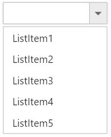
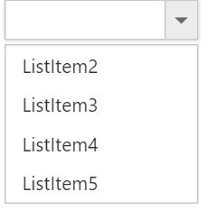

# How To

## Set focus to control initially?

[Access key](https://en.wikipedia.org/wiki/Access_key) property can be added in input element to set focus. Here focus is set by using access key + "j".



     <input type="text" id="dropdown1" />
     




        $(function () {
            var items = [
              { text: "ListItem 1", value: "item1" },
	          { text: "ListItem 2", value: "item2" },
		      { text: "ListItem 3", value: "item3" },
		      { text: "ListItem 4", value: "item4" },
		      { text: "ListItem 5", value: "item5" }
            ];
            $('#dropdown1').ejDropDownList({
                dataSource: items,
                fields: { text: "text", value: "value" }
            });
        //Control focus key
        $(document).on("keydown", function (e) {
            if (e.altKey && e.keyCode === 74) { // j- key code.
                $("#dropdown1_wrapper").focus();
            }
          });
       });
 


## Clear the text of DropDownList input?

To clear the text of the DropDownList input, you can use [clearText](http://help.syncfusion.com/js/api/ejdropdownlist#methods:cleartext) method.

## Add an item dynamically to the DropDownList?

You can use [addItem](http://help.syncfusion.com/js/api/ejdropdownlist#methods:additem) method to add single or multiple items dynamically to the popup list. You can define all the possible values that is supported by field property such as text, value, id, HTML attributes, selected, image and its associated attributes such as alt, width, and height etc..,

Adding text and value is demonstrated in the below given sample,



     <input type="text" id="dropdown1" />
     




       $(function () {
            var items = [
              { text: "ListItem 1", value: "item1" },
	          { text: "ListItem 2", value: "item2" },
		      { text: "ListItem 3", value: "item3" },
		      { text: "ListItem 4", value: "item4" },
		      { text: "ListItem 5", value: "item5" }
            ];
            $('#dropdown1').ejDropDownList({
                dataSource: items,
                fields: { text: "text", value: "value" }
            });

            $('#dropdown1').ejDropDownList("addItem", { text: "New Text", value: "text1" });

        });



## Disable/ Enable the DropDownList widget?

You can enable or disable the DropDownList widget using "enabled" property or methods. Detailed information is given [here](customization#enabledisable-the-widget).

## Control the popup visibility via methods in script showPopup ()/hidePopup ()?

By default popup list is shown on DropDownList button click but you can display the list initially by enabling the [showPopupOnLoad](http://help.syncfusion.com/js/api/ejdropdownlist#members:showpopuponload) property. You can also use [showPopup ()](http://help.syncfusion.com/js/api/ejdropdownlist#methods:showpopup) or [hidePopup ()](http://help.syncfusion.com/js/api/ejdropdownlist#methods:hidepopup) methods at run time to display or hide the popup list.

## Retrieve the selected item data from select event via arguments?

Bind the select event and you can retrieve the value from args.value. 



     <input type="text" id="dropdown1" />
     




        $(function () {
            var items = [
              { text: "ListItem 1", value: "item1" },
	          { text: "ListItem 2", value: "item2" },
		      { text: "ListItem 3", value: "item3" },
		      { text: "ListItem 4", value: "item4" },
		      { text: "ListItem 5", value: "item5" }
            ];
            $('#dropdown1').ejDropDownList({
                dataSource: items,
                fields: { text: "text", value: "value" },
                select: function (args) {
                    console.log("Value is " + args.value);
                }
            });
        });



The following screenshot will exhibit the select event arguments details,

## Append custom HTML in DropDownList popup outside the scroller part?

Create a custom HTML element and insert it after popup wrapper. Detailed sample is given [here](http://jsplayground.syncfusion.com/ey2mpity)

## Add check all option in popup list?

You can use [headerTemplate](http://help.syncfusion.com/js/api/ejdropdownlist#members:headertemplate) property to add any HTML element. Code snippet to add check all option is given below,



     <input type="text" id="dropdown1" />
	 




        .temp {
            height: 30px;
            display: block;
            padding-left: 13px;
            padding-top: 5px;
            border-bottom: 1px solid #c8c8c8;
        }
        .e-chkbox-wrap .e-text {
            font-size: 14px;
            padding-left: 10px;
        }

     




        $(function () {
            var items = [
              { text: "ListItem 1", value: "item1" },
	          { text: "ListItem 2", value: "item2" },
		      { text: "ListItem 3", value: "item3" },
		      { text: "ListItem 4", value: "item4" },
		      { text: "ListItem 5", value: "item5" }
            ];
            $('#dropdown1').ejDropDownList({
                width: 300,
                dataSource: items,
                fields: { text: "text", value: "value" },
                showCheckbox: true,
                headerTemplate: "
<input id ='check' type='checkbox'  />   
"
            });
            $("#check").ejCheckBox({ text: "Check All", change: "onallChange" });
        });
        function onallChange(args) {
            window.flag = true;
            var obj = $("#dropdown1").ejDropDownList("instance");
            if (args.isChecked) obj.checkAll();
            else obj.uncheckAll();
            window.flag = false;
        }



The following screenshot exhibits the output of the above code,

## To Cascade DropDownLists with different field names
By default cascading is performed based on the Value field, so that it needs to be same with cascaded DropDownList. If you need to cascade 2 DropDownLists with different field names and same values in it, you can achieve it using cascadeQuery and [cascade](http://help.syncfusion.com/js/api/ejdropdownlist#events:cascade "") event. Define the cascade event for the DropDownList from which you need to filter the datasource for the other DropDownList. 
Refer the following code blocks below



    
Group list

    <input id="groupsList" type="text" value="Group A" />
    
Country list

    <input id="countryList" type="text" />



In the cascade event arguments, modify the cascadeQuery which has the filtering query for the cascading DropDownList with your customized query.  So to filter the datasource based on the different field names, pass an ej.Query() which want to execute for cascade DropDownList.

**Javascript**



    $(function () {
            // declaration
            var groups = [
                { parentId: 'a', text: "Group A" },
                { parentId: 'b', text: "Group B" },
                { parentId: 'c', text: "Group C" },
                { parentId: 'd', text: "Group D" },
                { parentId: 'e', text: "Group E" }
            ];
            //first level child
            var countries = [
                { value: 11, id: 'a', text: "Algeria" },
                { value: 12, id: 'a', text: "Armenia" },
                { value: 15, id: 'b', text: "Denmark" },
                { value: 16, id: 'b', text: "Egypt" },
                { value: 17, id: 'c', text: "Finland" },
                { value: 18, id: 'c', text: "India"},
                { value: 19, id: 'c', text: "Malaysia" },
                { value: 20, id: 'd', text: "New Zealand" },
                { value: 21, id: 'd', text: "Norway" },
                { value: 22, id: 'd', text: "Poland" },
                { value: 23, id: 'e', text: "Romania" },
                { value: 26, id: 'e', text: "Ukraine" }
            ];

            var group = $('#groupsList').ejDropDownList({
                dataSource: groups,
                fields: { value: "parentId", text: "text" },
                cascadeTo: 'countryList',
                text: "Group A",
                cascade: "cascadeEvent",
            }).data("ejDropDownList");
            var country = $('#countryList').ejDropDownList({
                dataSource: countries,
                fields: { value: "value", text: "text" },
            }).data("ejDropDownList");
        });

        function cascadeEvent(args) {
            args.requiresDefaultFilter = false; // restrict the inbuilt mapping for cascading dropdown

            args.cascadeQuery = ej.Query().where("id", "equal", args.cascadeValue); // query to filter value based id 
        }



## To reorder the selected items and assign it to the top of popup list
Consider a DropDownList enabled with Virtual Scrolling, Filter search and Checkbox. This allows you to search through the list items and select multiple items. Selected items will be maintained in the DropDownList textbox but randomly shown in the pop up. 
To arrange the selected items and move it to the top of popup list, we need to get the sorted list of selected items and add it to the existing popup list items from popup close event. 
Initialize a DropDownList control with allowVirtualScrolling, enableFilterSearch and showCheckbox. 


    
    <input type="text" id="dropdown1" />
    


**Javascript**



    var BikeList = [
       { bkid: "bk1", text: "Apache RTR" }, { bkid: "bk2", text: "CBR 150-R" }, { bkid: "bk3", text: "CBZ Xtreme" }, { bkid: "bk4", text: "Discover" }, { bkid: "bk5", text: "Dazzler" }, { bkid: "bk6", text: "Flame" }, { bkid: "bk7", text: "Fazzer" }, { bkid: "bk8", text: "FZ-S" }, { bkid: "bk9", text: "Pulsar" }, { bkid: "bk10", text: "Shine" }, { bkid: "bk11", text: "R15" }, { bkid: "bk12", text: "Unicorn" }, { bkid: "bk14", text: "Kawasaki Ninja" }, { bkid: "bk15", text: "Ducati Streetfighter" }, { bkid: "bk16", text: "Aprilia TUONO" } ];   
            $(function () {
                obj = $("#dropdown1").ejDropDownList({
                    fields: { id: "bkid", text: "text", value: "text" },
                    dataSource: BikeList,
                    enableFilterSearch: true,
                    allowVirtualScrolling: true,
                    virtualScrollMode:"continuous",
                    itemsCount: 10,
                    showCheckbox: true,
                    popupHide: "onpopupclose",
                    popupHeight: "200px",
                    width: "250px",
                }).data("ejDropDownList");
                obj._updateSelectedIndexByValue = function () { }
            });



In the popupHide event, get the DropDownList control object and reorder the selected items.



    function onpopupclose(args) {
        //Followed below steps to reorder the selecteditem at top of the list
        var obj = $("#dropdown1").data("ejDropDownList");
        var items = obj.model.selectedItems.slice(0); // get the selected items
        items.sort(function (a, b) { return a - b; }); // numeric sorting for selected indices
        reorder(obj, items);
    }

    function reorder(obj, items) {
        var selectedLi = [], selectedData = [], newSelectedIndex = [], count = 0;
        var totalLi = obj.ultag.children("li"); // get the existing list items
        var totalData = obj.getListData(); // get the existing list items
        for (var m = 0; m <items.length; m++) {                   
            newSelectedIndex.push(m); // store the selected items to an array
            if(items[m] !=m)
                $(obj.ultag.children("li")[items[m]]).insertBefore(obj.ultag.children("li").eq(m)); // insert it to the ul li available in DropDownList
        }
        for (var n = items.length - 1; n >= 0; n--) {
            selectedData.push(totalData[items[n]]);
            totalData.splice(items[n], 1);  // generate new data excluding the previously selected items              
        }
        selectedData.reverse();                        
        obj._listItem(selectedData.concat(totalData)); // combine the new data and existing dataSource with excluded items
        obj.uncheckAll();
        obj.option("selectedIndices", newSelectedIndex);   // reset the select indices value since they are reorder to top            
    }



## To enable filter search for virtual items that are not visible on the page when virtualScrollMode is continuous
By default when virtualScrolling is enabled, filterSearch will work only for the elements available at that moment. To enable searching for the complete datasource bound to DropDownList, we need to manually configure the search query and corresponding changes for it. 
Initialize a DropDownList control with allowVirtualScrolling, enableFilterSearch and showCheckbox. 


   
    var query1 = ej.Query().select("ContactName");
    var dm = ej.DataManager({ "url": "http://mvc.syncfusion.com/services/Northwnd.svc/Customers" });
    var selectedItemsOnSearch = [];

    $(function () {
        window.dropObj = $("#databind_remote").ejDropDownList({
            dataSource: dm,
            query: query1,
            fields: { "text": "ContactName", "value": "ContactName" },
            enableFilterSearch: true,
            allowVirtualScrolling: true,
            virtualScrollMode: "continuous",
            itemsCount: 10,
            showCheckbox: true,
            popupHide: "onpopupclose",
            popupHeight: "200px",
            width: "250px",
            search: "onSearch",
            actionBegin: "onBegin",
            change: "onChange",
            create: "onCreate"
        }).data("ejDropDownList");

    });
    


Now override the addItem method which will be redefined based on this scenario to avoid adding duplicate data on virtualScrolling and empty the _updateSelectedIndexByValue prototype method.


    
    function onCreate(args) {
        window.dropObj = this;
        window.dropObj._updateSelectedIndexByValue = function () { }
        window.dropObj.addItemMethod = window.dropObj.addItem;
        window.dropObj.addItem = function (list) {
            appendList(this, list);
        }
    }
    /*
    In this method, we just override the functionalities of inbuilt addItem method to avoid the duplicate from remote to get append into ultag. 
    */
    function appendList(proxy, selectedList) {
        var alreadyPushed = false;
        if (selectedList.length) {
            for (var i = 0; i < selectedList.length; i++) {
                for (var j = 0; j < proxy._rawList.length; j++) {
                    if (proxy._rawList[j][proxy.model.fields.value] === selectedList[i][proxy.model.fields.value]) {
                        alreadyPushed = true;
                        break;
                    }
                }
                if (!alreadyPushed) {
                    window.dropObj.addItemMethod(selectedList[i]);
                }
                alreadyPushed = false;
            }
        }
    }
    


In the begin event for loading data items from remote source, modify the query for fetching data based on the search string. Also when items fetched from remote service append it to a temporary list instead of main popup list



    function onBegin(args) {
        var proxy = this;
        if (proxy.inputSearch && proxy.inputSearch.val() != "") {
            args.cancel = true;
            var skipQuery = proxy._addSearchQuery(ej.Query(), !proxy._isPlainType(proxy._rawList)).skip(proxy._getLi().length).clone();
            queryPromise = proxy.model.dataSource.executeQuery(skipQuery);
            queryPromise.done(function (e) {
                dynamicItems(proxy, e.result);
            }).fail(function () {
                console.log("failure triggered")
            }).always(function (e) {
                proxy._removeLoadingClass();
            });
        }
    }
    /*
    In this method, appending the items directly to ultag of popuplist items dynamcially when searching and do virtual scrolling. 
    */
    function dynamicItems(proxy, itemTag) {

        if (!itemTag) return false;
        proxy._mapFields();
        var list = $.isArray(itemTag) ? itemTag : [itemTag];
        if (list.length < 1) return false;
        proxy._generateLi(list, proxy.mapFld);
        proxy.ultag.append(proxy.dummyUl);               
        if (proxy.model.showCheckbox) {
            proxy._appendCheckbox(proxy.dummyUl);
        }
        if (proxy._isPopupShown()) {
            var scrollerPosition = proxy.scrollerObj ? proxy.scrollerObj.scrollTop() : 0;
            proxy._refreshScroller();
            if (proxy.scrollerObj) proxy.scrollerObj.option("scrollTop", scrollerPosition);
        }
    }



When performing search, define the event to change the query string for filtering data from remote service based on the search string. Also maintain selected items so that when you empty the search text box selected items will be appended to the popup list.


    
    /*
    In search event, we just filter out the querystring according the search string from remote and append it to popuplist items. 
    Maintaining the selected items on searching in selectedItemOnSelect varible and append those items once search input have empty string. 
    */

    function onSearch(args) {
        window.search = args;
        if (!window.searchFlag) {
            window.searchFlag = true;
            window.processSearchString = args.searchString;
            var proxy = window.dropObj;
            if (args.searchQuery && proxy.inputSearch.val() !== "") {
                var searchQuery = args.searchQuery.clone();
                var queryPromise = proxy.model.dataSource.executeQuery(searchQuery);
                queryPromise.done(function (e) {
                    if (window.processSearchString == window.search.searchString) {
                        proxy._filterSearch(args.searchQuery, e);
                        console.log("added");
                    }
                    else {
                        window.searchFlag = false;
                        console.log("recursive called");
                        onSearch(window.search);
                    }
                }).fail(function () {
                    console.log("fail triggered");
                }).always(function () {
                    window.searchFlag = false;
                });
                args.cancel = true;
            }
            else if (selectedItemsOnSearch.length > 0) {
                appendList(proxy, selectedItemsOnSearch);
                selectedItemsOnSearch = [];
                window.searchFlag = false;
            }
            else {
                window.searchFlag = false;
                args.cancel = true;
            }
        }
        else {
            console.log("continuous search have restricted");
        }
    }



Finally define change event to maintain the selected items on search



    function onChange(args) {
        var proxy = this;
        if (proxy.inputSearch && proxy.inputSearch.val() != "") {
            var item = {}, alreadyAdded = false;
            item[proxy.model.fields.value] = args.selectedValue;
            item[proxy.model.fields.text] = args.selectedText;
            if (args.isChecked) {
                for (var i = 0; i < selectedItemsOnSearch.length; i++) {
                    if (selectedItemsOnSearch[i].value == args.value) {
                        alreadyAdded = true;
                    }
                }
                if (!alreadyAdded) selectedItemsOnSearch.push(item);
            }
            else {
                for (var i = 0; i < selectedItemsOnSearch.length; i++) {
                    if (selectedItemsOnSearch[i].value == args.value) {
                        selectedItemsOnSearch.splice(i, 1);
                    }
                }
            }
        }
        else if (selectedItemsOnSearch.length > 0) {
            appendList(proxy, selectedItemsOnSearch);
            selectedItemsOnSearch = [];
        }
    }
    


## To remove the items from DropDownList?

You can remove the items from the DropDownList  by using [splice](http://www.tutorialspoint.com/javascript/array_splice.htm#) method and then rebind the data source through set model. 
Removing an entry from DropdownList is demonstrated in the below given sample.


<input id="dropdown1" /> <button id="remove">Remove items</button>
    
   



  $(document).ready(function () {
            var data = [
              { text: "ListItem1", value: "item1" },
              { text: "ListItem2", value: "item2" },
              { text: "ListItem3", value: "item3" },
              { text: "ListItem4", value: "item4" },
              { text: "ListItem5", value: "item5" }
            ];
            // create DropDownList from input HTML element
            $("#dropdown1").ejDropDownList({
                dataSource: data
            });
            $("#remove").click(function () {
                ddl = $("#dropdown1").data("ejDropDownList");
                data1 = ddl.model.dataSource.splice(0);
                data1.splice(0, 1);
                ddl.setModel({ dataSource: data1 });
            });
        });
  
The following screenshot exhibits the output of above code:

Before removing an item:

After removing an item:
