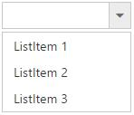
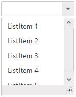
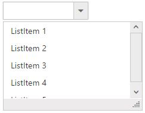

# Setting dimensions 

## Widget Sizing

### Fixed Size DropDownList widget

You can customize the widget dimensions using [width](https://help.syncfusion.com/api/js/ejdropdownlist#members:width) and [height](https://help.syncfusion.com/api/js/ejdropdownlist#members:height) properties. Fixed size values can be specified in pixel or percentage values. By default the DropDownList wrapper will be assigned with "143px" width and "30px" height.

### Fixed size popup list

You can customize the popup list dimensions using [popupWidth](https://help.syncfusion.com/api/js/ejdropdownlist#members:popupwidth) and [popupHeight](https://help.syncfusion.com/api/js/ejdropdownlist#members:popupheight) properties. Fixed size values can be specified in pixel or percentage values. By default popup width is auto and popup height is "152px". 

### Auto Sizing

DropDownList is adaptive to mobile and web layout such that it is adjustable with screen resolution. The textbox will be rendered based on its parent containers dimensions on assigning 100% values to the width property. Default value for popupWidth is auto, so when you assign 100% to popupWidth then it will be rendered based on specified range.

### Limit the number of items

You can use [itemsCount](https://help.syncfusion.com/api/js/ejdropdownlist#members:itemscount) property to fetch only the specific number of items from the data source. To fetch the remaining items you can enable [virtual scrolling](databinding#virtual-scrolling) support which loads the data on scrolling the data items in popup list. 

N> By default popup list is shown on DropDownList button click but you can display the list initially by enabling the [showPopupOnLoad](https://help.syncfusion.com/api/js/ejdropdownlist#members:showpopuponload) property. You can also use [showPopup ()](https://help.syncfusion.com/api/js/ejdropdownlist#methods:showpopup) or [hidePopup ()](https://help.syncfusion.com/api/js/ejdropdownlist#methods:hidepopup) methods at run time to display or hide the popup list.



     <input type="text" id="dropdown1" />
     




    $(function() {
        var items = [{
            text: "ListItem 1",
            value: "item1"
        }, {
            text: "ListItem 2",
            value: "item2"
        }, {
            text: "ListItem 3",
            value: "item3"
        }, {
            text: "ListItem 4",
            value: "item4"
        }, {
            text: "ListItem 5",
            value: "item5"
        }];
        
        $('#dropdown1').ejDropDownList({
            dataSource: items,
            fields: {
                text: "text",
                value: "value"
            },
            itemsCount: 3,
            showPopupOnLoad: true
        });
    });



## Popup resizing 

To show a resize handle in the popup list, use [enablePopupResize](https://help.syncfusion.com/api/js/ejdropdownlist#members:enablepopupresize) property. You can customize the resize functionality by setting dimensions to the following properties.

<table>
    <tr>
        <td>
            {{'[minPopupWidth](https://help.syncfusion.com/api/js/ejdropdownlist#members:minpopupwidth)'| markdownify }}
             
        </td>
        <td>
            Default value is 0, once set you cannot resize below to the specified width
             
        </td>
    </tr>
    <tr>
        <td>
            {{'[maxPopupWidth](https://help.syncfusion.com/api/js/ejdropdownlist#members:maxpopupwidth)'| markdownify }}
             
        </td>
        <td>
            Default value is null, once set you cannot extend beyond to the specified width
             
        </td>
    </tr>
    <tr>
        <td>
            {{'[minPopupHeight](https://help.syncfusion.com/api/js/ejdropdownlist#members:minpopupheight)'| markdownify }}
             
        </td>
        <td>
            Default value is 0, once set you cannot resize below to the specified height
             
        </td>
    </tr>
    <tr>
        <td>
            {{'[maxPopupHeight](https://help.syncfusion.com/api/js/ejdropdownlist#members:maxpopupheight)'| markdownify }}
             
        </td>
        <td>
            Default value is null, once set you cannot extend beyond to the specified height
             
        </td>
    </tr>
</table>



     <input type="text" id="dropdown1" />
     



	
    $(function() {
        var items = [{
            text: "ListItem 1",
            value: "item1"
        }, {
            text: "ListItem 2",
            value: "item2"
        }, {
            text: "ListItem 3",
            value: "item3"
        }, {
            text: "ListItem 4",
            value: "item4"
        }, {
            text: "ListItem 5",
            value: "item5"
        }];
        $('#dropdown1').ejDropDownList({
            dataSource: items,
            fields: {
                text: "text",
                value: "value"
            },
            enablePopupResize: true,
            minPopupWidth: 150,
            minPopupHeight: 150,
            maxPopupWidth: 550,
            maxPopupHeight: 550,
        });
    });



