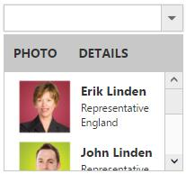

# Template Support

By default you can add any text or image to the DropDownList list item. To customize the items layout or to create your own visualized elements you can use this template support.

## Header Template

You can create the popup header by using [headerTemplate](https://help.syncfusion.com/api/js/ejdropdownlist#members:headertemplate) property. You can add any HTML content in header template.

N> Refer the check all option in popup list : [link](https://help.syncfusion.com/js/dropdownlist/howto#add-check-all-option-in-popup-list)

## Template Field

Create a set of div containers with common syntax or elements and assign it to the [template](https://help.syncfusion.com/api/js/ejdropdownlist#members:template) property. You can add any HTML mark-up element inside the DropDownList list using this property.

In the demo, a JSON array is created with text, imgId, role and country which is initialized with dataSource property. Content template is created by using the corresponding fields and assigned in template property. The content template is customized with images and custom CSS styles to visualize the items in popup.



     <input type="text" id="dropdown1" />	 
	 



	
    .imgId {
        margin: 0;
        padding: 3px 10px 3px 3px;
        border: 0 none;
        width: 60px;
        height: 60px;
        float: left;
    }
    
    .e-header {
        font-weight: bold;
        border-bottom: 1px solid #c8c8c8;
        background: #c8c8c8;
    }
    
    .e-header > span {
        display: inline-block;
        padding: 10px;
    }
    
    .ename {
        font-weight: bold;
        padding: 6px 3px 1px 3px;
    }
    
    .role, .cont {
        font-size: smaller;
        padding: 3px 3px -1px 0px;
    }
	
	 



    
    var List = [{
        text: "Erik Linden",
        imgId: "3",
        role: "Representative",
        country: "England"
    }, {
        text: "John Linden",
        imgId: "6",
        role: "Representative",
        country: "Norway"
    }, {
        text: "Louis",
        imgId: "7",
        role: "Representative",
        country: "Australia"
    }, {
        text: "Lawrence",
        imgId: "8",
        role: "Representative",
        country: "India"
    }];
    $(function() {
        $('#dropdown1').ejDropDownList({
            width: 200,
            dataSource: List,
            headerTemplate: "
PHOTO DETAILS
",
            template: '
' + '
 ${text} 

 ${role} 

 ${country} 

'
        });
    });
	



N> Images for this sample are available in (installed location)\Syncfusion\Essential Studio\{{ site.releaseversion }}\JavaScript\samples\web\themes\images 

N> Showing custom selected valued in the input field of DropDownList : [link](https://help.syncfusion.com/js/dropdownlist/howto)

