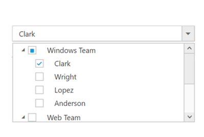

# Checkbox

DropDownTree displays checkboxes to the left of each item when you set [treeViewSettings.showCheckBox](https://help.syncfusion.com/api/js/ejdropdowntree#members:treeViewSettings) property to true. It allows you to select more than one item at a time from the DropDownTree. Popup list stays open until selection is complete. Click on an item’s text or checkbox to change the checkbox’s checked status.



    <input type="text" id="itemList" />
     




var localData = [{
         id: 1,
         name: "Windows Team",
         hasChild: true,
         expanded: true
     },
     {
         id: 2,
         pid: 1,
         name: "Clark"
     },
     {
         id: 3,
         pid: 1,
         name: "Wright"
     },
     {
         id: 4,
         pid: 1,
         name: "Lopez"
     },
     {
         id: 6,
         pid: 1,
         name: "Anderson"
     },
     {
         id: 7,
         name: "Web Team",
         hasChild: true,
         expanded: true
     },
     {
         id: 8,
         pid: 7,
         name: "Joshua"
     },
     {
         id: 9,
         pid: 7,
         name: "Matthew"
     },
     {
         id: 10,
         pid: 7,
         name: "David"
     },
     {
         id: 11,
         name: "Build Team",
         hasChild: true
     },
     {
         id: 12,
         pid: 11,
         name: "Ryan"
     },
     {
         id: 13,
         pid: 11,
         name: "Justin"
     },
     {
         id: 14,
         pid: 11,
         name: "Robert"
     },
     {
         id: 15,
         pid: 11,
         name: "Johnson"
     },
     {
         id: 16,
         name: "WPF Team",
         hasChild: true
     },
     {
         id: 17,
         pid: 16,
         name: "Rock"
     },
     {
         id: 18,
         pid: 16,
         name: "Gospel"
     },
     {
         id: 19,
         pid: 16,
         name: "Brown"
     },
     {
         id: 20,
         pid: 16,
         name: "Miller"
     }
 ];
 $(function() {
     $('#itemList').ejDropDownTree({
         treeViewSettings: {
             showCheckbox: true,
             fields: {
                 id: "id",
                 parentId: "pid",
                 value: "id",
                 text: "name",
                 hasChild: "hasChild",
                 dataSource: localData,
                 expanded: "expanded"
             }
         },
         watermarkText: "Please select",
         width: "100%"
     });
 });


N> If you want to showcase the DropDownTree with default checked items on data binding, use `checkedNodes` in the `treeViewSettings` property.

## Check/Uncheck All

You can check/uncheck all the list items at run time by using [checkAll](https://help.syncfusion.com/api/js/ejdropdowntree#methods:checkall) and [uncheckAll](https://help.syncfusion.com/api/js/ejdropdowntree#methods:uncheckall) methods. By default, no item will be in checked state.  



     <input type="text" id="itemList" />
     <input type="checkbox" id="toggle" />




  
var localData = [{
         id: 1,
         name: "Windows Team",
         hasChild: true,
         expanded: true
     },
     {
         id: 2,
         pid: 1,
         name: "Clark"
     },
     {
         id: 3,
         pid: 1,
         name: "Wright"
     },
     {
         id: 4,
         pid: 1,
         name: "Lopez"
     },
     {
         id: 6,
         pid: 1,
         name: "Anderson"
     },
     {
         id: 7,
         name: "Web Team",
         hasChild: true,
         expanded: true
     },
     {
         id: 8,
         pid: 7,
         name: "Joshua"
     },
     {
         id: 9,
         pid: 7,
         name: "Matthew"
     },
     {
         id: 10,
         pid: 7,
         name: "David"
     },
     {
         id: 11,
         name: "Build Team",
         hasChild: true
     },
     {
         id: 12,
         pid: 11,
         name: "Ryan"
     },
     {
         id: 13,
         pid: 11,
         name: "Justin"
     },
     {
         id: 14,
         pid: 11,
         name: "Robert"
     },
     {
         id: 15,
         pid: 11,
         name: "Johnson"
     },
     {
         id: 16,
         name: "WPF Team",
         hasChild: true
     },
     {
         id: 17,
         pid: 16,
         name: "Rock"
     },
     {
         id: 18,
         pid: 16,
         name: "Gospel"
     },
     {
         id: 19,
         pid: 16,
         name: "Brown"
     },
     {
         id: 20,
         pid: 16,
         name: "Miller"
     }
 ];
 $(function() {
     $('#itemList').ejDropDownTree({
         treeViewSettings: {
             showCheckbox: true,
             fields: {
                 id: "id",
                 parentId: "pid",
                 value: "id",
                 text: "name",
                 hasChild: "hasChild",
                 dataSource: localData,
                 expanded: "expanded"
             }
         },
         watermarkText: "Please select",
         width: "100%",

     });

     target = $('#itemList').data("ejDropDownTree");

     $("#toggle").ejToggleButton({
         "change": "onCheckUncheckAll",
         "defaultText": "Check All",
         "activeText": "Uncheck All"
     });
 });

 function onCheckUncheckAll(args) {
     if (args.isChecked) target.treeView.checkAll();
     else target.treeView.unCheckAll();
 }


## checkNode/uncheckNode
You can check/uncheck a particular node at run time by using [checkNode](https://help.syncfusion.com/api/js/ejdropdowntree#methods:checkNode) and [uncheckNode](https://help.syncfusion.com/api/js/ejdropdowntree#methods:uncheckNode) methods. By default, no item will be in checked state. 



     <input type="text" id="itemList" />
     <input type="checkbox" id="toggle" />
     



  
var localData = [{
        id: 1,
        name: "Windows Team",
        hasChild: true,
        expanded: true
    },
    {
        id: 2,
        pid: 1,
        name: "Clark"
    },
    {
        id: 3,
        pid: 1,
        name: "Wright"
    },
    {
        id: 4,
        pid: 1,
        name: "Lopez"
    },
    {
        id: 6,
        pid: 1,
        name: "Anderson"
    },
    {
        id: 7,
        name: "Web Team",
        hasChild: true,
        expanded: true
    },
    {
        id: 8,
        pid: 7,
        name: "Joshua"
    },
    {
        id: 9,
        pid: 7,
        name: "Matthew"
    },
    {
        id: 10,
        pid: 7,
        name: "David"
    },
    {
        id: 11,
        name: "Build Team",
        hasChild: true
    },
    {
        id: 12,
        pid: 11,
        name: "Ryan"
    },
    {
        id: 13,
        pid: 11,
        name: "Justin"
    },
    {
        id: 14,
        pid: 11,
        name: "Robert"
    },
    {
        id: 15,
        pid: 11,
        name: "Johnson"
    },
    {
        id: 16,
        name: "WPF Team",
        hasChild: true
    },
    {
        id: 17,
        pid: 16,
        name: "Rock"
    },
    {
        id: 18,
        pid: 16,
        name: "Gospel"
    },
    {
        id: 19,
        pid: 16,
        name: "Brown"
    },
    {
        id: 20,
        pid: 16,
        name: "Miller"
    }
];
$(function() {
    $('#itemList').ejDropDownTree({
        treeViewSettings: {
            showCheckbox: true,
            fields: {
                id: "id",
                parentId: "pid",
                value: "id",
                text: "name",
                hasChild: "hasChild",
                dataSource: localData,
                expanded: "expanded"
            }
        },
        watermarkText: "Please select",
        width: "100%",

    });

    $("#toggle").ejToggleButton({
        "change": "onCheckUncheckAll",
        "defaultText": "Check Node",
        "activeText": "Uncheck Node"
    });
});

function onCheckUncheckAll(args) {
    var ddTreeObj = $('#itemList').data("ejDropDownTree");
    if (args.isChecked) ddTreeObj.checkNode($("#1"));
    else ddTreeObj.uncheckNode($("#1"));
}
    


