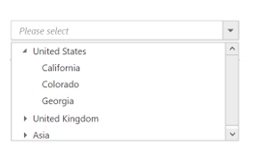

# Getting Started with JavaScript DropDownTree

The external script dependencies of the DropDownTree widget are,

* [jQuery 1.7.1](http://jquery.com/) and later versions.

And the internal script dependencies of the DropDownTree widget are:

<table>
	<tr>
		<th>File </th>
		<th>Description / Usage </th>
	</tr>
	<tr>
		<td>ej.core.min.js</td>
		<td>Must be referred always before using all the JS controls.</td>
	</tr>
	<tr>
		<td>ej.data.min.js</td>
		<td>Used to handle data operation and should be used while binding data to JS controls.</td>
	</tr>
	<tr>
		<td>ej.treeview.min.js</td>
		<td>The DropDownTree’s popup main file</td>
	</tr>
	<tr>
		<td>ej.dropdowntree.min.js</td>
		<td>The DropDownTree’s main file</td>
	</tr>
	<tr>
		<td>ej.checkbox.min.js</td>
		<td>Should be referred when using checkbox functionalities in DropDownTree.</td>
	</tr>
	<tr>
		<td>ej.scroller.min.js</td>
		<td>Should be referred when using scrolling in DropDownTree.</td>
	</tr>
	<tr>
		<td>ej.draggable.min.js</td>
		<td>Should be referred when using popup resize functionality in DropDownTree.</td>
	</tr>
    <tr>
		<td>ej.waitingpopup.min.js</td>
		<td>Should be referred when using load on demand in TreeView.</td>
	</tr>
	<tr>
		<td>ej.globalize.min.js</td>
		<td>Should be referred for localization in DropDownTree.</td>
	</tr>
</table>

To get started, you can use the ‘ej.web.all.min.js’ file, which encapsulates all the 'ej' controls and frameworks in one single file.
For themes, you can use the ‘ej.web.all.min.css’ CDN link from the snippet given. To add themes to your application, please refer to [this link](https://help.syncfusion.com/js/theming-in-essential-javascript-components#adding-specific-theme-to-your-application).

## Preparing HTML document

Create a new HTML file and add [CDN](https://help.syncfusion.com/js/cdn) links to the [JavaScript](https://help.syncfusion.com/js/dependencies) and [CSS](https://help.syncfusion.com/js/theming-in-essential-javascript-components) dependencies to your project.



<!DOCTYPE html>
<html>
  <head>
    <meta name="viewport" content="width=device-width, initial-scale=1.0" charset="utf-8" />
    <!-- style sheet for default theme(flat azure) -->
    <link href="http://cdn.syncfusion.com/{{ site.releaseversion }}/js/web/flat-azure/ej.web.all.min.css"
      rel="stylesheet" />
    <!--scripts-->
    
    
    
  </head>
  <body>
    <!--Place input element to create DropDownTree-->
    
  </body>
</html>



 N>   In production,  using Syncfusion [custom script generator](https://help.syncfusion.com/js/custom-script-generator#) is highly recommended to create custom script file with the required controls and its dependencies only. To reduce the file size further, use [GZip compression](https://developers.google.com/web/fundamentals/performance/optimizing-content-efficiency/optimize-encoding-and-transfer?hl=en#text-compression-with-gzip) in your server.

 ## Creating DropDownTree

The DropDownTree can be created from a HTML ‘input’ element with the HTML 'id' attribute and 'ul','li' elements for hierarchical data. To create the DropDownTree, you should call the 'ejDropDownTree' jQuery plug-in function.

    
	
<input type="text" id="selectItem" />

  <ul id="treeView">
    <li class="expanded">
      United States
      <ul>
        <li>California</li>
        <li>Colorado</li>
        <li>Georgia</li>
      </ul>
    </li>
    <li>
      United Kingdom
      <ul>
        <li>England</li>
        <li>Scotland</li>
        <li>Northern Ireland</li>
      </ul>
    </li>
    <li>
      Asia
      <ul>
        <li>Afghanistan</li>
        <li>Kuwait</li>
        <li>Russia</li>
      </ul>
    </li>
  </ul>

	
	
		
	
$(function () {
$('#selectItem').ejDropDownTree();
});

	

## Populating data

The DropDownTree can be bound to both local array and remote data services using [ej.DataManager](https://help.syncfusion.com/js/datamanager/overview). You can use [DataManager](https://help.syncfusion.com/js/datamanager/overview) component to serve data from the data services based on the query provided. To bind data to DropDownTree widget, the [treeViewSettings.fields.dataSource](https://help.syncfusion.com/api/js/ejdropdowntree#members:treeViewSettings) property should be assigned with the instance of 'ej.DataManager'.

N> The ODataAdaptor is the default adaptor for DataManager. On binding to other web services, proper [data adaptor](https://help.syncfusion.com/js/datamanager/data-adaptors) should  be set on 'adaptor' option of the DataManager. 

	

	<input type="text" id="dropdown1" />
	
	
	
		
	
	$(function() {
	    // declaration
	    var localData = [{
	            id: 1,
	            name: "Discover Music",
	            hasChild: true,
	            expanded: true
	        },
	        {
	            id: 2,
	            pid: 1,
	            name: "Hot Singles"
	        },
	        {
	            id: 3,
	            pid: 1,
	            name: "Rising Artists"
	        },
	        {
	            id: 4,
	            pid: 1,
	            name: "Live Music"
	        },
	        {
	            id: 6,
	            pid: 1,
	            name: "Best of 2013 So Far"
	        },
	        {
	            id: 7,
	            name: "Sales and Events",
	            hasChild: true,
	            expanded: true
	        },
	        {
	            id: 8,
	            pid: 7,
	            name: "100 Albums - $5 Each"
	        },
	        {
	            id: 9,
	            pid: 7,
	            name: "Hip-Hop and R&B Sale"
	        },
	        {
	            id: 10,
	            pid: 7,
	            name: "CD Deals"
	        },
	        {
	            id: 11,
	            name: "Categories",
	            hasChild: true
	        },
	        {
	            id: 12,
	            pid: 11,
	            name: "Songs"
	        },
	        {
	            id: 13,
	            pid: 11,
	            name: "Bestselling Albums"
	        },
	        {
	            id: 14,
	            pid: 11,
	            name: "New Releases"
	        },
	        {
	            id: 15,
	            pid: 11,
	            name: "Bestselling Songs"
	        },
	        {
	            id: 16,
	            name: "MP3 Albums",
	            hasChild: true
	        },
	        {
	            id: 17,
	            pid: 16,
	            name: "Rock"
	        },
	        {
	            id: 18,
	            pid: 16,
	            name: "Gospel"
	        },
	        {
	            id: 19,
	            pid: 16,
	            name: "Latin Music"
	        },
	        {
	            id: 20,
	            pid: 16,
	            name: "Jazz"
	        },
	        {
	            id: 21,
	            name: "More in Music",
	            hasChild: true
	        },
	        {
	            id: 22,
	            pid: 21,
	            name: "Music Trade-In"
	        },
	        {
	            id: 23,
	            pid: 21,
	            name: "Redeem a Gift Card"
	        },
	        {
	            id: 24,
	            pid: 21,
	            name: "Band T-Shirts"
	        },
	        {
	            id: 25,
	            pid: 21,
	            name: "Mobile MVC"
	        }
	    ];
	    $('#localList').ejDropDownTree({
	        treeViewSettings: {
	            fields: {
	                id: "id",
	                parentId: "pid",
	                text: "name",
	                hasChild: "hasChild",
	                dataSource: ej.DataManager(localData),
	                expanded: "expanded"
	            }
	        },
	        watermarkText: "Please select",
	        width: "100%"
	    });
	});

	
	

## Setting Dimensions

The DropDownTree dimensions can be set using [width](https://help.syncfusion.com/api/js/ejdropdowntree#members:width) and [height](https://help.syncfusion.com/api/js/ejdropdowntree#members:height) APIs.
	
	
	
	<input type="text" id="dropdown1" />
	
	
	
		
    $(function() {
	    $('#dropdown1').ejDropDownTree({
	        width: “150 px”,
	        height: "160px"
	    });
	});
	

**Setting dimensions to Popup list**

[PopupSettings.width](https://help.syncfusion.com/api/js/ejdropdowntree#members:popupSettings-width) and [PopupSettings.height](https://help.syncfusion.com/api/js/ejdropdowntree#members:popupSettings-height) can be used to create a fixed size popup list.

	

	<input type="text" id="localList" />

	
	
	
	
$(function() {
    // declaration
    var localData = [{
            id: 1,
            name: "Discover Music",
            hasChild: true,
            expanded: true
        },
        {
            id: 2,
            pid: 1,
            name: "Hot Singles"
        },
        {
            id: 3,
            pid: 1,
            name: "Rising Artists"
        },
        {
            id: 4,
            pid: 1,
            name: "Live Music"
        },
        {
            id: 6,
            pid: 1,
            name: "Best of 2013 So Far"
        },
        {
            id: 7,
            name: "Sales and Events",
            hasChild: true,
            expanded: true
        },
        {
            id: 8,
            pid: 7,
            name: "100 Albums - $5 Each"
        },
        {
            id: 9,
            pid: 7,
            name: "Hip-Hop and R&B Sale"
        },
        {
            id: 10,
            pid: 7,
            name: "CD Deals"
        },
        {
            id: 11,
            name: "Categories",
            hasChild: true
        },
        {
            id: 12,
            pid: 11,
            name: "Songs"
        },
        {
            id: 13,
            pid: 11,
            name: "Bestselling Albums"
        },
        {
            id: 14,
            pid: 11,
            name: "New Releases"
        },
        {
            id: 15,
            pid: 11,
            name: "Bestselling Songs"
        },
        {
            id: 16,
            name: "MP3 Albums",
            hasChild: true
        },
        {
            id: 17,
            pid: 16,
            name: "Rock"
        },
        {
            id: 18,
            pid: 16,
            name: "Gospel"
        },
        {
            id: 19,
            pid: 16,
            name: "Latin Music"
        },
        {
            id: 20,
            pid: 16,
            name: "Jazz"
        },
        {
            id: 21,
            name: "More in Music",
            hasChild: true
        },
        {
            id: 22,
            pid: 21,
            name: "Music Trade-In"
        },
        {
            id: 23,
            pid: 21,
            name: "Redeem a Gift Card"
        },
        {
            id: 24,
            pid: 21,
            name: "Band T-Shirts"
        },
        {
            id: 25,
            pid: 21,
            name: "Mobile MVC"
        }
    ];
    $('#localList').ejDropDownTree({
        treeViewSettings: {
            fields: {
                id: "id",
                parentId: "pid",
                text: "name",
                hasChild: "hasChild",
                dataSource: localData,
                expanded: "expanded"
            }
        },
        watermarkText: "Please select",
        popupSettings: {
            height: "500px",
            width: "300px"
        }
    });
});
	
	

## Setting and Getting Value

You can select single or multiple values from the DropDownTree widget. To assign a value initially to the DropDownTree, you can use the [value](https://help.syncfusion.com/api/js/ejdropdowntree#members:value) property.

	

<input type="text" id="selectItem" />

  <ul id="treeView">
    <li class="expanded">
      United States
      <ul>
        <li>California</li>
        <li>Colorado</li>
        <li>Georgia</li>
      </ul>
    </li>
    <li>
      United Kingdom
      <ul>
        <li>England</li>
        <li>Scotland</li>
        <li>Northern Ireland</li>
      </ul>
    </li>
    <li>
      Asia
      <ul>
        <li>Afghanistan</li>
        <li>Kuwait</li>
        <li>Russia</li>
      </ul>
    </li>
  </ul>

	
	
		
	
$(function() {

    $('#selectItem').ejDropDownTree({
        value: 'Afghanistan',
        watermarkText: "Please select",
        targetId: "itemList"
    });

    var obj = $('#selectItem').data("ejDropDownTree");

    console.log("Selected Item's Text - " + obj.option("text"));

    console.log("selected Item's Value - " + obj.option("value"));

    console.log("selected Item's Value - " + obj.getValue());

});
    

	
