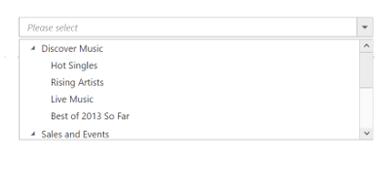

## Local Data

Define a JSON array and initialize the widget with the [treeViewSettings](https://help.syncfusion.com/api/js/ejdropdowntree#members:treeViewSettings) property. Specify the column names in the `fields` property of the `treeViewSettings`.

N> The columns are bounded automatically when the fields are specified with the default names like id, text, etc...



	<input type="text" id="localList" />
    



	
$(function() {

     // declaration

     var localData = [{
             id: 1,
             name: "Discover Music",
             hasChild: true,
             expanded: true
         },
         {
             id: 2,
             pid: 1,
             name: "Hot Singles"
         },
         {
             id: 3,
             pid: 1,
             name: "Rising Artists"
         },
         {
             id: 4,
             pid: 1,
             name: "Live Music"
         },
         {
             id: 6,
             pid: 1,
             name: "Best of 2013 So Far"
         },
         {
             id: 7,
             name: "Sales and Events",
             hasChild: true,
             expanded: true
         },
         {
             id: 8,
             pid: 7,
             name: "100 Albums - $5 Each"
         },
         {
             id: 9,
             pid: 7,
             name: "Hip-Hop and R&B Sale"
         },
         {
             id: 10,
             pid: 7,
             name: "CD Deals"
         },
         {
             id: 11,
             name: "Categories",
             hasChild: true
         },
         {
             id: 12,
             pid: 11,
             name: "Songs"
         },
         {
             id: 13,
             pid: 11,
             name: "Bestselling Albums"
         },
         {
             id: 14,
             pid: 11,
             name: "New Releases"
         },
         {
             id: 15,
             pid: 11,
             name: "Bestselling Songs"
         },
         {
             id: 16,
             name: "MP3 Albums",
             hasChild: true
         },
         {
             id: 17,
             pid: 16,
             name: "Rock"
         },
         {
             id: 18,
             pid: 16,
             name: "Gospel"
         },
         {
             id: 19,
             pid: 16,
             name: "Latin Music"
         },
         {
             id: 20,
             pid: 16,
             name: "Jazz"
         },
         {
             id: 21,
             name: "More in Music",
             hasChild: true
         },
         {
             id: 22,
             pid: 21,
             name: "Music Trade-In"
         },
         {
             id: 23,
             pid: 21,
             name: "Redeem a Gift Card"
         },
         {
             id: 24,
             pid: 21,
             name: "Band T-Shirts"
         },
         {
             id: 25,
             pid: 21,
             name: "Mobile MVC"
         }
     ];

     $('#localList').ejDropDownTree({
         treeViewSettings: {
             fields: {
                 id: "id",
                 parentId: "pid",
                 text: "name",
                 hasChild: "hasChild",
                 dataSource: localData,
                 expanded: "expanded"
             }
         },
         watermarkText: "Please select",
     });
 });


N> Images for this sample are available in (installed location)\Syncfusion\Essential Studio\{{ site.releaseversion }}\JavaScript\samples\web\themes\images 
I> The htmlAttributes and imageAttributes should have JSON type values and samples for spriteCSSClass field available  [here](http://jsplayground.syncfusion.com/Sync_px3jew3i).
	
The JSON array to the `fields` property can also be provided as an instance of the [ej.DataManager](https://help.syncfusion.com/api/js/ejdatamanager). When the JSON array is passed as an instance of [ej.DataManager](https://help.syncfusion.com/api/js/ejdatamanager), the [ej.JsonAdaptor](https://help.syncfusion.com/js/datamanager/data-adaptors#json-adaptor) will be used to manipulate the DropDownTree data source. The following code explains this behavior,



	<input type="text" id="localList" />
	


	
  
$(function() {

    // declaration

    var localData = [{
            id: 1,
            name: "Discover Music",
            hasChild: true,
            expanded: true
        },
        {
            id: 2,
            pid: 1,
            name: "Hot Singles"
        },
        {
            id: 3,
            pid: 1,
            name: "Rising Artists"
        },
        {
            id: 4,
            pid: 1,
            name: "Live Music"
        },
        {
            id: 6,
            pid: 1,
            name: "Best of 2013 So Far"
        },
        {
            id: 7,
            name: "Sales and Events",
            hasChild: true,
            expanded: true
        },
        {
            id: 8,
            pid: 7,
            name: "100 Albums - $5 Each"
        },
        {
            id: 9,
            pid: 7,
            name: "Hip-Hop and R&B Sale"
        },
        {
            id: 10,
            pid: 7,
            name: "CD Deals"
        },
        {
            id: 11,
            name: "Categories",
            hasChild: true
        },
        {
            id: 12,
            pid: 11,
            name: "Songs"
        },
        {
            id: 13,
            pid: 11,
            name: "Bestselling Albums"
        },
        {
            id: 14,
            pid: 11,
            name: "New Releases"
        },
        {
            id: 15,
            pid: 11,
            name: "Bestselling Songs"
        },
        {
            id: 16,
            name: "MP3 Albums",
            hasChild: true
        },
        {
            id: 17,
            pid: 16,
            name: "Rock"
        },
        {
            id: 18,
            pid: 16,
            name: "Gospel"
        },
        {
            id: 19,
            pid: 16,
            name: "Latin Music"
        },
        {
            id: 20,
            pid: 16,
            name: "Jazz"
        },
        {
            id: 21,
            name: "More in Music",
            hasChild: true
        },
        {
            id: 22,
            pid: 21,
            name: "Music Trade-In"
        },
        {
            id: 23,
            pid: 21,
            name: "Redeem a Gift Card"
        },
        {
            id: 24,
            pid: 21,
            name: "Band T-Shirts"
        },
        {
            id: 25,
            pid: 21,
            name: "Mobile MVC"
        }
    ];

    $('#localList').ejDropDownTree({
        treeViewSettings: {
            fields: {
                id: "id",
                parentId: "pid",
                text: "name",
                hasChild: "hasChild",
                dataSource: ej.DataManager(localData),
                expanded: "expanded"
            }
        },
        watermarkText: "Please select",
    });
});



## Binding Remote Data Service

To bind remote data to the DropDownTree, assign service data as an instance of `ejDataManager` to the `fields` property of [`treeViewSettings`](https://help.syncfusion.com/api/js/ejdropdowntree#members:treeViewSettings).

### OData

OData is a standardized protocol for creating and consuming data. Provide  [OData service](http://www.odata.org/) URL directly to the "ej.DataManager" class, and then you can assign it to the DropDownTree "dataSource".



     <input type="text" id="selectCar" />
     




var dataManger = ej.DataManager({
    url: "http://js.syncfusion.com/demos/ejServices/Wcf/Northwind.svc/",
    adaptor: new ej.ODataAdaptor(),
    crossDomain: true
});
// Query creation
var query = ej.Query().from("Categories").select("CategoryID,CategoryName").take(3);
$(function() {
    $('#selectCar').ejDropDownTree({
        watermarkText: "Select a car",
        width: "50%",
        treeViewSettings: {
            fields: {
                dataSource: dataManger,
                query: query,
                id: "CategoryID",
                text: "CategoryName",
                child: {
                    dataSource: dataManger,
                    tableName: "Products",
                    parentId: "CategoryID",
                    text: "ProductName"
                }
            }
        }
    });
});
   


           
          
## OData Version 4
The OData v4 is an improved version of OData protocols, and the data manager can also retrieve and consume data from [ODatav4](http://www.odata.org/) services.

By using URL property of “ej.DataManager”, bind OData Version 4 Service link and specify adaptor as ej.ODataV4Adaptor.



     <input type="text" id="dropdown1" />
     




var dataManger = ej.DataManager({
    url: "http://js.syncfusion.com/demos/ejServices/Wcf/Northwind.svc/",
    adaptor: new ej.ODataV4Adaptor(),
    crossDomain: true
});
// Query creation
var query = ej.Query().from("Categories").select("CategoryID,CategoryName").take(3);
$(function() {
    $('#selectCar').ejDropDownTree({
        watermarkText: "Select a car",
        width: "50%",
        treeViewSettings: {
            fields: {
                dataSource: dataManger,
                query: query,
                id: "CategoryID",
                text: "CategoryName",
                child: {
                    dataSource: dataManger,
                    tableName: "Products",
                    parentId: "CategoryID",
                    text: "ProductName"
                }
            }
        }
    });
});


N> Events associated with remote data binding is listed [here](https://help.syncfusion.com/api/js/ejdropdowntree#events). 

## WebAPI Binding

Using [ej.WebApiAdaptor](https://help.syncfusion.com/js/datamanager/data-adaptors#webapi-adaptor), bind WebApi services data to DropDownTree.



     <input type="text" id="selectCar" />
     




   // DataManager creation
   var dataManager = ej.DataManager({
       url: "http://js.syncfusion.com/demos/ejServices/api/TreeViewData/GetAllData",
       crossDomain: true,
       adaptor: new ej.WebApiAdaptor()

   });
   // Query creation
   var query = ej.Query().from("Categories").select("CategoryID,CategoryName").take(3);
   $(function() {
       $('#selectCar').ejDropDownTree({
           watermarkText: "Select a car",
           width: "50%",
           treeViewSettings: {
               fields: {
                   dataSource: dataManager,

                   id: "id",
                   text: "name",
                   parentId: "pid",
               }
           }
       });
   });



## Other Restful web services

The [Custom Adaptor](https://help.syncfusion.com/js/datamanager/data-adaptors#custom-adaptor) concept of "ej.DataManager" allows you to customize or generate your own adaptor used to process "query" and "result" data. 
When using remote data binding, the adaptor of "ej.DataManager" plays a vital role in processing queries to make them suitable to send along with data request and also process the response data from the server.



     <input type="text" id="remoteList" />
     



  
var localData = [{
        id: 1,
        name: "Discover Music",
        hasChild: true,
        expanded: true
    },
    {
        id: 2,
        pid: 1,
        name: "Hot Singles"
    },
    {
        id: 3,
        pid: 1,
        name: "Rising Artists"
    },
    {
        id: 4,
        pid: 1,
        name: "Live Music"
    },
    {
        id: 6,
        pid: 1,
        name: "Best of 2013 So Far"
    },
    {
        id: 7,
        name: "Sales and Events",
        hasChild: true,
        expanded: true
    },
    {
        id: 8,
        pid: 7,
        name: "100 Albums - $5 Each"
    },
    {
        id: 9,
        pid: 7,
        name: "Hip-Hop and R&B Sale"
    },
    {
        id: 10,
        pid: 7,
        name: "CD Deals"
    },
    {
        id: 11,
        name: "Categories",
        hasChild: true
    },
    {
        id: 12,
        pid: 11,
        name: "Songs"
    },
    {
        id: 13,
        pid: 11,
        name: "Bestselling Albums"
    },
    {
        id: 14,
        pid: 11,
        name: "New Releases"
    },
    {
        id: 15,
        pid: 11,
        name: "Bestselling Songs"
    },
    {
        id: 16,
        name: "MP3 Albums",
        hasChild: true
    },
    {
        id: 17,
        pid: 16,
        name: "Rock"
    },
    {
        id: 18,
        pid: 16,
        name: "Gospel"
    },
    {
        id: 19,
        pid: 16,
        name: "Latin Music"
    },
    {
        id: 20,
        pid: 16,
        name: "Jazz"
    },
    {
        id: 21,
        name: "More in Music",
        hasChild: true
    },
    {
        id: 22,
        pid: 21,
        name: "Music Trade-In"
    },
    {
        id: 23,
        pid: 21,
        name: "Redeem a Gift Card"
    },
    {
        id: 24,
        pid: 21,
        name: "Band T-Shirts"
    },
];
var customAdaptor = new ej.Adaptor().extend({
    insert: function(dataObj, data) {
        return dataObj.dataSource.json.push(data);
    },
    processQuery: ej.JsonAdaptor.prototype.processQuery
    // reused process query from JSON adaptor
});

var dataManager = new ej.DataManager(localData);

// assigning custom adaptor to datamanager
dataManager.adaptor = new customAdaptor();

// insert from custom adaptor usage
dataManager.insert({
    id: 29,
    pid: 1,
    name: `Gospel`
});

$(function() {

    $('#remoteList').ejDropDownTree({
        watermarkText: "Please select",
        width: "100%",
        treeViewSettings: {
            fields: {
                dataSource: dataManager,
                id: "id",
                parentId: "pid",
                text: "name",
                hasChild: "hasChild"
            }
        }
    });
});


