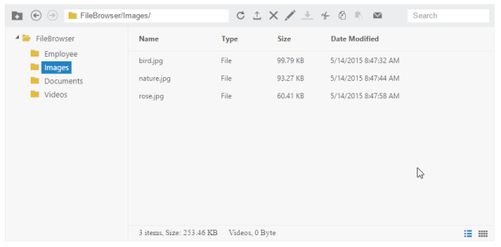

# Getting Started

The following section is briefly explain the things to get started with FileExplorer control.

## Preparing the HTML document

Create a new HTML file and include the below code: 



    <!DOCTYPE html>

    <html xmlns="http://www.w3.org/1999/xhtml">

    <head>

        <meta charset="utf-8">

        <title> </title>

    </head>

    <body>

    </body>

    </html>



## Adding the references

To include the control in the application the following references need to be added:

* CSS references
* Script references

### CSS references

Add the below CSS reference in the head section, for the default theme



       <link rel="stylesheet" href="http://cdn.syncfusion.com/{{ site.releaseversion }}/js/web/flat-azure/ej.web.all.min.css" />  



N> Essential JS widgets having the support for 13 built-in themes, to know more please check [here](http://docs.syncfusion.com/js/theming-in-essential-javascript-components#)

### Script references

The external script dependencies of the FileExplorer widget are,

* [jQuery 1.7.1](http://jquery.com/#) or later versions.
* [jsrender](https://www.jsviews.com/#jsrender) – for grid view template.

And the internal script dependencies of the FileExplorer widget are:

<table>
<tr>
<th>
File</th><th>
Description/Usage</th></tr>
<tr>
<td>
ej.core.min.js  </td><td>
Must be referred always before using all the JS controls.  </td></tr>
<tr>
<td>
ej.data.min.js  </td><td>
Used to handle data operation and should be used while binding data to JS controls.  </td></tr>
<tr>
<td>
ej. draggable.min.js  </td><td>
Used to handle the drag and drop functionality  </td></tr>
<tr>
<td>
ej.scroller.min.js  </td><td>
Used to show the scroller in the layout area  </td></tr>
<tr>
<td>
ej.button.min.js  </td><td>
Used to display the buttons in the toolbar  </td></tr>
<tr>
<td>
ej.treeview.min.js  </td><td>
Used to display the treeview in the navigation pane  </td></tr>
<tr>
<td>
ej.uploadbox.min.js  </td><td>
Used to perform the upload functionality   </td></tr>
<tr>
<td>
ej.waitingpopup.min.js  </td><td>
Used to showcase the waiting popup  </td></tr>
<tr>
<td>
ej.dialog.min.js  </td><td>
Used to create the alert windows   </td></tr>
<tr>
<td>
ej.splitter.min.js  </td><td>
Used as the body section to separate the navigation and layout area  </td></tr>
<tr>
<td>
ej.toolbar.min.js  </td><td>
Used to showcase the hearer section  </td></tr>
<tr>
<td>
ej.menu.min.js  </td><td>
Used to showcase the context menu  </td></tr>
<tr>
<td>
ej.grid.min.js  </td><td>
Used to showcase the grid layout view  </td></tr>
</table>

For getting started you can use the “**ej.web.all.min.js**” file, which encapsulates all the `ej` controls and frameworks in one single file. 

So you can add the below Script references in the head section:



    <!--External script references-->

    

    

    <!--Internal script references-->

    



N> The above Script and CSS references uses the [CDN links](http://docs.syncfusion.com/js/cdn#). In case if you need to refer the local files then you can copy the corresponding files from the [installed location](http://docs.syncfusion.com/js/installation-and-deployment#) and can include into your application directory

N> In production we recommend you to use our [Custom script generator](http://docs.syncfusion.com/js/include-only-the-needed-widgets#) to create custom script file with required controls and its dependencies only]

## Adding the control element 

The control can be created from a div element. So you can add the div element into your page at where you want to render the FileExplorer.



		



## Initialize and configure the control

Once added the element you can initialize the control from the script section like below:



        $(function () {

            var fileSystemPath = "http://js.syncfusion.com/demos/ejServices/Content/FileBrowser/";

            var ajaxActionHandler = "http://js.syncfusion.com/demos/ejServices/api/FileExplorer/FileOperations";

            $("#fileExplorer").ejFileExplorer({

                path: fileSystemPath,

                ajaxAction: ajaxActionHandler

            });

        });



Here [path](https://help.syncfusion.com/api/js/ejfileexplorer#members:path) and [ajaxAction](https://help.syncfusion.com/api/js/ejfileexplorer#members:ajaxaction) are the mandatory configuration to showcase the FileExplorer control.

    <table>
        <tr>
            <td>
                N> As you know FileExplorer is a client side control but it depends on the server side actions. So in JavaScript to handle the server side actions we are using the Web API service and it was hosted in our server.  
            </td>
        </tr>
    </table>
	
To perform the server side actions using local web API service, please refer the [link](https://help.syncfusion.com/js/fileexplorer/how-to#service-for-fileexplorer)

Once you have completed the above steps, you get an output like below

