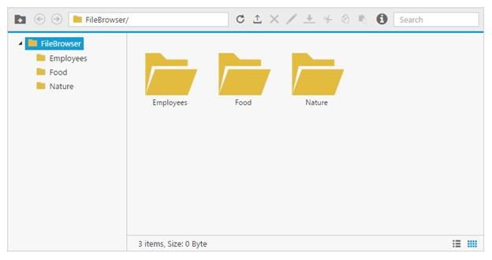

# Overview

The **Essential JavaScript FileExplorer** is an interface for managing the File system through any web application. It allows the user to perform the most common file operations include browse, open, create, rename, copy, paste or move, delete and file searching.

For a live demo of FileExplorer check the online sample from [here](https://js.syncfusion.com/demos/web/#!/azure/fileexplorer/DefaultFunctionalities)

N>  The FileExplorer control was officially added with the Essential Studio JavaScript package from the v13.1 release only.

## Key features

* Windows explorer like functionalities and appearances
* Handy file operations (copy, paste, move and delete)
* File download and upload
* File type restriction
* Easy UI customization
* Different layouts (grid and tile view)
* Context menu support
* built-in image viewer support
* Keyboard navigation 
* Right to Left alignment (RTL) support
* Localization support

