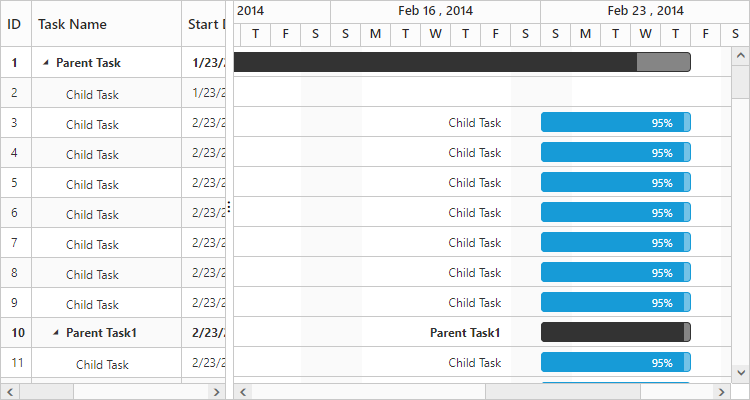
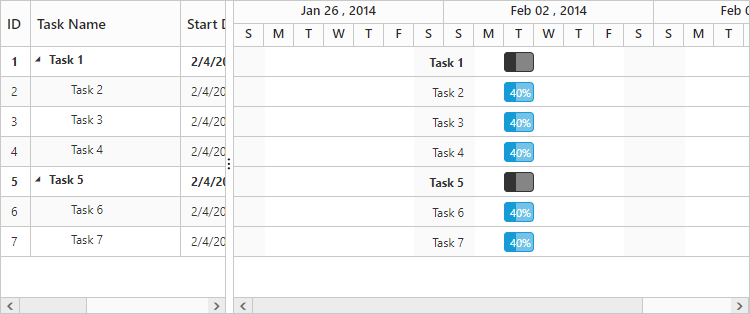

# Data Binding

Data binding is the process that establishes a connection between the application and different kinds of data sources such as business objects. And it is possible to bind local data and remote data in Gantt.
You can set the data source for Gantt control by using [`dataSource`](/api/js/ejgantt#members:datasource) property.

## Local Data Binding

In Local Data Binding, datasource for rendering the Gantt control is retrieved from the same application locally.

Two types of Data Binding are possible with Gantt control, 

* Hierarchical datasource binding
* Self-referential data binding (Flat data)

### Hierarchical data-source binding

In hierarchical data binding subtasks or child tasks collections are identified by using [`childMapping`](/api/js/ejgantt#members:childmapping) property.
The following code example explains how to bind the hierarchical data in Gantt.


var  taskDetails = [{

    taskID: 1,

    taskName: "Design",

    startDate: new Date("02/10/2014"),

    endDate: new Date("02/14/2014"),

    baselineStartDate: new Date("02/10/2014"),

    baselineEndDate: new Date("02/12/2014"),

    duration: 5,

    subtasks: [

        {

            taskID: 2,

            taskName: "Software Specification",

            startDate: new Date("02/10/2014"),

            endDate: new Date("02/12/2014"),

            baselineStartDate: new Date("02/10/2014"),

            baselineEndDate: new Date("02/12/2014"),

            duration: 4,

            progress: "60",

            resourceId: [2]

        },

        {

            taskID: 3,

            taskName: "Develop prototype",

            startDate: new Date("02/10/2014"),

            endDate: new Date("02/12/2014"),

            baselineStartDate: new Date("02/10/2014"),

            baselineEndDate: new Date("02/12/2014"),

            duration: 4,

            progress: "70",

            resourceId: [3]

        },

        //...

    ]

}];

$(function() {

    $("#GanttContainer").ejGantt(

        {

            dataSource: taskDetails,

            taskIdMapping: "taskID",

            taskNameMapping: "taskName",

            scheduleStartDate: "02/01/2014",

            scheduleEndDate: "03/14/2014",

            startDateMapping: "startDate",

            durationMapping: "duration",

            progressMapping: "progress",

            childMapping: "subtasks",

            treeColumnIndex: 1

        });

});



The output of the above steps is as follows.

It is also possible to set the data source to Gantt using ejDataManager. And we can pass the query value to ejDataManager by using [`query`](/api/js/ejgantt#members:query) property. The following code example explains how to assign the ejDataManager instance to Gantt.



$("#GanttContainer").ejGantt({
    dataSource: ej.DataManager(taskDetails),
    query: ej.Query().select("taskID", "taskName", "startDate", "duration", "progress", "subtasks"),
    //…
});



### Self-referential data binding (Flat data)

Gantt can be rendered from self-referential data structures, by mapping the task ID and parent task ID fields.

* Task ID field- This field must contain unique values to identify the nodes. It should be mapped to the [`taskIdMapping`](/api/js/ejgantt#members:taskidmapping) property.
* Parent task ID field- This field must contain values to identify the parent nodes. It should be mapped to the [`parentTaskIdMapping`](/api/js/ejgantt#members:parenttaskidmapping) property.



var projectData1 = [

    { taskID: 1, taskName: "Task 1", startDate: "02/03/2014", endDate: "03/07/2014", duration: 5},
    
    { taskID: 2, pId: 1, taskName: "Child Task 1", startDate: "02/03/2014", endDate: "02/07/2014", duration: 5},

    { taskID: 3, pId: 1, taskName: "Child Task 2", startDate: "02/03/2014", endDate: "02/07/2014", duration: 5, progress: "100" },

    { taskID: 22, pId: 2, taskName: "Sub Child Task 1", startDate: "02/03/2014", endDate: "02/07/2014", duration: 5 },

    { taskID: 23, pId: 2, taskName: "Sub Child Task 2", startDate: "02/03/2014", endDate: "02/07/2014", duration: 5, progress: "100" },

    { taskID: 12, pId: 22, taskName: "Inner Child Task 1", startDate: "02/03/2014", endDate: "02/07/2014", duration: 5},

    { taskID: 13, pId: 22, taskName: "Inner Child Task 2", startDate: "02/03/2014", endDate: "02/07/2014", duration: 5, progress: "100"},

    { taskID: 4, taskName: "Task 2", startDate: "02/03/2014", endDate: "02/07/2014", duration: 5, progress: "100"},

    { taskID: 5, pId: 4, taskName: "Child Task 1", startDate: "02/03/2014", endDate: "02/07/2014", duration: 5, progress: "100" },

    { taskID: 6, pId: 4, taskName: "Child Task 2", startDate: "02/07/2014", endDate: "02/07/2014", duration: 5},

    { taskID: 7, pId: 6, taskName: "Sub Child Task 1", startDate: "02/07/2014", endDate: "02/07/2014", duration: 5},

    { taskID: 8, pId: 7, taskName: "Inner Child Task 1", startDate: "02/10/2014", endDate: "02/12/2014", duration: 3, progress: "60"},

    { taskID: 9, pId: 7, taskName: "Inner Child Task 2", startDate: "02/10/2014", endDate: "02/12/2014", duration: 3, progress: "100" },

    { taskID: 10, taskName: "Task 3", startDate: "02/13/2014", endDate: "02/14/2014", duration: 2, progress: "100"},

    { taskID: 11, taskName: "Task 4", startDate: "02/14/2014", endDate: "02/14/2014", duration: 0, }

];

$(function() {

    $("#GanttContainer").ejGantt(

        {

            dataSource: projectData,

            taskIdMapping: "taskID",

            parentTaskIdMapping: "pId",

            taskNameMapping: "taskName",

            startDateMapping: "startDate",

            progressMapping: "progress",

            durationMapping: "duration",

            endDateMapping: "endDate",

            childMapping: "subtasks",

            enableVirtualization: true,

            highlightWeekEnds: true,

            includeWeekend: false,

            scheduleStartDate: "02/01/2014",

            scheduleEndDate: "03/14/2014",

        });

});


The following screenshot shows the output of the above steps.

You can find the online demo sample for binding self-referential data [here](http://js.syncfusion.com/demos/web/#!/bootstrap/gantt/databinding/selfreference)

## Remote data

### OData

OData is a standardized protocol for creating and consuming data. You can provide the OData service URL directly to the ej.DataManager class and then you can assign it to Gantt dataSource.

The following code example describes the above behavior.



$(function() {

    var dataManger = ej.DataManager("http://js.syncfusion.com/demos/ejServices/Wcf/TreeGridGantt/TreeGantt.svc/SelfReferenceDatas");

    $("#GanttContainer").ejGantt({

        dataSource: dataManger,

        taskIdMapping: "TaskID",

        taskNameMapping: "TaskName",

        parentTaskIdMapping: "ParentID",

        startDateMapping: "StartDate",

        endDateMapping: "EndDate",

        //...

    });

});



The following output is displayed for the code above,

### WebAPI

You can bind WebApi service data to Gantt. The data from WebApi service must be returned as object that has property Items with its value as datasource and this object can be pass to dataSource property of Gantt control.

The following code example describes the above behavior.



$(function() {
    var dataManger = ej.DataManager("api/Home/GetGanttData");
    $("#GanttContainer").ejGantt({
        dataSource: dataManger,
        taskIdMapping: "TaskID",
        taskNameMapping: "TaskName",
        parentTaskIdMapping: "ParentID",
        startDateMapping: "StartDate",
        endDateMapping: "EndDate",
        //...
    });
});





using System;
using System.Collections.Generic;
using System.Linq;
using System.Net;
using System.Net.Http;
using System.Web.Http;
using GanttExportService.Models;
namespace GanttExportService {
    public class HomeController: ApiController {
        GanttDataEntities data = new GanttDataEntities();
        public object GetGanttData() {
            var Data = data.Table1.ToList();
            return Data;
        }
    }
}



The following output is displayed as a result of the above code example.

## Virtualization mode in Gantt

Virtualization support was used to render large number tasks in Gantt with effective performance, in this mode all the tasks are fetched from data source initially then some of the records are rendered in DOM which are compact to the current viewport area. While scrolling tasks are updated in DOM as per current viewport position. This mode can be enabled by setting [`enableVirtualization`](/api/js/ejgantt#members:enablevirtualization) property as `true`. The below code example shows how to use this property.



$("#GanttContainer").ejGantt({
    dataSource: dataSource,
    enableVirtualization: true
    //…
});



You can find the online demo sample of Gantt with virtualization mode [here](https://js.syncfusion.com/demos/web/#!/bootstrap/gantt/databinding/performance).
