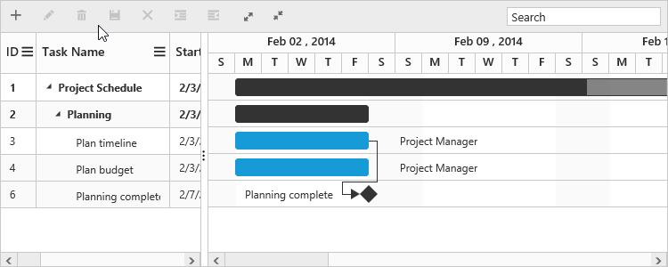
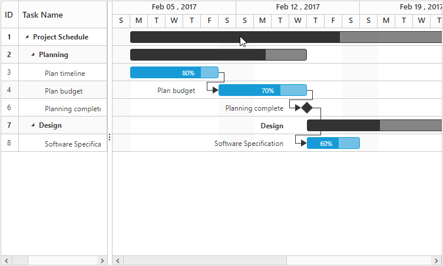

# Filtering

Filtering helps to view specific or related records from data source which meets a given filtering criteria. The [`filterSettings`](/api/js/ejgantt#members:filtersettings) property in Gantt is used to set the filtering criteria at load time.

## Filter columns at initial load
It is possible to filter one or more columns at initial load by providing the [`field`](/api/js/ejgantt#members:filtersettings-filteredcolumns-field "filterSettings.filteredColumns.field"), [`value`](/api/js/ejgantt#members:filtersettings-filteredcolumns-value "filterSettings.filteredColumns.value"),[`predicate`](/api/js/ejgantt#members:filtersettings-filteredcolumns-predicate "filterSettings.filteredColumns.predicate") and [`operator`](/api/js/ejgantt#members:filtersettings-filteredcolumns-operator "filterSettings.filteredColumns.operator") to the [`filteredColumns`](/api/js/ejgantt#members:filtersettings-filteredcolumns) property. The following code example explains how to filter a column on initial load.



$("#GanttContainer").ejGantt({
    //...
    filterSettings: {
        filteredColumns: [{
            value: "plan",
            field: "taskName",
            predicate: "and",
            operator: "startswith"
        }]
    },
});



The output of the filtering applied for a column is as follows.

## Filtering a specific column by method

It is possible to filter columns dynamically by using the [`filterColumn`](/api/js/ejgantt#methods:filtercolumn) method. 
The below code snippet explains the above behavior.



<button id="filterColumn">Filter Column</button>



## Filtering multiple columns dynamically

It is possible to filtering multiple columns dynamically by using the [`filterContent`](/api/js/ejgantt#methods:filtercontent) method. 
The below code snippet explains how to filter multiple columns dynamically in Gantt.



<button id="filterContent">filterContent</button>


The below screenshot shows the output of above code example.

## Clearing the filter applied to Gantt

You can clear all the filtering condition done in the Gantt by using the [`clearFilter`](/api/js/ejgantt#methods:clearfilter) public method. 
The below code snippet explains the above behavior.



<button id="clearFilter">Clear Filter</button>

