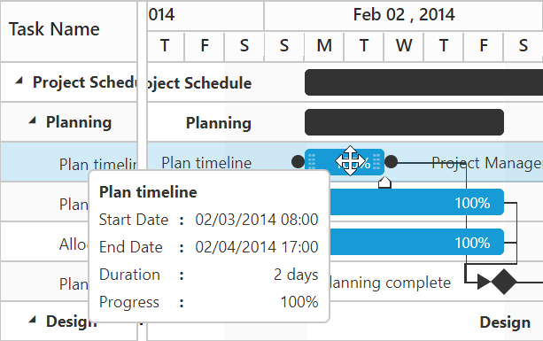

## Round-off start date, end date and duration value on taskbar editing
In Gantt start date, end date and duration values can be round-off as per current [`scheduleHeaderSettings.scheduleHeaderType`](/api/js/ejgantt#members:scheduleheadersettings-scheduleheadertype "scheduleHeaderSettings.scheduleHeaderType") value on taskbar resizing and dragging actions. This can be achieved by setting `roundOffDuration` argument value as `true` in [`taskbarEditing`](/api/js/ejgantt#events:taskbarediting) event.

The below code example explains how to achieve this requirement. 



   $("#gantt").ejGantt({
         taskbarEditing : function (args) {
                args.roundOffDuration = true;
         }
   })



Before resizing

{:.caption}

After resizing

{:.caption} 