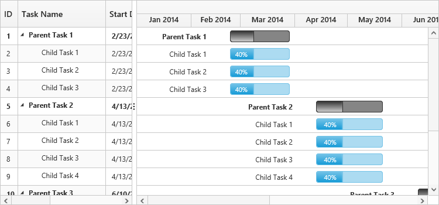

# Timescale customization

The Gantt contains in-built support to switch over various schedule modes. You can achieve this by defining a schedule header type for the Gantt.

## Schedule Header Types

Gantt contains the following in-built schedule header types.

* Hour – Minute
* Day – Hour
* Week – Day
* Month – Week
* Year – Month
* Year – Half Year
* Year – Quarter Year

Time scale mode in Gantt can be defined by using [`scheduleHeaderType`](/api/js/ejgantt#members:scheduleheadersettings-scheduleheadertype) property and 
the following code example illustrates you on how to change the schedule mode.

### Week schedule mode

In the Week schedule mode the upper part of the schedule header displays the weeks, whereas the bottom half of the header displays the days. Refer to the following code example.


$("#GanttContainer").ejGantt({

    //...

    scheduleHeaderSettings: {

        scheduleHeaderType: ej.Gantt.ScheduleHeaderType.Week,

        weekHeaderFormat: "MMM dd , yyyy",

        dayHeaderFormat: "ddd",

    },

});


The following screenshot illustrates the Week Schedule in Gantt control.

### Month schedule mode

In the Month schedule mode the upper part of the schedule header displays the Months, whereas the bottom header of the schedule displays its corresponding Weeks. Refer to the following code example.


$("#GanttContainer").ejGantt({

    //... 

    scheduleHeaderSettings: {

        scheduleHeaderType: ej.Gantt.ScheduleHeaderType.Month,

        monthHeaderFormat: "MMM yyyy",

        weekHeaderFormat: "M/dd",

    },

});


The following screenshot illustrates the Month Schedule in Gantt control.

### Year schedule mode

In the Year schedule mode the upper schedule header displays the Years whereas, the bottom header displays its corresponding Months. Refer to the following code example.


$("#GanttContainer").ejGantt({

    //...

    scheduleHeaderSettings: {

        scheduleHeaderType: ej.Gantt.ScheduleHeaderType.Year,

        yearHeaderFormat: "yyyy",

        monthHeaderFormat: "MMM",

    },

});


The following screen shot shows the Year Schedule in Gantt control.

### Half Year schedule mode

In the Half Year mode the upper schedule header displays the Year whereas, the bottom schedule header displays two halves of the corresponding year named H1,H2. Each half is a six months period of the corresponding year.
Refer the following code example to enable the half year schedule mode


$("#GanttContainer").ejGantt({

    //...

    scheduleHeaderSettings: {

        scheduleHeaderType: ej.Gantt.ScheduleHeaderType.HalfYear,
        
    },

});


The following screenshot illustrates the Half Year Schedule in Gantt control.

### Quarter Year schedule mode

In the Quarter Year mode the upper schedule header displays the Year whereas, the bottom schedule header displays the four quarters of the corresponding year named Q1,Q2,Q3 and Q4. Each Quarter is a three months period of the corresponding year.
Refer the following code example to enable the quarter year schedule mode


$("#GanttContainer").ejGantt({

    //...

    scheduleHeaderSettings: {

        scheduleHeaderType: ej.Gantt.ScheduleHeaderType.QuarterYear,
        
    },

});


The following screenshot illustrates the Quarter Year Schedule in Gantt control.

### Day schedule mode

In the Day schedule mode the upper part of the header displays the Days whereas, the bottom schedule header displays its corresponding Hours. Refer to the following code example.


$("#GanttContainer").ejGantt({

    //...

    scheduleHeaderSettings: {

        scheduleHeaderType: ej.Gantt.ScheduleHeaderType.Day,

        dayHeaderFormat: " dd,MM,yy ",

        hourHeaderFormat: "HH",

    },

});


The following screenshot illustrates the Day Schedule in Gantt control.

### Hour schedule mode

An Hour-Minute Schedule Mode tracks the tasks in minutes scale. In this mode, upper schedule header displays hour scale and the lower schedule header displays its corresponding Minutes. The minute split-up in the lower schedule header can be defined by using the [`minutesPerInterval`](/api/js/ejgantt#members:scheduleheadersettings-minutesperinterval) enumeration property. The enumeration values of the [`minutesPerInterval`](/api/js/ejgantt#members:scheduleheadersettings-minutesperinterval) are.

* Auto 
* oneMinute
* fiveMinutes
* fifteenMinutes
* thirtyMinutes

The value `auto` automatically calculates the interval depending upon the [`scheduleStartDate`](/api/js/ejgantt#members:schedulestartdate) and [`scheduleEndDate`](/api/js/ejgantt#members:scheduleenddate), whereas the other enumeration values splits up accordingly.

The Hour Schedule Mode supports both the `minute` and `hour` duration units.


$("#GanttContainer").ejGantt({

    // ... 

    dateFormat: "M/d/yyyy hh:mm:ss tt",

    durationUnit: ej.Gantt.DurationUnit.Minute,

    scheduleHeaderSettings: {

        scheduleHeaderType: ej.Gantt.ScheduleHeaderType.Hour,

        minutesPerInterval: ej.Gantt.minutesPerInterval.FiveMinutes,

    },

    // ...

});


## Week start day customization

In Gantt, we can customize week start day by using [`weekStartDay`](/api/js/ejgantt#members:scheduleheadersettings-weekstartday "scheduleHeaderSettings.weekStartDay") property.
By default the [`weekStartDay`](/api/js/ejgantt#members:scheduleheadersettings-weekstartday "scheduleHeaderSettings.weekStartDay") will be assigned with 0 which specifies the start day of the week.

In week schedule mode, week starts with Sunday by default. But we can customize the week start day by using below code example.
 

$("#GanttContainer").ejGantt({
    // ... 
    scheduleHeaderSettings: {
        scheduleHeaderType: ej.Gantt.ScheduleHeaderType.Week,
		weekStartDay : 3
		},
    // ...

});


## Rounding off timescale (schedule) start date

You can able to round off the schedule start date in a project by using the [`timescaleStartDateMode`](/api/js/ejgantt#members:scheduleheadersettings-timescalestartdatemode "scheduleHeaderSettings.timescaleStartDateMode") property. It is possible to set the following values to the property.

* auto
* month
* week
* year

The value `auto`, automatically calculates the schedule header depending on the datasource values, whereas the other enumeration values rounds off the schedule header accordingly. For Instance, in year schedule if you set the [`timescaleStartDateMode`](/api/js/ejgantt#members:scheduleheadersettings-timescalestartdatemode "scheduleHeaderSettings.timescaleStartDateMode") as `month` then the schedule header will start from the immediate month of the schedule instead of starting from beginning of the year.


$("#GanttContainer").ejGantt({

    // ... 

    scheduleHeaderSettings: {

        scheduleHeaderType: ej.Gantt.ScheduleHeaderType.Year,

        timescaleStartDateMode: ej.Gantt.TimescaleRoundMode.Month,

    },

    // ...

});


[Click](http://js.syncfusion.com/demos/web/#!/bootstrap/gantt/schedulingconcepts/timescalemodes) here to view the timescale modes in Gantt.

## Customize automatic timescale update action

In Gantt, schedule timeline will be automatically updated when the tasks are edited beyond the schedule start date and end date range. This can be enabled/disabled by using [`updateTimescaleView`](/api/js/ejgantt#members:scheduleheadersettings-updatetimescaleview "scheduleHeaderSettings.updateTimescaleView") property.
The following code snippets shows how to prevent the automatic timescale update in Gantt.


$("#GanttContainer").ejGantt({
	// ... 
	scheduleHeaderSettings: {
		scheduleHeaderType: ej.Gantt.ScheduleHeaderType.Week,
  		updateTimescaleView : false
 	},
	// ...
});


The following screenshot illustrates the behavior of `updateTimescaleView` property.

At Initial load
{:.caption}

`updateTimescaleView` property as `false`
{:.caption}

`updateTimescaleView` property as `true`
{:.caption}