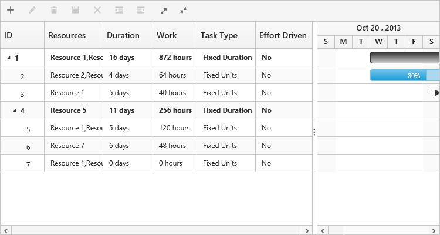

# Work

The Work is the total labor hours necessary to complete a task. Work can be mapped from the data source field using the property [`workMapping`](/api/js/ejgantt#members:workmapping) and when the work value is mapped from the data source, the end date and duration of the task will be calculated automatically based on the work and resource unit values from the data source. 
The below code snippet explains mapping the work value from the data source.



$("#GanttContainer").ejGantt({              
    //...
    workMapping: "estimatedWork"
    //...
});



Note: 

* When the work is mapped from the data source and if the resource unit is not defined for a task, the work will be calculated as 0 and task will be displayed as a milestone.
* When the work field is mapped from the data source, the default task type will be `fixed work`.

When the work value for a task is not mapped from the data source using the [`workMapping`](/api/js/ejgantt#members:workmapping) property, it will be calculated internally based on the number of resources assigned to the task and the duration of the task.

Note:	

* By Default, the work field value for a task will be calculated based on the duration and assigned resource unit.
* If an assigned resource has resource unit value of 100% for a task, i.e. if a resource is dedicatedly assigned to a task, the work per day will be __8__ __hours__.

Work can be measured in hours, days and minutes, and it is measured in 'hours' scale by default and this can be changed by using the [`workUnit`](/api/js/ejgantt#members:workunit) property.

The below code snippet explains how to change work unit property in Gantt.



$("#GanttContainer").ejGantt({                

//...

workUnit: ej.Gantt.WorkUnit.Minute,

});



# Task type 

The work, duration and resource unit fields of a task depends upon each other values and will change automatically on editing any one of these fields. But we can also set these field’s values as constant using the [`taskType`](/api/js/ejgantt#members:tasktype) property. The following values can be set to the type property,

**Fixed Duration** - Duration task field will remain constant while updating resource unit or work field.

**Fixed Work**      - Work field will remain constant while updating resource unit or duration fields.

**Fixed Unit**         - Resource units will remain constant while updating duration or work field.

The following code snippet explains how to set taskType property in Gantt,



$("#GanttContainer").ejGantt({                

//...

taskType: ej.Gantt.TaskType.FixedWork,

});



Following table explains how the work, duration and resource unit fields will gets updated on changing any of the fields

<table>
<tr>
<td>
Task Type</td><td>
Changes in Duration</td><td>
Changes in Work</td><td>
Changes in Resource units</td></tr>
<tr>
<td>
Fixed Duration</td><td>
Work field updates</td><td>
Resource unit updates</td><td>
Work field updates</td></tr>
<tr>
<td>
Fixed Work</td><td>
Resource unit updatesNote: For manually scheduled task work will update.</td><td>
Duration field updatesNote: For manually scheduled task resource unit updates.</td><td>
Duration will updateNote: For manually scheduled task work field updates.</td></tr>
<tr>
<td>
Fixed Unit</td><td>
Work field updates</td><td>
Duration field updatesNote: For manually scheduled task resource unit updates.</td><td>
Duration will updateNote: For manually scheduled task work field updates.</td></tr>
</table>
Note: 

* __Fixed__ __Unit__ is the default taskType in Gantt.
* The above calculations are not applicable for Milestones.

# Effort driven tasks

The effortDriven field is used to define whether the total labor hours or the work need to split or to be extended among the resources when adding or removing a resource to a task.

Note:

* Effort driven field is effective only on adding or removing a resource in a task.

The below table illustrates the effects of effort driven field with [`taskType`](/api/js/ejgantt#members:tasktype) property.

<table>
<tr>
<td>
Task Type</td><td>
Effort driven tasks</td><td>
Task without effort driven</td></tr>
<tr>
<td>
Fixed Duration</td><td>
Resource unit updates</td><td>
Work field updates</td></tr>
<tr>
<td>
Fixed Work</td><td>
Duration field updatesNote: For Fixed Work effort driven is always true.In this task type the effort driven field is non-editable.</td><td>
Not applicable</td></tr>
<tr>
<td>
Fixed Unit</td><td>
Duration field updates</td><td>
Work field updates</td></tr>
</table>
Notes:

* The above calculations will not be considered for Milestones.
* For manually scheduled task effort driven will not be considered while adding or removing resources.
* For manually scheduled task the taskType and effortDriven fields are non-editable.
* When assigning a first resource for the task the effortDriven and taskType fields are not considered, the work field alone will be calculated.

The following screen shot depicts the work, task type and effort driven fields in Gantt.

