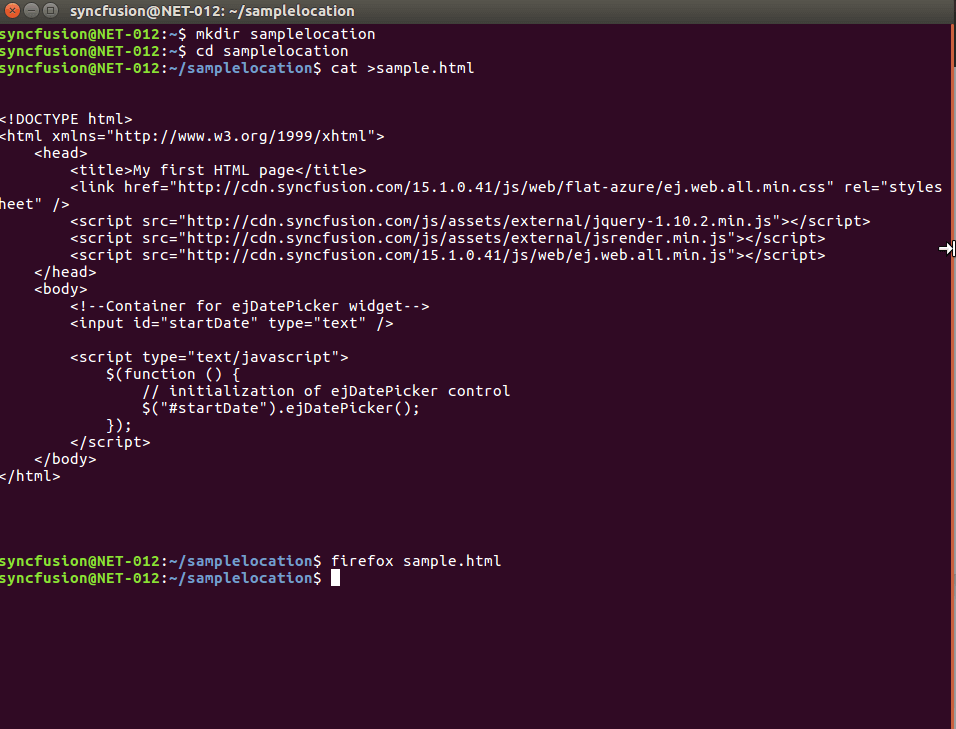

# Getting Started on Linux

The below guidelines demonstrate how to create an javascript application and configure with our Essential Studio Components on Linux.

Open your terminal window and execute the following commands to create the sample folder



mkdir sample

 

The above command create the directory name called sample.In this directory create the html page called sample.html by using the below command.


cd sample
cat > sample.html

 

## Edit the sample

The sample can be edited by using one of the following ways,

* Using default Linux editors like gedit.
* Using terminal window.
        
## Using default Linux editors like gedit.

In the sample HTML file refer all the required CDN links for the [scripts](/js/cdn#cdn-script-links) and [style sheets](/js/cdn#cdn-stylesheet-links) within the `<head>` section as shown below, 



<!DOCTYPE html>
<html xmlns="http://www.w3.org/1999/xhtml">
    <head>
        <title>My first HTML page</title>
        <link href="http://cdn.syncfusion.com/{{ site.releaseversion }}/js/web/default-theme/ej.web.all.min.css" rel="stylesheet" />
        
        
         
    </head>
    <body>    
    </body>
</html>



### Adding Syncfusion Widget into your HTML page

Add the `<input>` element within the `<body>` section, which acts as a container for `ejDatePicker` widget to render and then initialize the `ejDatePicker` widget within the script section as shown below,



<!DOCTYPE html>
<html xmlns="http://www.w3.org/1999/xhtml">
    <head>
        <title>My first HTML page</title>
        <link href="http://cdn.syncfusion.com/{{ site.releaseversion }}/js/web/flat-azure/ej.web.all.min.css" rel="stylesheet" />
        
        
         
    </head>
    <body>     
        <!--Container for ejDatePicker widget-->
        <input id="startDate" type="text" /> 

        
    </body>
</html>



## Using terminal window.

Create a sample using the command `cat > sample.html` and edit the sample in the terminal window itself by pressing `enter`key. To Add the Syncfusion widget into your HTML page, refer the [`link`](https://help.syncfusion.com/js/control-initialization)
and press `ctrl + D` to save and exit.

To run the sample, execute the below command.



firefox sample.html

 

The web browser and the screen will display the DatePicker widget as shown below,
 

The DatePicker control is rendered with its default appearance now. You can then use its various available properties to set its value and also make use of its available events to trigger when necessary.