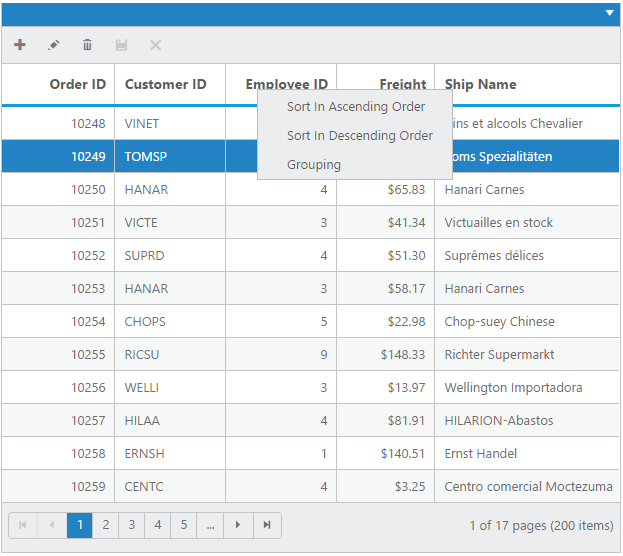
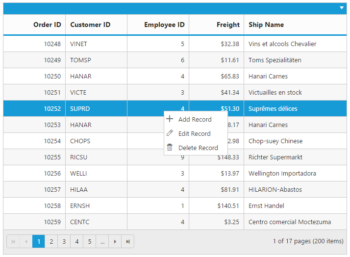
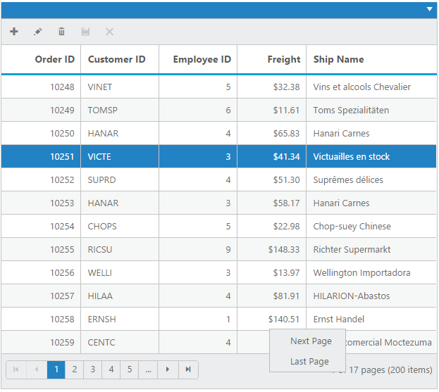
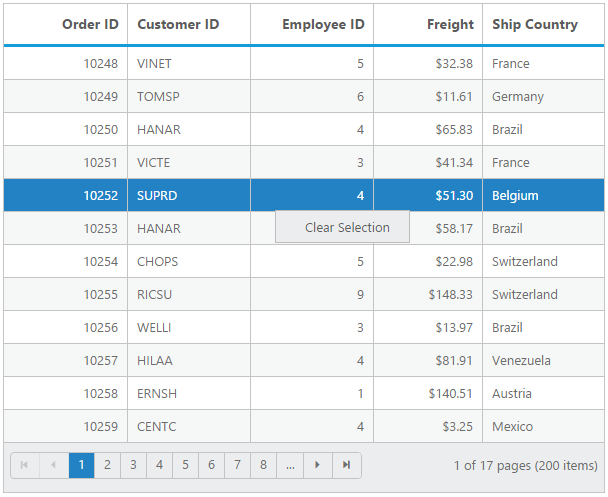
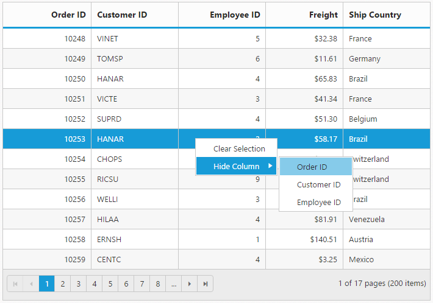

# Context Menu

Context menu is used to improve user action with Grid using the popup menu. It can be shown by defining [`contextMenuSettings.enableContextMenu`](https://help.syncfusion.com/api/js/ejgrid#members:contextmenusettings-enablecontextmenu "contextMenuSettings.enableContextMenu") as true. Context menu has option to add default items in [`contextMenuSettings.contextMenuItems`](https://help.syncfusion.com/api/js/ejgrid#members:contextmenusettings-contextmenuitems "contextMenuSettings.contextMenuItems") and customized items in [`contextMenuSettings.customContextMenuItems`](https://help.syncfusion.com/api/js/ejgrid#members:contextmenusettings-customcontextmenuitems "contextMenuSettings.customContextMenuItems").

To bind the required action before context menu opened use [`contextOpen`](https://help.syncfusion.com/api/js/ejgrid#events:contextopen "contextOpen") event.

## Default Context Menu items

Please find the below table for default context menu items and its actions.

 <table>
        <tr>
            <th>
                Section
            </th>
            <th>
                Context menu items.
            </th>
            <th>
                Action
            </th>
        </tr>
        <tr>
            <td rowspan="4">
                Header
            </td>
            <td>
                Sort in Ascending Order
            </td>
            <td>
                Sort column in Ascending order.
            </td>
        </tr>
        <tr>
            <td>
                Sort in Descending Order
            </td>
            <td>
                Sort column in Descending order.
            </td>
        </tr>
        <tr>
            <td>
                Group
            </td>
            <td>
                Group the current column.
            </td>
        </tr>
        <tr>
            <td>
                Ungroup
            </td>
            <td>
                Ungroup the current column if already grouped.
            </td>
        </tr>
        <tr>
            <td rowspan="5">
                Body
            </td>
            <td>
                Add Record
            </td>
            <td>
                Start Add new record.
            </td>
        </tr>
        <tr>
            <td>
                Edit Record
            </td>
            <td>
                Start Edit in current record.
            </td>
        </tr>
        <tr>
            <td>
                Delete Record
            </td>
            <td>
                Delete the current record.
            </td>
        </tr>
        <tr>
            <td>
                Save
            </td>
            <td>
                Save the record if Add/Edit record is started.
            </td>
        </tr>
        <tr>
            <td>
                Cancel
            </td>
            <td>
                Cancel Added/Edited state.
            </td>
        </tr>
        <tr>
            <td rowspan="4">
                Pager
            </td>
            <td>
                Next Page
            </td>
            <td>
                Go to Next Page.
            </td>
        </tr>
        <tr>            
            <td>
                Last Page
            </td>
            <td>
                Go to Last page
            </td>
        </tr>
        <tr>
            <td>
                Previous page
            </td>
            <td>
                Go to previous page.
            </td>
        </tr>
        <tr>
            <td>
                First page
            </td>
            <td>
                Go to first page.
            </td>
        </tr>
    </table>





{:catption}

Contextmenu at header

{:catption}

Contextmenu at body

{:caption}

Context menu at pager

N> `allowGrouping`, `allowSorting` should be enabled to perform default context menu actions in the Grid header. `allowEditing`, `allowDeleting` and `allowAdding` should be enabled to perform default actions in the body.

N> Use [`contextMenuSettings.disableDefaultItems `](https://help.syncfusion.com/api/js/ejgrid#members:contextmenusettings-disabledefaultitems  "contextMenuSettings.disableDefaultItems ") property to disable the default context menu items.
## Custom Context Menu

Custom context menu is used to create your own menu item and its action. To add customized context menu items, you need to use the [`contextMenuSettings.customContextMenuItems`](https://help.syncfusion.com/api/js/ejgrid#members:contextmenusettings-customcontextmenuitems "contextMenuSettings.customContextMenuItems") property and to bind required actions for this, use [`contextClick`](https://help.syncfusion.com/api/js/ejgrid#events:contextclick "contextClick") event.





## Sub Context Menu

[`subContextMenu  `](https://help.syncfusion.com/api/js/ejgrid#members:contextmenusettings-subcontextmenu  "subContextMenu ") is used to add customized sub menu to the custom context menu item. To add a sub context menu, you need to use [`contextMenuSettings.subContextMenu.subMenu `](https://help.syncfusion.com/api/js/ejgrid#members:contextmenusettings-subcontextmenu-submenu  "contextMenuSettings.subContextMenu.subMenu ") property and to bind required actions for this, use the [`contextClick`](https://help.syncfusion.com/api/js/ejgrid#events:contextclick "contextClick") event.

Use [`contextMenuSettings.subContextMenu.contextMenuItem `](https://help.syncfusion.com/api/js/ejgrid#members:contextmenusettings-subcontextmenu-contextmenuitem  "contextMenuSettings.subContextMenu.contextMenuItem ") property to get or set the corresponding custom context menu item to which the submenu to be appended.





## Sub Context Menu with Template

On rendering the Sub context menu items, the customized sub menu items are created by using [`contextMenuSettings.subContextMenu.template`](https://help.syncfusion.com/api/js/ejgrid#members:contextmenusettings-subcontextmenu-template "contextMenuSettings.subContextMenu.template") property.





