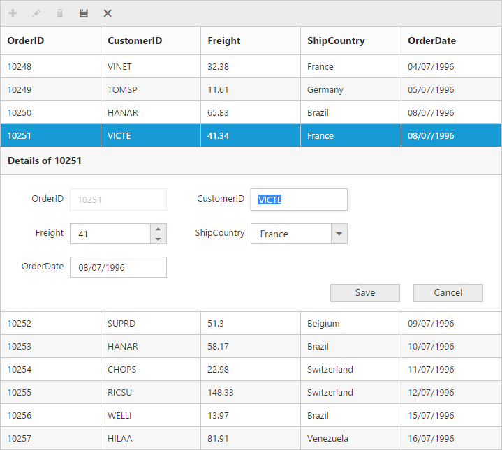
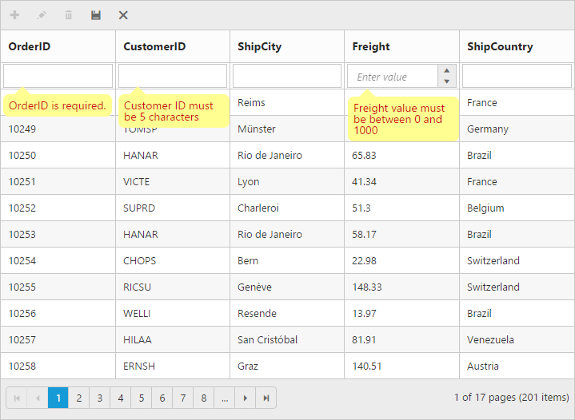
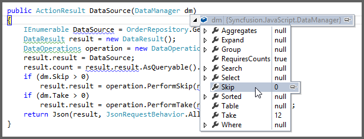
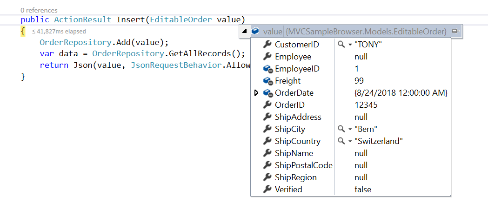
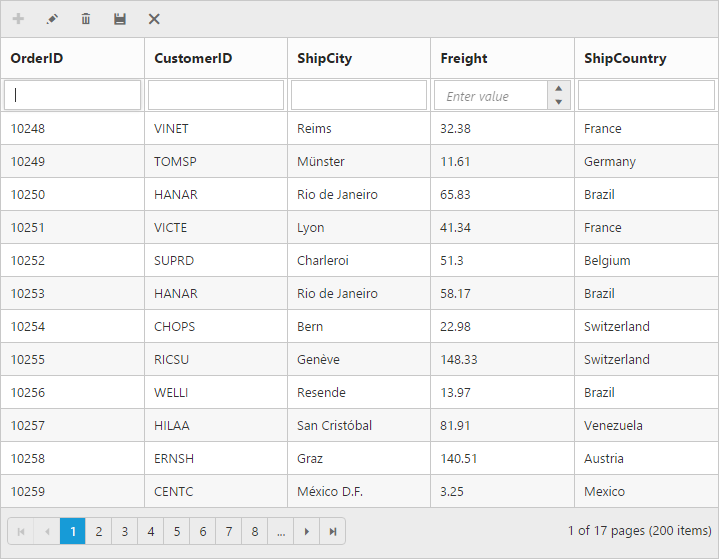

---
layout: post
title: Editing
description: editing
platform: js
control: Grid
documentation: ug
--- 

# Editing

The grid control has support for dynamic insertion, updation and deletion of records. You can start the edit either by double click on the particular row or selecting the required row and click on Edit icon in toolbar. Also, you can start adding new record either by clicking on insert icon in toolbar or on external button which is bound to call [`addRecord`](http://help.syncfusion.com/js/api/ejgrid#methods:addrecord "addRecord") method of grid.  `Save` and `Cancel` while on edit mode is possible using respective toolbar icon in grid.

Deletion of the record is possible by selecting the required row and clicking on Delete icon in toolbar. 

The primary key for the data source should be defined in [`columns`](http://help.syncfusion.com/js/api/ejgrid#members:columns "columns") definition for editing to work properly. In [`columns`](http://help.syncfusion.com/js/api/ejgrid#members:columns "columns") definition, particular primary column’s [`isPrimaryKey`](http://help.syncfusion.com/js/api/ejgrid#members:columns-isprimarykey "isPrimaryKey") property should be set to `true`. Refer the Knowledge base [link](http://www.syncfusion.com/kb/2675/cant-edit-any-row-except-the-first-row-in-grid# "link") for more information.

N> 1. In grid, the primary key column will automatically set to read only while editing the row, but you can specify primary key column value while adding a new record.
N> 2. The column which is specified as [`isIdentity`](http://help.syncfusion.com/js/api/ejgrid#members:columns-isidentity "isIdentity"), then it is in readonly mode while editing or adding a record. And also auto incremented value is assigned to that [`isIdentity`](http://help.syncfusion.com/js/api/ejgrid#members:columns-isidentity "isIdentity") column.

## Toolbar with edit option

Using [toolbar](http://help.syncfusion.com/js/api/ejgrid#members:toolbarsettings-toolbaritems "toolbar") you can show all the CRUD related action which is rendered at the top of the grid header. To enable toolbar and toolbar items, set [`showToolbar`](http://help.syncfusion.com/js/api/ejgrid#members:toolbarsettings-showtoolbar "showToolbar") property as true and [`toolbarItems`](http://help.syncfusion.com/js/api/ejgrid#members:toolbarsettings-toolbaritems "toolbarItems"). The default toolbar items are `Add`, `Edit`, `Delete`, `Update` and `Cancel`.

N> For [`toolbarItems`](http://help.syncfusion.com/js/api/ejgrid#members:toolbarsettings-toolbaritems "toolbarItems") property you can assign either `string` value (“add”) or `enum` value (`ej.Grid.ToolBarItems.Add`).

The following code example describes the above behavior.






$(function () {	
	$("#Grid").ejGrid({
		//The datasource "window.gridData" is referred from 'http://js.syncfusion.com/demos/web/scripts/jsondata.min.js'
		dataSource : window.gridData, 
		toolbarSettings : {	showToolbar : true, toolbarItems : ["add", "edit", "delete", "update", "cancel"] },
		editSettings:{ allowEditing: true, allowAdding: true, allowDeleting: true},
		allowPaging : true,
		columns : [
			{ field: "OrderID", isPrimaryKey: true },
			{ field: "CustomerID" },
			{ field: "EmployeeID" },
			{ field: "ShipCity" },
			{ field: "ShipCountry" }
		]
	});
});


The following output is displayed as a result of the above code example.

## Cell edit type and its params

The edit type of bound column can be customized using [`editType`](http://help.syncfusion.com/js/api/ejgrid#members:columns-edittype "editType") property of [`columns`](http://help.syncfusion.com/js/api/ejgrid#members:columns "columns"). The following Essential JavaScript controls are supported inbuilt by [`editType`](http://help.syncfusion.com/js/api/ejgrid#members:columns-edittype "editType"). You can set the [`editType`](http://help.syncfusion.com/js/api/ejgrid#members:columns-edittype "editType") based on specific data type of the column. 

 [`CheckBox`](http://help.syncfusion.com/js/api/ejcheckbox# "CheckBox") control for boolean data type.
 [`NumericTextBox`](http://help.syncfusion.com/js/api/ejtextboxes# "NumericTextBox") control for integers, double, and decimal data types.
 `InputTextBox` control for string data type.
 [`DatePicker`](http://help.syncfusion.com/js/api/ejdatepicker# "DatePicker") control for date data type.
 [`DateTimePicker`](http://help.syncfusion.com/js/api/ejdatetimepicker# "DateTimePicker") control for date-time data type.
 [`DropDownList`](http://help.syncfusion.com/js/api/ejdropdownlist# "DropDownList") control for list of data type.

And also you can define the model for all the editTypes controls while editing through [`editParams`](http://help.syncfusion.com/js/api/ejgrid#members:columns-editparams "editParams") property of [`columns`](http://help.syncfusion.com/js/api/ejgrid#members:columns "columns").

The following table describes [`editType`](http://help.syncfusion.com/js/api/ejgrid#members:columns-edittype "editType") and their corresponding [`editParams`](http://help.syncfusion.com/js/api/ejgrid#members:columns-editparams "editParams") of the specific data type of the column.

<table>
<tr>
<td>
EditType  </td><td>
EditParams  </td><td>
Example  </td></tr>
<tr>
<td>
CheckBox  </td><td>
{{'[http://help.syncfusion.com/js/api/ejcheckbox](http://help.syncfusion.com/js/api/ejcheckbox#"")'| markdownify }}   </td><td>
editParams: { checked: true }  </td></tr>
<tr>
<td>
NumericTextBox   </td><td>
{{'[http://help.syncfusion.com/js/api/ejtextboxes](http://help.syncfusion.com/js/api/ejtextboxes#"")'| markdownify }}   </td><td>
editParams: { decimalPlaces: 2, value:5  }  </td></tr>
<tr>
<td>
InputTextBox   </td><td>
-  </td><td>
-  </td></tr>
<tr>
<td>
DatePicker   </td><td>
{{'[http://help.syncfusion.com/js/api/ejdatepicker](http://help.syncfusion.com/js/api/ejdatepicker#"")'| markdownify }}   </td><td>
editParams: {  buttonText : "Now" }    </td></tr>
<tr>
<td>
DateTimePicker  </td><td>
{{'[http://help.syncfusion.com/js/api/ejdatetimepicker](http://help.syncfusion.com/js/api/ejdatetimepicker#"")'| markdownify }}   </td><td>
editParams: {  enabled: true }    </td></tr>
<tr>
<td>
DropDownList  </td><td>
{{'[http://help.syncfusion.com/js/api/ejdropdownlist](http://help.syncfusion.com/js/api/ejdropdownlist#"")'| markdownify }}   </td><td>
editParams: {  allowGrouping: true }    </td></tr>
</table>
N> 1. If [`editType`](http://help.syncfusion.com/js/api/ejgrid#members:columns-edittype "editType") is not set then by default it will display the input element (“stringedit”) while editing a column.
N> 2. For [`editType`](http://help.syncfusion.com/js/api/ejgrid#members:columns-edittype "editType") property you can assign either `string` value (“numericedit”) or `enum` value (`ej.Grid.EditingType.Numeric`).

The following code example describes the above behavior.






$(function () {
	//The datasource "window.gridData" is referred from 'http://js.syncfusion.com/demos/web/scripts/jsondata.min.js'
	$("#Grid").ejGrid({
		dataSource : window.gridData,
		toolbarSettings : { showToolbar : true, toolbarItems : ["add", "edit", "delete", "update", "cancel"] },
		editSettings:{ allowEditing: true, allowAdding: true, allowDeleting: true},
		allowPaging : true,
		columns : [
			{ field: "OrderID", isPrimaryKey: true },
			{ field: "CustomerID", editType: "stringedit" },
			{ field: "Freight", editType: "numericedit", editParams: { decimalPlaces: 2 } },
			{ field: "ShipCity", editType: "dropdownedit", editParams: { enableAnimation: true } },
			{ field: "ShipCountry" },
			{ field: "OrderDate", editType: "datepicker", format: "{0:MM/dd/yyyy}", editParams: { buttonText: "Now" } },
			{ field: "Verified", editType: "booleanedit", editParams: { showRoundedCorner: true } }
		]
	});
});


The following output is displayed as a result of the above code example.

## Cell Edit Template

To create a custom editor to edit column values by using [`editTemplate`](http://help.syncfusion.com/js/api/ejgrid#members:columns-edittemplate "editTemplate") property of [`columns`](http://help.syncfusion.com/js/api/ejgrid#members:columns "columns"). It has three functions, they are

1. `create` - It is used to create the control at time of initialize.
2. `read` - It is used to read the input value at time of save.
3. `write` - It is used to assign the value to control at time of editing.

The following code example describes the above behavior.






$(function () {
	//The datasource "window.gridData" is referred from 'http://js.syncfusion.com/demos/web/scripts/jsondata.min.js'
	$("#Grid").ejGrid({
		dataSource : window.gridData,
		toolbarSettings : { showToolbar : true, toolbarItems : ["add", "edit", "delete", "update", "cancel"] },
		editSettings:{ allowEditing: true, allowAdding: true, allowDeleting: true},
		allowPaging : true,
		columns : [
			{ field: "OrderID", isPrimaryKey: true },
			{ field: "CustomerID" },
			{ field: "Freight" },
			{ field: "ShipCountry" },
			{
				field : "ShipPostalCode",
				editTemplate : {
					create : function () {
						return "<input>";
					},
					read : function (args) {
						return args.ejMaskEdit("get_UnstrippedValue");
					},
					write : function (args) {
						args.element.ejMaskEdit({
						maskFormat : "99-99-9999",
						value : args.rowdata["ShipPostalCode"]
						});
					}
				}
			}
		]
	});
});


The following output is displayed as a result of the above code example.

## Edit Modes

### Inline 

Set [`editMode`](http://help.syncfusion.com/js/api/ejgrid#members:editsettings-editmode "editMode") as `normal`, then the row itself changed as an edited row.

N> For [`editMode`](http://help.syncfusion.com/js/api/ejgrid#members:editsettings-editmode "editMode") property you can assign either `string` value (“normal”) or `enum` value (`ej.Grid.EditMode.Normal`).

The following code example describes the above behavior.






$(function () {
	//The datasource "window.gridData" is referred from 'http://js.syncfusion.com/demos/web/scripts/jsondata.min.js'
	$("#Grid").ejGrid({
		dataSource : window.gridData,
		toolbarSettings : {
			showToolbar : true,
			toolbarItems : ["add", "edit", "delete", "update", "cancel"]
		},
		editSettings : {
			allowEditing : true,
			allowAdding : true,
			allowDeleting : true,
			editMode : "normal"
		},
		allowPaging : true,
		columns : [
			{ field: "OrderID", isPrimaryKey: true },
			{ field: "CustomerID" },
			{ field: "Freight", editType: "numericedit" },
			{ field: "ShipCountry", editType: "dropdownedit" },
			{ field: "OrderDate",editType: "datepicker", format: "{0:dd/MM/yyyy}"}
		]
	});
});


The following output is displayed as a result of the above code example.

### Inline Form

Set [`editMode`](http://help.syncfusion.com/js/api/ejgrid#members:editsettings-editmode "editMode") as `inlineform`, then edit form will be inserted next to row which is going to edit and that has fields associated with the data record being edited.

The following code example describes the above behavior.






$(function () {
	//The datasource "window.gridData" is referred from 'http://js.syncfusion.com/demos/web/scripts/jsondata.min.js'
	$("#Grid").ejGrid({
		dataSource : window.gridData,
		toolbarSettings : {
			showToolbar : true,
			toolbarItems : ["add", "edit", "delete", "update", "cancel"]
		},
		editSettings : {
			allowEditing : true,
			allowAdding : true,
			allowDeleting : true,
			editMode : "inlineform"
		},
		allowPaging : true,
		columns : [
			{ field: "OrderID", isPrimaryKey: true },
			{ field: "CustomerID" },
			{ field: "Freight", editType: "numericedit" },
			{ field: "ShipCountry", editType: "dropdownedit" },
			{ field: "OrderDate",editType: "datepicker", format: "{0:dd/MM/yyyy}"}
		]
	});
});


The following output is displayed as a result of the above code example.

### Inline Template Form

To edit the records using Inline template form, set [`editMode`](http://help.syncfusion.com/js/api/ejgrid#members:editsettings-editmode "editMode") as `inlineformtemplate` and specify the template ID to [`editSettings.inlineFormTemplateID`](http://help.syncfusion.com/js/api/ejgrid#members:editsettings-inlineformtemplateid "editSettings.inlineFormTemplateID"). Using this template, you can edit the fields that are not bound to grid columns.

While using template form, you can change the HTML elements in it to appropriate JS controls based on the column type. This can be achieved by using [`actionComplete`](http://help.syncfusion.com/js/api/ejgrid#events:actioncomplete "actionComplete") event of grid.

N> 1. `value`, attribute is used to bind the corresponding field value while editing.
N> 2. `name`, attribute is used to get the changed field values while save the edited record.

1. It’s a standard way to enclose the `template` within the `script` tag with `type` as "text/x-jsrender".
2. For [`editMode`](http://help.syncfusion.com/js/api/ejgrid#members:editsettings-editmode "editMode") property you can assign either `string` value (“inlineformtemplate”) or `enum` value (`ej.Grid.EditMode.InlineTemplateForm`)

The following code example describes the above behaviour.






$(function () {
	$("#Grid").ejGrid({
		//The datasource "window.gridData" is referred from 'http://js.syncfusion.com/demos/web/scripts/jsondata.min.js'
		dataSource : window.gridData,
		toolbarSettings : {
			showToolbar : true,
			toolbarItems : ["add", "edit", "delete", "update", "cancel"]
		},
		editSettings : {
			allowEditing : true,
			allowAdding : true,
			allowDeleting : true,
			editMode : "inlineformtemplate",
			inlineFormTemplateID : "#template"
		},
		allowPaging : true,
		columns : [
			{ field: "OrderID", isPrimaryKey: true },
			{ field: "CustomerID" },
			{ field: "ShipCity" }
		],
		actionComplete : "complete"
	});
});

function complete(args) {
	$("#EmployeeID").ejNumericTextbox();
	$("#Freight").ejNumericTextbox();
	$("#ShipCity").ejDropDownList();
}


The following output is displayed as a result of the above code example.

### Dialog

Set [`editMode`](http://help.syncfusion.com/js/api/ejgrid#members:editsettings-editmode "editMode") as `dialog`, to edit data using a dialog box that has fields associated with the data record being edited.

The following code example describes the above behavior.






$(function () {
	//The datasource "window.gridData" is referred from 'http://js.syncfusion.com/demos/web/scripts/jsondata.min.js'
	$("#Grid").ejGrid({
		dataSource : window.gridData,
		toolbarSettings : {
			showToolbar : true,
			toolbarItems : ["add", "edit", "delete", "update", "cancel"]
		},
		editSettings : {
			allowEditing : true,
			allowAdding : true,
			allowDeleting : true,
			editMode : "dialog"
		},
		allowPaging : true,
		columns : [
			{ field: "OrderID", isPrimaryKey: true },
			{ field: "CustomerID" },
			{ field: "Freight", editType: "numericedit" },
			{ field: "ShipCountry", editType: "dropdownedit" },
			{ field: "OrderDate",editType: "datepicker", format: "{0:dd/MM/yyyy}"}
		]
	});
});


The following output is displayed as a result of the above code example.

### Dialog Template Form

You can edit any of the fields pertaining to a single record of data and apply it to a template so that the same format is applied to all the other records that you may edit later.

Using this template support, you can edit the fields that are not bound to grid columns.

To edit the records using Inline template form, by setting [`editMode`](http://help.syncfusion.com/js/api/ejgrid#members:editsettings-editmode "editMode") as dialogtemplate and specify the template id to [`dialogEditorTemplateID`](http://help.syncfusion.com/js/api/ejgrid#members:editsettings-dialogeditortemplateid "dialogEditorTemplateID") property of [`editSettings`](http://help.syncfusion.com/js/api/ejgrid#members:editsettings "editSettings").

While using template, you can change the elements that are defined in the `template`, to appropriate JS controls based on the column type. This can be achieved by using [`actionComplete`](http://help.syncfusion.com/js/api/ejgrid#events:actioncomplete "actionComplete") event of grid.

N> 1. `value` attribute is used to bind the corresponding field value while editing.
N> 2. `name` attribute is used to get the changed field values while save the edited record. 
N> 3. For [`editMode`](http://help.syncfusion.com/js/api/ejgrid#members:editsettings-editmode "editMode") property you can assign either `string` value (“dialogtemplate”) or `enum` value (`ej.Grid.EditMode.DialogTemplate`).

The following code example describes the above behaviour.






$(function () {
	$("#Grid").ejGrid({
		//The datasource "window.gridData" is referred from 'http://js.syncfusion.com/demos/web/scripts/jsondata.min.js'
		dataSource : window.gridData,
		toolbarSettings : {
			showToolbar : true,
			toolbarItems : ["add", "edit", "delete", "update", "cancel"]
		},
		editSettings : {
			allowEditing : true,
			allowAdding : true,
			allowDeleting : true,
			editMode : "dialogtemplate",
			dialogEditorTemplateID : "#template"
		},
		allowPaging : true,
		columns : [
			{ field: "OrderID", isPrimaryKey: true },
			{ field: "CustomerID" },
			{ field: "ShipCity" }
		],
		actionComplete : "complete"
	});
});

function complete(args) {
	$("#EmployeeID").ejNumericTextbox();
	$("#Freight").ejNumericTextbox();
	$("#ShipCity").ejDropDownList();
}


The following output is displayed as a result of the above code example.

### External Form

Set [`editMode`](http://help.syncfusion.com/js/api/ejgrid#members:editsettings-editmode "editMode") as externalform, then the edit form is opened out of grid content, which has fields associated with the data record being edited.

The following code example describes the above behavior.






$(function () {
	//The datasource "window.gridData" is referred from 'http://js.syncfusion.com/demos/web/scripts/jsondata.min.js'
	$("#Grid").ejGrid({
		dataSource : window.gridData,
		toolbarSettings : {
			showToolbar : true,
			toolbarItems : ["add", "edit", "delete", "update", "cancel"]
		},
		editSettings : {
			allowEditing : true,
			allowAdding : true,
			allowDeleting : true,
			editMode : "externalform"
		},
		allowPaging : true,
		pageSettings : {
			pageSize : 7
		},
		columns : [
			{ field: "OrderID", isPrimaryKey: true },
			{ field: "CustomerID" },
			{ field: "Freight", editType: "numericedit" },
			{ field: "ShipCountry", editType: "dropdownedit" },
			{ field: "OrderDate", editType: "datepicker",format: "{0:dd/MM/yyyy}"}
		]
	});
});


The following output is displayed as a result of the above code example.

Form Position:

You can [position](http://help.syncfusion.com/js/api/ejgrid#members:editsettings-formposition "position") an external edit form in the following two ways. 

1. Top-right
2. Bottom left

This can be achieved by set [`formPosition`](http://help.syncfusion.com/js/api/ejgrid#members:editsettings-formposition "formPosition") property of [`editSettings`](http://help.syncfusion.com/js/api/ejgrid#members:editsettings "editSettings") as “topright” or “bottomleft”.

The following code example describes the above behavior.






$(function () {
	//The datasource "window.gridData" is referred from 'http://js.syncfusion.com/demos/web/scripts/jsondata.min.js'
	$("#Grid").ejGrid({
		dataSource : window.gridData,
		toolbarSettings : {
			showToolbar : true,
			toolbarItems : ["add", "edit", "delete", "update", "cancel"]
		},
		editSettings : {
			allowEditing : true,
			allowAdding : true,
			allowDeleting : true,
			editMode : "externalform",
			formPosition : "topright"
		},
		allowPaging : true,
		columns : [
			{ field: "OrderID", isPrimaryKey: true },
			{ field: "CustomerID" },
			{ field: "Freight", editType: "numericedit" },
			{ field: "ShipCountry", editType: "dropdownedit" }
		]
	});
});


The following output is displayed as a result of the above code example.

### External Template Form

You can edit any of the fields pertaining to a single record of data and apply it to a template so that the same format is applied to all the other records that you may edit later.

Using this template support, you can edit the fields that are not bound to grid columns.

To edit the records using Inline template form, by setting [`editMode`](http://help.syncfusion.com/js/api/ejgrid#members:editsettings-editmode "editMode") as externalformtemplate and specify the template id to [`externalFormTemplateID`](http://help.syncfusion.com/js/api/ejgrid#members:editsettings-externalformtemplateid "externalFormTemplateID") property of [`editSettings`](http://help.syncfusion.com/js/api/ejgrid#members:editsettings "editSettings").

While using template, you can change the elements that are defined in the template, to appropriate JS controls based on the column type. This can be achieved by using [`actionComplete`](http://help.syncfusion.com/js/api/ejgrid#events:actioncomplete "actionComplete") event of grid.

N> 1. `value` attribute is used to bind the corresponding field value while editing. 
N> 2. `name` attribute is used to get the changed field values while save the edited record. 
N> 3. For [`editMode`](http://help.syncfusion.com/js/api/ejgrid#members:editsettings-editmode "editMode") property you can assign either `string` value (“externalformtemplate”) or `enum` value (`ej.Grid.EditMode.ExternalFormTemplate`).

The following code example describes the above behaviour.






$(function () {
	$("#Grid").ejGrid({
		//The datasource "window.gridData" is referred from 'http://js.syncfusion.com/demos/web/scripts/jsondata.min.js'
		dataSource : window.gridData,
		toolbarSettings : {
			showToolbar : true,
			toolbarItems : ["add", "edit", "delete", "update", "cancel"]
		},
		editSettings : {
			allowEditing : true,
			allowAdding : true,
			allowDeleting : true,
			editMode : "externalformtemplate",
			externalFormTemplateID : "#template"
		},
		allowPaging : true,
		pageSettings : {
			pageSize : 5
		},
		columns : [
			{ field: "OrderID", isPrimaryKey: true },
			{ field: "CustomerID" },
			{ field: "ShipCity" }
		],
		actionComplete : "complete"
	});
});

function complete(args) {
	$("#EmployeeID").ejNumericTextbox();
	$("#Freight").ejNumericTextbox();
	$("#ShipCity").ejDropDownList();
}


The following output is displayed as a result of the above code example.

### Batch / Excel-like

Users can start editing by typing into any cell. Edited cell will be marked while navigating to next cell or any other row, so that you know which fields or cells has been edited. Set [`editMode`](http://help.syncfusion.com/js/api/ejgrid#members:editsettings-editmode "editMode") as `batch` to enable batch editing.

N> Refer the KB [link](http://www.syncfusion.com/kb/3016/how-to-suppress-grid-confirmation-messages# "link") for “How to suppress grid confirmation messages” in batch mode.

The following code example describes the above behavior.






$(function () {
	//The datasource "window.gridData" is referred from 'http://js.syncfusion.com/demos/web/scripts/jsondata.min.js'
	$("#Grid").ejGrid({
		dataSource : window.gridData,
		toolbarSettings : {
			showToolbar : true,
			toolbarItems : ["add", "edit", "delete", "update", "cancel"]
		},
		editSettings : {
			allowEditing : true,
			allowAdding : true,
			allowDeleting : true,
			editMode : "batch"
		},
		allowPaging : true,
		columns : [
			{ field: "OrderID", isPrimaryKey: true },
			{ field: "CustomerID" },
			{ field: "Freight", editType: "numericedit" },
			{ field: "ShipCountry", editType: "dropdownedit" },
			{ field: "OrderDate", editType: "datepicker", format: "{0:dd/MM/yyyy}" }
		]
	});
});


The following output is displayed as a result of the above code example.

## Confirmation messages

To show the [confirm dialog](http://help.syncfusion.com/js/api/ejgrid#members:editsettings-showconfirmdialog "confirm dialog") while saving or discarding the batch changes (discarding during the grid action like filtering, sorting and paging). To enable confirmation dialog, set [`showConfirmDialog`](http://help.syncfusion.com/js/api/ejgrid#members:editsettings-showconfirmdialog "showConfirmDialog") as `true`.

N> [`showConfirmDialog`](http://help.syncfusion.com/js/api/ejgrid#members:editsettings-showconfirmdialog "showConfirmDialog") property is only for batch editing mode.

The following code example describes the above behavior.






$(function () {
	//The datasource "window.gridData" is referred from 'http://js.syncfusion.com/demos/web/scripts/jsondata.min.js'
	$("#Grid").ejGrid({
		dataSource : window.gridData,
		toolbarSettings : {
			showToolbar : true,
			toolbarItems : ["add", "edit", "delete", "update", "cancel"]
		},
		editSettings : {
			allowEditing : true,
			allowAdding : true,
			allowDeleting : true,
			editMode : "batch"
		},
		allowPaging : true,
		columns : [
			{ field: "OrderID", isPrimaryKey: true },
			{ field: "CustomerID" },
			{ field: "Freight", editType: "numericedit" },
			{ field: "ShipCountry", editType: "dropdownedit" },
			{ field: "OrderDate", editType: "datepicker", format: "{0:dd/MM/yyyy}"}
		]
	});
});


The following output is displayed as a result of the above code example.

To show delete confirm dialog while deleting a record by setting the [`showDeleteConfirmDialog`](http://help.syncfusion.com/js/api/ejgrid#members:editsettings-showdeleteconfirmdialog "showDeleteConfirmDialog") as true.

N> [`showDeleteConfirmDialog`](http://help.syncfusion.com/js/api/ejgrid#members:editsettings-showdeleteconfirmdialog "showDeleteConfirmDialog") property is for all type of [`editMode`](http://help.syncfusion.com/js/api/ejgrid#members:editsettings-editmode "editMode").

The following code example describes the above behavior.






$(function () {
	//The datasource "window.gridData" is referred from 'http://js.syncfusion.com/demos/web/scripts/jsondata.min.js'
	$("#Grid").ejGrid({
		dataSource : window.gridData,
		toolbarSettings : {
			showToolbar : true,
			toolbarItems : ["add", "edit", "delete", "update", "cancel"]
		},
		editSettings : {
			allowEditing : true,
			allowAdding : true,
			allowDeleting : true,
			showDeleteConfirmDialog : true
		},
		allowPaging : true,
		columns : [
			{ field: "OrderID", isPrimaryKey: true },
			{ field: "CustomerID" },
			{ field: "Freight", editType: "numericedit" },
			{ field: "ShipCountry", editType: "dropdownedit" },
			{ field: "OrderDate", editType: "datepicker", format: "{0:dd/MM/yyyy}"}
		]
	});
});


The following output is displayed as a result of the above code example.

## Column Validation

[Validate](http://help.syncfusion.com/js/api/ejgrid#members:columns-validationrules "Validate") the value of the edited or added record cell before the values are saved.

The below validation script files are needed when editing is enabled with validation.

 jquery.validate.min.js
 jquery.validate.unobtrusive.min.js
### Jquery Validation

You can set validation rules using [`validationRules`](http://help.syncfusion.com/js/api/ejgrid#members:columns-validationrules "validationRules") property of [`columns`](http://help.syncfusion.com/js/api/ejgrid#members:columns "columns"). The following are Jquery validation methods.

__List__ __of__ __Jquery__ __validation__ __methods__

<table>
<tr>
<td>
Rules  </td><td>
Description  </td></tr>
<tr>
<td>
required  </td><td>
Requires an element.  </td></tr>
<tr>
<td>
remote  </td><td>
Requests a resource to check the element for validity.  </td></tr>
<tr>
<td>
minlength  </td><td>
Requires the element to be of given minimum length.  </td></tr>
<tr>
<td>
maxlength  </td><td>
Requires the element to be of given maximum length.  </td></tr>
<tr>
<td>
rangelength  </td><td>
Requires the element to be in given value range.  </td></tr>
<tr>
<td>
min  </td><td>
The element requires a given minimum.  </td></tr>
<tr>
<td>
max  </td><td>
The element requires a given maximum.  </td></tr>
<tr>
<td>
range  </td><td>
Requires the element to be in a given value range.  </td></tr>
<tr>
<td>
email  </td><td>
The element requires a valid email.  </td></tr>
<tr>
<td>
url  </td><td>
The element requires a valid url  </td></tr>
<tr>
<td>
date  </td><td>
Requires the element to be a date.  </td></tr>
<tr>
<td>
dateISO  </td><td>
The element requires an ISO date.  </td></tr>
<tr>
<td>
number  </td><td>
The element requires a decimal number.  </td></tr>
<tr>
<td>
digits  </td><td>
The element requires digits only.  </td></tr>
<tr>
<td>
creditcard  </td><td>
Requires the element to be a credit card number.  </td></tr>
<tr>
<td>
equalTo  </td><td>
Requires the element to be the same as another.  </td></tr>
</table>
Grid supports all the standard validation methods of Jquery, please refer the Jquery validation documentation [link](http://jqueryvalidation.org/documentation/# "link") for more information.

The following code example describes the above behavior.






$(function () {
	$("#Grid").ejGrid({
		//The datasource "window.gridData" is referred from 'http://js.syncfusion.com/demos/web/scripts/jsondata.min.js'
		dataSource : window.gridData,
		toolbarSettings : {
			showToolbar : true,
			toolbarItems : ["add", "edit", "delete", "update", "cancel"]
		},
		editSettings : {
			allowEditing : true,
			allowAdding : true,
			allowDeleting : true,
			showDeleteConfirmDialog : true
		},
		allowPaging : true,
		columns : [
			{ field: "OrderID", isPrimaryKey: true, validationRules: { required: true, number: true } },
			{ field: "CustomerID", validationRules: { required: true, minlength: 3 } },
			{ field: "ShipCity" },
			{ field: "Freight", editType: "numericedit", validationRules: { range: [0, 1000] } },
			{ field: "ShipCountry" }
		]
	});
});


The following output is displayed as a result of the above code example.

### Custom Validation

In addition to Jquery validation methods, you can also add your own custom validation methods for a specific column. Information for calling custom validator function using [`validationRules`](http://help.syncfusion.com/js/api/ejgrid#members:columns-validationrules "validationRules") property of [`columns`](http://help.syncfusion.com/js/api/ejgrid#members:columns "columns"). 

Using `messages` property of [`validationRules`](http://help.syncfusion.com/js/api/ejgrid#members:columns-validationrules "validationRules") you can specify the error message for that column.

Grid supports all the standard custom validation methods of Jquery, please refer the Jquery validation documentation [link](http://jqueryvalidation.org/jQuery.validator.addMethod# "link") for more information

The following code example describes the above behavior.






$(function () {
	$.validator.addMethod("customCompare", function (value, element, params) {
		return element.value > params[0] && element.value < params[1]
	}, "Freight value must be between 0 and 1000");

	$.validator.addMethod("customRegex", function (value, element, params) {
		if (element.value.length == params)
			return true;
		return false;
	}, "Customer ID must be 5 characters");

	$("#Grid").ejGrid({
		//The datasource "window.gridData" is referred from 'http://js.syncfusion.com/demos/web/scripts/jsondata.min.js'
		dataSource : window.gridData,
		toolbarSettings : {
			showToolbar : true,
			toolbarItems : ["add", "edit", "delete", "update", "cancel"]
		},
		editSettings : {
			allowEditing : true,
			allowAdding : true,
			allowDeleting : true,
			showDeleteConfirmDialog : true
		},
		allowPaging : true,
		columns : [
			{ field: "OrderID", isPrimaryKey: true, validationRules: { required: true, number: true } },
			{ field: "CustomerID", validationRules: { customRegex: 5 } },
			{ field: "ShipCity" },
			{ field: "Freight", editType: "numericedit", validationRules: { customCompare: [0, 1000] } },
			{ field: "ShipCountry" }
		]
	});
});


The following output is displayed as a result of the above code example.

## Persisting data in Server

Edited data can be persisted in database using RESTful web services. 

All the CRUD operations in grid are done through DataManager. Datamanger have an option to bind all the CRUD related data in server side. Please refer the link to know about the [DataManager](http://help.syncfusion.com/js/datamanager/overview# "DataManager").

In the below section, we have explained about how to get the edited data details in server side using URLAdaptor. 

For you information ODataAdaptor persist date in server as OData protocol.

URL Adaptor

You can use the `UrlAdaptor` of [`ejDataManger`](http://help.syncfusion.com/js/api/ejdatamanager# "ejDataManger") when binding datasource from remote data. At initial load of Grid, using URL property of DataManager, data are fetched from remote data and binded to Grid. You can map CRUD operation in Grid to Server-Side Controller action using the properties `insertUrl`, `removeUrl`, `updateUrl`, `crudUrl` and `batchUrl`.

The following code example describes the above behavior.






$(function () {
	$("#Grid").ejGrid({
		dataSource : ej.DataManager({
			url : "Home/DataSource",
			updateUrl : "Home/Update",
			insertUrl : "Home/Insert",
			removeUrl : "Home/Delete",
			adaptor : “UrlAdaptor”
		}),
		allowPaging : true,
		editSettings : {
			allowEditing : true,
			allowAdding : true,
			allowDeleting : true
		},
		toolbarSettings : {
			showToolbar : true,
			toolbarItems : [ej.Grid.ToolBarItems.Add, ej.Grid.ToolBarItems.Edit, ej.Grid.ToolBarItems.Delete, ej.Grid.ToolBarItems.Update, ej.Grid.ToolBarItems.Cancel]
		},
		columns : [
			{ field: "OrderID", isPrimaryKey: true },
			{ field: "CustomerID" },
			{ field: "EmployeeID"},
			{ field: "Freight", editType: ej.Grid.EditingType.Numeric, editParams: { decimalPlaces: 2 }, format: "{0:C}" },
			{ field: "ShipName" },
			{ field: "ShipCountry"}
		]
	});
});


Also when you use `UrlAdaptor`, you need to return the data as `JSON` and the JSON object must contain field name as `result` with its value as dataSource and one more field name as `count` with its value as dataSource total records count.

The following code example describes the above behavior.


public ActionResult DataSource(DataManager dm)
{
	IEnumerable DataSource = OrderRepository.GetAllRecords();
	DataResult result = new DataResult();
	DataOperations operation = new DataOperations();
	result.result = DataSource;
	result.count = result.result.AsQueryable().Count();
	if (dm.Skip > 0)
		result.result = operation.PerformSkip(result.result, dm.Skip);
	if (dm.Take > 0)
		result.result = operation.PerformTake(result.result, dm.Take);
	return Json(result, JsonRequestBehavior.AllowGet);
}
public class DataResult
{
	public IEnumerable result { get; set; }
	public int count { get; set; }
}


The grid actions (sorting, filtering, paging, searching, and aggregates) details are obtained in the “DataManager” class. While initializing the grid, paging only enabled hence in the below screen shot paging details are bound to the DataManager class.

Please refer the below screen shot.

And also using “DataOperations” class methods you can perform grid action in server side. The in-build methods that we have provided in the DataOperations class can be listed below.

 PerformSorting
 PerformFiltering
 PerformSearching
 PerformSkip
 PerformTake
 PerformWhereFilter
 PerformSelect
 Execute

Accessing CRUD action request details in server side:

The “Server-Side” function must be declared with the following parameter name for each editing functionality.

__Parameters__ __Table__

<table>
<tr>
<td>
Action  </td><td>
Parameter Name  </td><td>
Example  </td></tr>
<tr>
<td>
Update,Insert  </td><td>
value  </td><td>
public ActionResult Update(EditableOrder value){ }  </td></tr>
<tr>
<td>
  </td><td>
  </td><td>
public ActionResult Insert(EditableOrder value){ }  </td></tr>
<tr>
<td>
Remove  </td><td>
key  </td><td>
public ActionResult Remove(int key){ }  </td></tr>
<tr>
<td>
Batch Add  </td><td>
added  </td><td>
public ActionResult BatchUpdate(string action, List<EditableOrder> added, List<EditableOrder> changed, List<EditableOrder> deleted, int? key){ }  </td></tr>
<tr>
<td>
Batch Update  </td><td>
changed  </td><td>
  </td></tr>
<tr>
<td>
Batch Delete  </td><td>
deleted  </td><td>
  </td></tr>
<tr>
<td>
Crud Update,  Crud Remove,  Crud Insert  </td><td>
value, action  </td><td>
public ActionResult CrudUrl(EditableOrder value, string action){ }  </td></tr>
</table>
Insert Record:

Using `insertUrl` property, you can specify the controller action mapping URL to perform insert operation in server side.

The following code example describes the above behavior.


public ActionResult Insert(EditableOrder value)
{
	//Insert record in database
}


The newly added record details are bound to the “value” parameter. Please refer the below image.

Update Record:

Using `updateUrl` property, you can specify the controller action mapping URL to perform save/update operation in server side.

The following code example describes the above behavior.


public ActionResult Update(EditableOrder value)
{
	//Update record in database
}


The updated record details are bound to the “value” parameter. Please refer the below image.

Delete Record:

Using `removeUrl` property, you can specify the controller action mapping URL to perform delete operation in server side.

The following code example describes the above behavior.


public ActionResult Remove(int key)
{
	//Delete record in database
}


The deleted record primary key value is bound to the “key” parameter. Please refer the below image.

CRUD URL:

Instead of specifying separate controller action method for CRUD (insert, update and delete)operation, using `crudUrl` property you can specify the controller action mapping URL to perform all the CRUD operation in server side using single method.

The action parameter of `crudUrl` is used to get the corresponding CRUD action.

The following code example describes the above behavior.






$(function () {
	$("#Grid").ejGrid({
		dataSource : ej.DataManager({
			url : "Home/DataSource",
			crudUrl : "Home/CrudUpdate",
			adaptor : “UrlAdaptor”
		}),
		allowPaging : true,
		editSettings : {
			allowEditing : true,
			allowAdding : true,
			allowDeleting : true
		},
		toolbarSettings : {
			showToolbar : true,
			toolbarItems : [ej.Grid.ToolBarItems.Add, ej.Grid.ToolBarItems.Edit, ej.Grid.ToolBarItems.Delete, ej.Grid.ToolBarItems.Update, ej.Grid.ToolBarItems.Cancel]
		},
		columns : [
			{ field: "OrderID", isPrimaryKey: true },
			{ field: "CustomerID" },
			{ field: "EmployeeID"},
			{ field: "Freight", editType: ej.Grid.EditingType.Numeric, editParams: { decimalPlaces: 2 }, format: "{0:C}" },
			{ field: "ShipName" },
			{ field: "ShipCountry"}
		]
	});
});



public ActionResult CrudUpdate(EditableOrder value, string action)
{
	//Delete record in database
}


Please refer the below image to know about the action parameter

N> If you specify `insertUrl` along with `CrudUrl` then while adding `insertUrl` only called.

Batch URL:

The `batchUrl` property supports only for batch editing mode. You can specify the controller action mapping URL to perform Batch operation in server side.

The following code example describes the above behavior.






$(function () {
	$("#Grid").ejGrid({
		dataSource : ej.DataManager({
			url : "Home/DataSource",
			batchUrl : "Home/BatchUpdate",
			adaptor : “UrlAdaptor”
		}),
		allowPaging : true,
		editSettings : {
			allowEditing : true,
			allowAdding : true,
			allowDeleting : true,
			editMode : "batch"
		},
		toolbarSettings : {
			showToolbar : true,
			toolbarItems : [ej.Grid.ToolBarItems.Add, ej.Grid.ToolBarItems.Edit, ej.Grid.ToolBarItems.Delete, ej.Grid.ToolBarItems.Update, ej.Grid.ToolBarItems.Cancel]
		},
		columns : [
			{ field: "OrderID", isPrimaryKey: true },
			{ field: "CustomerID" },
			{ field: "EmployeeID"},
			{ field: "Freight", editType: ej.Grid.EditingType.Numeric, editParams: { decimalPlaces: 2 }, format: "{0:C}" },
			{ field: "ShipName" },
			{ field: "ShipCountry"}
		]
	});
});



public ActionResult BatchUpdate(string action, List<EditableOrder> added, List<EditableOrder> changed, List<EditableOrder> deleted, int? key)
{
	//Save the batch changes in database
}


Please refer the below image for more information about batch paramaters

## Adding New Row Position

To add new row in the top or bottom [position](http://help.syncfusion.com/js/api/ejgrid#members:editsettings-rowposition "position") of grid content that depends upon the requirement. Using [`rowPosition`](http://help.syncfusion.com/js/api/ejgrid#members:editsettings-rowposition "rowPosition") property of [`editSettings`](http://help.syncfusion.com/js/api/ejgrid#members:editsettings "editSettings") you can specify add new row position.

The following code example describes the above behavior.






$(function () {
	$("#Grid").ejGrid({
		//The datasource "window.gridData" is referred from 'http://js.syncfusion.com/demos/web/scripts/jsondata.min.js'
		dataSource : window.gridData,
		toolbarSettings : {
			showToolbar : true,
			toolbarItems : ["add", "edit", "delete", "update", "cancel"]
		},
		editSettings : {
			allowEditing : true,
			allowAdding : true,
			allowDeleting : true,
			rowPosition : "bottom"
		},
		allowPaging : true,
		columns : [
			{ field: "OrderID", isPrimaryKey: true },
			{ field: "CustomerID" },
			{ field: "ShipCity" },
			{ field: "Freight", editType: "numericedit" },
			{ field: "ShipCountry" }
		]
	});
});


The following output is displayed as a result of the above code example.

## Render with blank row for easy add new

The blank add new row is displayed in the grid content during grid initialization itself to add a new record easily. To enable show add new row by default, set [`showAddNewRow`](http://help.syncfusion.com/js/api/ejgrid#members:showaddnewrow "showAddNewRow") property of [`editSettings`](http://help.syncfusion.com/js/api/ejgrid#members:editsettings "editSettings") as `true`.

The blank add new row is displayed either in the top or bottom of the corresponding page, its position is based on the [`rowPosition`](http://help.syncfusion.com/js/api/ejgrid#members:editsettings-rowposition "rowPosition") property of [`editSettings`](http://help.syncfusion.com/js/api/ejgrid#members:editsettings "editSettings").

The following code example describes the above behavior.






$(function () {
	$("#Grid").ejGrid({
		//The datasource "window.gridData" is referred from 'http://js.syncfusion.com/demos/web/scripts/jsondata.min.js'
		dataSource : window.gridData,
		toolbarSettings : {
			showToolbar : true,
			toolbarItems : ["add", "edit", "delete", "update", "cancel"]
		},
		editSettings : {
			allowEditing : true,
			allowAdding : true,
			allowDeleting : true,
			showAddNewRow : true
		},
		allowPaging : true,
		columns : [
			{ field: "OrderID", isPrimaryKey: true },
			{ field: "CustomerID" },
			{ field: "ShipCity" },
			{ field: "Freight", editType: "numericedit" },
			{ field: "ShipCountry" }
		]
	});
});


The following output is displayed as a result of the above code example.

N> 1. If it is remote, then the newly added record is placed based on the index from current view data. 
N> 2. If it is local, then the newly added record is added at the top of the page even the added new [`rowPosition`](http://help.syncfusion.com/js/api/ejgrid#members:editsettings-rowposition "rowPosition") is mentioned as “bottom”.

## Default column values on add new

While adding new record in grid, there is an option to set the default value for the columns. Using [`defaultValue`](http://help.syncfusion.com/js/api/ejgrid#members:columns-defaultvalue "defaultValue") property of [`columns`](http://help.syncfusion.com/js/api/ejgrid#members:columns "columns") you can set the default values for that particular column while editing or adding a new row.

The following code example describes the above behavior.






$(function () {
	$("#Grid").ejGrid({
		//The datasource "window.gridData" is referred from 'http://js.syncfusion.com/demos/web/scripts/jsondata.min.js'
		dataSource : window.gridData,
		toolbarSettings : {
			showToolbar : true,
			toolbarItems : ["add", "edit", "delete", "update", "cancel"]
		},
		editSettings : {
			allowEditing : true,
			allowAdding : true,
			allowDeleting : true
		},
		allowPaging : true,
		columns : [
			{ field: "OrderID", isPrimaryKey: true },
			{ field: "CustomerID" },
			{ field: "ShipCity", defaultValue: "Bern" },
			{ field: "Freight", editType: "numericedit", defaultValue: 45 },
			{ field: "ShipCountry", defaultValue: "Brazil" }
		]
	});
});


The following output is displayed as a result of the above code example.

