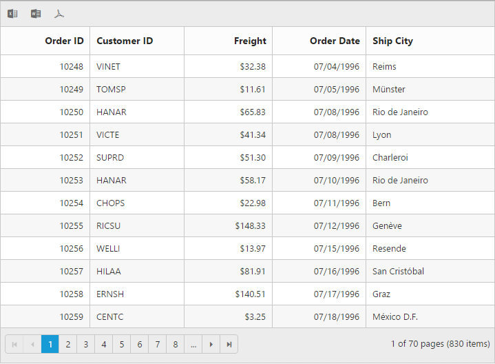

# Export in JavaScript Grid

To export the grid, `export` method should  be called with export mapper as a parameter. To make it work from the grid toolbar, `ExcelExport`, `WordExport` and `PdfExport` toolbar items needs to be added in [`toolbarSettings.toolbarItems`](https://help.syncfusion.com/api/js/ejgrid#members:toolbarsettings-toolbaritems) property and equivalent server action mapper should be defined in [`exportToExcelAction `](https://help.syncfusion.com/api/js/ejgrid#members:exporttoexcelaction "exportToExcelAction "), [`exportToWordAction `](https://help.syncfusion.com/api/js/ejgrid#members:exporttowordaction "exportToWordAction "), and [`exportToPdfAction `](https://help.syncfusion.com/api/js/ejgrid#members:exporttopdfaction "exportToPdfAction ") properties. The code snippet for this is





 

## External Export in Grid

To export the grid by external action use [`export `](https://help.syncfusion.com/api/js/ejgrid#methods:export "export ") method, refer the KB  [`link `](https://www.syncfusion.com/kb/4335/how-to-export-grid-data-to-excel-word-and-pdf-formats-on-external-action "link ").

## Server configuration

Currently grid data can be converted to different file formats in server-side only, through **EJ's** helper functions in .NET. So, to use exporting in your projects, it is required to create a server with any of the following web services. 

* Web API 
* WCF Service
* ASP.NET MVC Controller Action 
* ASP.NET WebMethod 

Following code snippet demonstrate exporting with WebAPI controller.



public class OrdersController: ApiController

{
	private NORTHWNDEntities db = new NORTHWNDEntities();
	public IEnumerable < Order > Get()
	{
		return db.Orders.ToList();
	}
	
	[System.Web.Http.ActionName("ExcelExport")]
	[AcceptVerbs("POST")]
	public void ExcelExport()
	{
		string gridModel = HttpContext.Current.Request.Params["GridModel"];
		GridProperties gridProperty = ConvertGridObject(gridModel);
		ExcelExport exp = new ExcelExport();
		IEnumerable < Order > result = db.Orders.ToList();
		exp.Export(gridProperty, result, "Export.xlsx", ExcelVersion.Excel2010, false, false, "flat-saffron");
	}
	
	[System.Web.Http.ActionName("PdfExport")]
	[AcceptVerbs("POST")]
	public void PdfExport()
	{
		string gridModel = HttpContext.Current.Request.Params["GridModel"];
		GridProperties gridProperty = ConvertGridObject(gridModel);
		PdfExport exp = new PdfExport();
		IEnumerable < Order > result = db.Orders.ToList();
		exp.Export(gridProperty, result, "Export.pdf");
	}
	
	[System.Web.Http.ActionName("WordExport")]
	[AcceptVerbs("POST")]
	public void WordExport()
	{
		string gridModel = HttpContext.Current.Request.Params["GridModel"];
		GridProperties gridProperties = ConvertGridObject(gridModel);
		WordExport exp = new WordExport();
		IEnumerable < Order > data = db.Orders.ToList();
		exp.Export(gridProperties, (IEnumerable) data, "Export.docx");
	}
	
	private GridProperties ConvertGridObject(string gridProperty)
	{
		JavaScriptSerializer serializer = new JavaScriptSerializer();
		IEnumerable div = (IEnumerable) serializer.Deserialize(gridProperty, typeof(IEnumerable));
		GridProperties gridProp = new GridProperties();
		foreach(KeyValuePair < string, object > datasource in div)
		{
			var property = gridProp.GetType()
				.GetProperty(datasource.Key, BindingFlags.Instance ' BindingFlags.Public ' BindingFlags.IgnoreCase);
			if (property != null)
			{
				Type type = property.PropertyType;
				string serialize = serializer.Serialize(datasource.Value);
				object value = serializer.Deserialize(serialize, type);
				property.SetValue(gridProp, value, null);
			}
		}
		return gridProp;
	}
}



### Server dependencies

Export Helper functions are available in the Assembly `Syncfusion.EJ.Export`, which is available in the Essential Studio & Essential JavaScript builds. Full list of assemblies needed for the grid Export as follows.

1. Syncfusion.EJ
2. Syncfusion.EJ.Export
3. Syncfusion.Linq.Base
4. Syncfusion.Compression.Base
5. Syncfusion.DocIO.Base
6. Syncfusion.XlsIO.Base
7. Syncfusion.PDF.Base

### Supported Export types

Currently server helper functions allows the following three types of exporting.

* Word
* Excel
* PDF

## Multiple Grid export to single file

To export multiple grids in current page, the method `ej.Grid.exportAll` can be used with 'jquery selector' as the parameter.

The JavaScript code snippet for it is 


	$('#exportAll').click(function(){
			ej.Grid.exportAll('MultipleExportToExcel',['#Grid1', '#Grid2']);
		});



The Server side C# snippet is



// Excel export

public void MultipleExportToExcel(string[] GridModel)

{
	ExcelExport exp = new ExcelExport();
	var EmployeeData = new NorthwindDataContext().EmployeeViews.Take(5).ToList();
	var OrderData = new NorthwindDataContext().OrdersViews.Take(5).ToList();
	bool initial = true;
	IWorkbook book = null;
	foreach(string gridProperty in GridModel)
	{
		GridProperties gridProp = ConvertObject(gridProperty);
		if (initial)
		{
			book = exp.Export(gridProp, EmployeeData, "Export.xlsx", ExcelVersion.Excel2010, true, true, "flat-saffron", true);
			initial = false;
		} 
		else
		{
			exp.Export(gridProp, OrderData, "Export.xlsx", ExcelVersion.Excel2010, true, true, "flat-saffron", false, book, MultipleExportType.AppendToSheet, "Second Grid");
		}

	}

}

// Word export

public void MultipleExportToWord(string[] GridModel)

{
	WordExport exp = new WordExport();
	var EmployeeData = new NorthwindDataContext().EmployeeViews.Take(5).ToList();
	var OrderData = new NorthwindDataContext().OrdersViews.Take(5).ToList();
	IWordDocument document = null;
	bool initial = true;;
	foreach(string gridProperty in GridModel)
	{
		GridProperties gridProp = ConvertObject(gridProperty);
		if (initial)
		{
			document = exp.Export(gridProp, EmployeeData, "Export.docx", true, true, "flat-saffron", true);
			initial = false;
		} else
		{
			exp.Export(gridProp, OrderData, "Export.docx", true, true, "flat-saffron", false, document, "Second Grid");
		}

	}

}

// PDF export

public void MultipleExportToPdf(string[] GridModel)

{
	PdfExport exp = new PdfExport();
	var EmployeeData = new NorthwindDataContext().EmployeeViews.Take(5).ToList();
	var OrderData = new NorthwindDataContext().OrdersViews.Take(5).ToList();
	PdfDocument document = null;
	bool initial = true;
	foreach(string gridProperty in GridModel)
	{
		GridProperties gridProp = ConvertObject(gridProperty);
		if (initial)
		{
			document = exp.Export(gridProp, EmployeeData, "Export.pdf", true, true, "flat-saffron", true);
			initial = false;
		} else

		{
			exp.Export(gridProp, OrderData, "Export.pdf", true, true, "flat-saffron", false, document, "Second Grid");
		}
	}
}



## List of properties ignored on export

Following are the list of properties that are excluded during grid export, to reduce the unwanted data transfer to server.  

* dataSource
* query
* rowTemplate
* detailsTemplate
* pageSettings
* enableRTL
* cssClass

To ignore the additional desired grid  properties on exporting use  [`addIgnoreOnExport `](https://help.syncfusion.com/api/js/ejgrid#methods:addignoreonexport "addIgnoreOnExport ") method. Here we ignored filterSettings so while exporting it will be exported without filtering applied.

The snippet for this is.



var grid = $('#Grid').ejGrid('instance');
grid.addIgnoreOnExport("filterSettings");



## Export only visible records

By default `pageSettings` is ignored in export to facilitate all pages export. To achieve current visible page record export, `pageSettings` should be removed from ignore list using the following code.

The snippet for this is.



	var grid = $('#Grid').ejGrid('instance');
	grid.ignoreOnExport.splice(grid.ignoreOnExport.indexOf('pageSettings'), 1);



On server before calling the `Export` function, the data source should be processed using DataOperations's Execute function. 



public void ExportToExcel(string GridModel)
{
	ExcelExport exp = new ExcelExport();
	var DataSource = new NorthwindDataContext().OrdersViews.ToList();
	GridProperties properties = ConvertGridObject(GridModel);
	var dataSource = new DataOperations().Execute(GridModel, DataSource);
	exp.Export(properties, dataSource, "Export.xlsx", ExcelVersion.Excel2010, false, false, "flat-saffron");

}

public void ExportToWord(string GridModel)
{
	WordExport exp = new WordExport();
	var DataSource = new NorthwindDataContext().OrdersViews.ToList();
	GridProperties properties = ConvertGridObject(GridModel);
	var dataSource = new DataOperations().Execute(GridModel, DataSource);
	exp.Export(properties, dataSource, "Export.docx", false, false, "flat-saffron");
}
public void ExportToPdf(string GridModel)
{
	PdfExport exp = new PdfExport();
	var DataSource = new NorthwindDataContext().OrdersViews.ToList();
	GridProperties properties = ConvertGridProperties(GridModel);
	var dataSource = new DataOperations().Execute(GridModel, DataSource);
	exp.Export(properties, dataSource, "Export.pdf", false, false, "flat-saffron");
}

private GridProperties ConvertGridProperties(string gridProperty)
{
	JavaScriptSerializer serializer = new JavaScriptSerializer();
	IEnumerable div = (IEnumerable) serializer.Deserialize(gridProperty, typeof(IEnumerable));
	GridProperties gridProp = new GridProperties();
	foreach(KeyValuePair < string, propertiesSection > datasource in div)
	{
		var property = gridProp.GetType().GetProperty(datasource.Key, BindingFlags.Instance ' BindingFlags.Public ' BindingFlags.IgnoreCase);
		if (property != null)
		{
			Type type = property.PropertyType;
			string serialize = serializer.Serialize(datasource.Value);
			propertiesSection value = serializer.Deserialize(serialize, type);
			property.SetValue(gridProp, value, null);
		}
	}

	return gridProp;
}



## Local data 

By default, client data source is not sent to the server to prevent unwanted data transfer since all the data origin is in server. In case, if you don't want to query the data source again for exporting in server, the grid's client [`dataSource`](https://help.syncfusion.com/api/js/ejgrid#members:datasource) can be sent to server on export postback by removing the [`dataSource`](https://help.syncfusion.com/api/js/ejgrid#members:datasource) property in grid's ignore list. The code snippet for this is as follows



var grid = $('#GridId').ejGrid('instance');
grid.ignoreOnExport.splice(grid.ignoreOnExport.indexOf('dataSource'), 1);



## ColumnTemplate Exporting

To export the grid with template column we have to set `IsTemplateColumnIncluded` as true in the parameter of the export method. You can handle the template elements in server side event while exporting grid to various files such as Excel, PDF and Word.

The server side events available in template column exporting and its argument types are listed in the following table.

<table>
<tr>
<th>
Event Name
</th>
<th>
Argument
</th>
<th>
Description
</th>
</tr>
<tr>
<td>
ExcelColumnTemplateInfo
</td>
<td>
currentCell, Row
</td>
<td>
It returns the current cell and row of excel sheet.
</td>
</tr>
<tr>
<td>
WordColumnTemplateInfo
</td>
<td>
currentCell, Row
</td>
<td>
It returns the current cell and row of word.
</td>
</tr>
<tr>
<td>
PdfColumnTemplateInfo
</td>
<td>
currentCell, Row
</td>
<td>
It returns the current cell and row of PDF.
</td>
</tr>
</table>

You can modify the template column of exporting files using server events. The code snippet for this is







[System.Web.Http.ActionName("TemplateExcelExport")]
[AcceptVerbs("POST")]
public void TemplateExcelExport(string GridModel)
{
   ExcelExport exp = new ExcelExport();
   var DataSource =  new NorthwindDataContext().EmployeeViews.ToList();
   GridProperties obj = ConvertGridObject(GridModel);
   obj.ExcelColumnTemplateInfo = templateInfo;
   exp.Export(obj, DataSource, "Export.xlsx", ExcelVersion.Excel2010, false, true, "flat-saffron");
}

[System.Web.Http.ActionName("TemplateWordExport")]
[AcceptVerbs("POST")]
public void TemplateWordExport(string GridModel)
{
   WordExport exp = new WordExport();
   var DataSource =  new NorthwindDataContext().EmployeeViews.ToList();
   GridProperties obj = ConvertGridObject(GridModel);
   obj.WordColumnTemplateInfo = WordTemplateInfo;
   exp.Export(obj, DataSource, "Export.docx", false, true, "flat-saffron");
}

[System.Web.Http.ActionName("TemplatePdfExport")]
[AcceptVerbs("POST")]
public void TemplatePdfExport(string GridModel)
{
  PdfExport exp = new PdfExport();
  var DataSource = new NorthwindDataContext().EmployeeViews.ToList();
  GridProperties obj = ConvertGridObject(GridModel);
  obj.PdfColumnTemplateInfo = PdfTemplateInfo;
  exp.Export(obj, DataSource, "Export.pdf", false, true, "flat-saffron");
}

public void templateInfo(object currentCell, object row)
{
  IRange range = (IRange)currentCell;
  object templates;
  foreach (var data in row.GetType().GetProperties())
  {
     if (range.Value.Contains(data.Name))
     {
       templates = row.GetType().GetProperty(data.Name).GetValue(row, null);
       range.Value = range.Value.Replace(data.Name, templates.ToString());
       var regex = new Regex("<a [^>]*href=(?:'(?<href>.*?)')|(?:\"(?<href>.*?)\")", RegexOptions.IgnoreCase);
       var urls = regex.Matches(range.Value.ToString()).OfType<match>().Select(m => m.Groups["href"].Value).SingleOrDefault();
       IHyperLink hyperlink = (range.Parent as Syncfusion.XlsIO.Implementation.WorksheetImpl).HyperLinks.Add(range);
       hyperlink.Type = ExcelHyperLinkType.Url;
       hyperlink.TextToDisplay = templates.ToString();
       hyperlink.Address = urls;
     }
  }
}

public void WordTemplateInfo(object currentCell, object row)
{
  WTableCell wCell = (WTableCell)currentCell;
  object templates;
  foreach (var data in row.GetType().GetProperties())
  {
     if (wCell.LastParagraph.Text.ToString().Contains(data.Name))
     {
        templates = row.GetType().GetProperty(data.Name).GetValue(row, null);
        var regex = new Regex("<a [^>]*href=(?:'(?<href>.*?)')|(?:\"(?<href>.*?)\")", RegexOptions.IgnoreCase);
        var urls = regex.Matches(wCell.LastParagraph.Text).OfType<Match>().Select(m => m.Groups["href"].Value).SingleOrDefault();
        wCell.LastParagraph.Text = "";
        IWField field = wCell.LastParagraph.AppendHyperlink(urls, templates.ToString(), HyperlinkType.WebLink);
     }
  }
}

public void PdfTemplateInfo(object currentCell, object row)
{
   Syncfusion.Pdf.Grid.PdfGridCell range = (Syncfusion.Pdf.Grid.PdfGridCell)currentCell;
   object templates;
   range.Value = Uri.UnescapeDataString(range.Value.ToString());
   foreach (var data in row.GetType().GetProperties())
   {
     if (range.Value.ToString().Contains(data.Name))
     {
       templates = row.GetType().GetProperty(data.Name).GetValue(row, null);
       var regex = new Regex("<a [^>]*href=(?:'(?<href>.*?)')|(?:\"(?<href>.*?)\")", RegexOptions.IgnoreCase);
       var urls = regex.Matches(range.Value.ToString()).OfType<Match>().Select(m => m.Groups["href"].Value).SingleOrDefault();
       RectangleF rectangle = new RectangleF(10, 40, 30, 30);
       PdfUriAnnotation uriAnnotation = new PdfUriAnnotation(rectangle, urls);
       uriAnnotation.Text = templates.ToString();
       range.Value = uriAnnotation;
     }
   }
}



## DetailTemplate Exporting

To export the grid with detail template we have to set `IncludeDetailRow` as true in the parameter of the export method. You can handle template elements using server side event while exporting grid to various files such as Excel, PDF and Word.

The server side events available in detail template exporting and its argument types are listed in the following table.

<table>
<tr>
<th>
Event Name
</th>
<th>
Argument
</th>
<th>
Description
</th>
</tr>
<tr>
<td>
ExcelDetailTemplateInfo
</td>
<td>
currentCell, Row
</td>
<td>
It returns the current cell and row of excel sheet.
</td>
</tr>
<tr>
<td>
WordDetailTemplateInfo
</td>
<td>
currentCell, Row
</td>
<td>
It returns the current cell and row of word.
</td>
</tr>
<tr>
<td>
PdfDetailTemplateInfo
</td>
<td>
currentCell, Row
</td>
<td>
It returns the current cell and row of PDF.
</td>
</tr>
</table>

You can modify the detailTemplate of exporting files using server events. The code snippet for this is







public class GridController : Controller
{
    public ActionResult GridFeatures()
    {
       var DataSource = new NorthwindDataContext().EmployeeViews.ToList();
       ViewBag.dataSource = DataSource;
       return View();
    }
    
   [System.Web.Http.ActionName("ExportToExcel")]
   [AcceptVerbs("POST")]
   public void ExportToExcel(string GridModel)
   {
     ExcelExport exp = new ExcelExport();
     var DataSource = new NorthwindDataContext().EmployeeViews.ToList();
     GridProperties obj = ConvertGridObject(GridModel);
     GridExcelExport exp2 = new GridExcelExport() { IncludeDetailRow = true, IsTemplateColumnIncluded = false, IsHideColumnIncude = false, Theme = "flat-saffron", FileName = "Export.xlsx" };
     obj.ExcelDetailTemplateInfo = templateInfo;
     exp.Export(obj, DataSource, exp2);
   }
   
   [System.Web.Http.ActionName("ExportToWord")]
   [AcceptVerbs("POST")]
   public void ExportToWord(string GridModel)
   {
     WordExport exp = new WordExport();
     var DataSource = new NorthwindDataContext().EmployeeViews.ToList();
     GridProperties obj = ConvertGridObject(GridModel);
     obj.WordDetailTemplateInfo = WordDetailTemplateInfo;
     GridWordExport exp1 = new GridWordExport() { IncludeDetailRow = true, IsTemplateColumnIncluded = false, IsHideColumnIncude = false, Theme = "flat-saffron", FileName = "Export.docx" };
     exp.Export(obj, DataSource, exp1);
   }
   
   [System.Web.Http.ActionName("ExportToPDF")]
   [AcceptVerbs("POST")]
   public void ExportToPDF(string GridModel)
   {
     PdfExport exp = new PdfExport();
     var DataSource = new NorthwindDataContext().EmployeeViews.ToList();
     GridProperties obj = ConvertGridObject(GridModel);     
     obj.PdfDetailTemplateInfo = PdfDetailTemplateInfo;
     GridPdfExport exp3 = new GridPdfExport() { IncludeDetailRow = true, IsTemplateColumnIncluded = false, IsHideColumnIncude = false, Theme = "flat-saffron", FileName = "Export.pdf" };
     exp.Export(obj, DataSource, exp3);
   }
   
   public void templateInfo(object currentCell, object row)
   {
     IRange range = (IRange)currentCell;
     object templates;
     foreach (var data in row.GetType().GetProperties())
     {
       if (range.Value.Contains(data.Name))
       {
         templates = row.GetType().GetProperty(data.Name).GetValue(row, null);
         range.Value = range.Value.Replace(data.Name, templates.ToString());
         var charsToRemove = new string[] { '{', '}', '<b>', ':', '</b>', ' ', 'style', '=', 'class', '
', '
', '
', 'detail', '<b', '>', };
         foreach (var c in charsToRemove)
         {
            range.Value = range.Value.ToString().Replace(c, string.Empty); // Representing additional information of the parent Row
         }
         range.HorizontalAlignment = ExcelHAlign.HAlignCenter;
       }
     }
   }
   
   public void WordDetailTemplateInfo(object currentCell, object row)
   {
      WTableCell wCell = (WTableCell)currentCell;
      object templates;
      foreach (var data in row.GetType().GetProperties())
      {
        if (wCell.LastParagraph.Text.ToString().Contains(data.Name))
        {
          templates = row.GetType().GetProperty(data.Name).GetValue(row, null);
          wCell.LastParagraph.Text = wCell.LastParagraph.Text.ToString().Replace(data.Name, templates.ToString());
          var charsToRemove = new string[] { '{', '}', '<b>', ':', '</b>', ' ', 'style', '=', 'class', '
', '
', '
', 'detail', '<b', '>', };
          foreach (var c in charsToRemove)
          {
             wCell.LastParagraph.Text  = wCell.LastParagraph.Text.ToString().Replace(c, string.Empty); // Representing additional information of the parent Row
          }
        }
      }
   }
   
   public void PdfDetailTemplateInfo(object currentCell, object row)
   {
     Syncfusion.Pdf.Grid.PdfGridCell range = (Syncfusion.Pdf.Grid.PdfGridCell)currentCell;
     object templates;
     foreach (var data in row.GetType().GetProperties())
     {
        if (range.Value.ToString().Contains(data.Name))
        {
          templates = row.GetType().GetProperty(data.Name).GetValue(row, null);
          range.Value = range.Value.ToString().Replace(data.Name, templates.ToString());
          var charsToRemove = new string[] { '{', '}', '<b>', ':', '</b>', ' ', 'style', '=', 'class', '
', '
', '
', 'detail', '<b', '>', };
          foreach (var c in charsToRemove)
          {
             range.Value = range.Value.ToString().Replace(c, string.Empty); // Representing additional information of the parent Row
          }
        }
      }
  }
   
  private GridProperties ConvertGridObject(string gridProperty)
  {
    JavaScriptSerializer serializer = new JavaScriptSerializer();
    IEnumerable div = (IEnumerable)serializer.Deserialize(gridProperty, typeof(IEnumerable));
    GridProperties gridProp = new GridProperties();
    foreach (KeyValuePair<string, object> data in div)
    {
      var property = gridProp.GetType().GetProperty(data.Key, BindingFlags.Instance | BindingFlags.Public | BindingFlags.IgnoreCase);
      if (property != null)
      {
        Type type = property.PropertyType;
        string serialize = serializer.Serialize(data.Value);
        object value = serializer.Deserialize(serialize, type);
        property.SetValue(gridProp, value, null);
      }
    }
    return gridProp;
  }
}



## Exporting with Custom Summary

In Exporting, custom summary needs to be handled using `QueryCustomSummaryInfo` server-side event.

The following code example describes the above behavior.









   namespace Grid.Controllers
   {
     public class GridController : Controller
     {
        public ActionResult GridFeatures()
        {
            var DataSource = new NorthwindDataContext().OrdersViews.ToList();
            ViewBag.datasource = DataSource;
            return View();
        }
        public void ExportToExcel(string GridModel)
        {
            ExcelExport exp = new ExcelExport();
            GridExcelExport GridExp = new GridExcelExport();
            GridExp.QueryCustomSummaryInfo = SummaryCellInfo;
            GridExp.Theme = "flat-saffron";
            GridExp.FileName = "Export.xlsx";
            var DataSource = new NorthwindDataContext().OrdersViews.Take(100).ToList();
            GridProperties obj = ConvertGridObject(GridModel);
            exp.Export(obj, DataSource, GridExp);
        }
        public void ExportToWord(string GridModel)
        {
            WordExport exp = new WordExport();
            GridWordExport GridExp = new GridWordExport();
            GridExp.QueryCustomSummaryInfo = SummaryCellInfo;
            GridExp.Theme = "flat-saffron";
            GridExp.FileName = "Export.docx";
            var DataSource = new NorthwindDataContext().OrdersViews.Take(100).ToList();
            GridProperties obj = ConvertGridObject(GridModel);
            exp.Export(obj, DataSource, GridExp);
        }
        public void ExportToPdf(string GridModel)
        {
            PdfExport exp = new PdfExport();
            GridPdfExport GridExp = new GridPdfExport();
            GridExp.QueryCustomSummaryInfo = SummaryCellInfo;
            GridExp.Theme = "flat-saffron";
            GridExp.FileName = "Export.pdf";
            var DataSource = new NorthwindDataContext().OrdersViews.Take(100).ToList();
            GridProperties obj = ConvertGridObject(GridModel);
            exp.Export(obj, DataSource, GridExp);
        }
        private object SummaryCellInfo(IQueryable arg1, SummaryColumn arg2)
        {
            var rs = 0; double value = 0;
            if (arg2.DisplayColumn == "Freight")
            {
                rs = 100000;
                value = 0.017;
            }

            return (rs * value);
        }
        private GridProperties ConvertGridObject(string gridProperty)
        {
            JavaScriptSerializer serializer = new JavaScriptSerializer();
            IEnumerable div = (IEnumerable)serializer.Deserialize(gridProperty, typeof(IEnumerable));
            GridProperties gridProp = new GridProperties();
            foreach (KeyValuePair<string, object> ds in div)
            {
                var property = gridProp.GetType().GetProperty(ds.Key, BindingFlags.Instance | BindingFlags.Public | BindingFlags.IgnoreCase);
                if (property != null)
                {
                    Type type = property.PropertyType;
                    string serialize = serializer.Serialize(ds.Value);
                    object value = serializer.Deserialize(serialize, type);
                    property.SetValue(gridProp, value, null);
                }
            }
            return gridProp;
        }
     }
   }
   




   




## Theme

The grid export have 13 theme option to match with our [built-in control themes](https://help.syncfusion.com/js/theming-in-essential-javascript-components#). They are

* default-theme
* flat-azure-dark
* flat-lime
* flat-lime-dark
* flat-saffron
* flat-saffron-dark
* gradient-azure
* gradient-azure-dark
* gradient-lime
* gradient-lime-dark
* gradient-saffron
* gradient-saffron-dark
* bootstrap-theme

Also, it has `none` option which will export the grid without any theme.  The desired theme name can be passed as a parameter to `Export` method and the code snippet for this as follows.



[System.Web.Http.ActionName("ExcelExport")]

[AcceptVerbs("POST")]

public void ExcelExport()

{
	string gridModel = HttpContext.Current.Request.Params["GridModel"];
	GridProperties gridProperty = ConvertGridObject(gridModel);
	ExcelExport exp = new ExcelExport();
	IEnumerable < Order > result = db.Orders.ToList();
	exp.Export(gridProperty, result, "Export.xlsx", ExcelVersion.Excel2010, false, false, " gradient-azure");
}



## Hierarchy Grid Exporting

Grid will be exported with its child Grid. This can be achieved by enabling `IncludeChildGrid` property of the respective Exporting classes like `GridExcelExport`, `GridWordExport` and `GridPdfExport` and include the dataSource needed for ChildGrid in the GridProperties object after deserializing them. Remaining procedures will be same as the normal Grid Exporting.

N> Excel File will be exported in the collapsed state with the expand/collapse icon whereas other file-formats like PDF and Word will be exported in expanded state.



    

    



 
    public class HomeController : Controller
    {
        public ActionResult Index()
        {
            var order = new NorthWndDataContext().Orders.Take(100).ToList();
            var emp = new NorthWndDataContext().Employees.ToList();
            ViewBag.childData = order;
            ViewBag.parentData = emp;
            return View();
        }
        public void ExportToExcel(string GridModel)
        {
            ExcelExport exp = new ExcelExport();
            var DataSource = new NorthWndDataContext().Employees.ToList();
            GridProperties obj = ConvertGridObject(GridModel);
            obj.ChildGrid.DataSource = new NorthWndDataContext().Orders.Take(100).ToList();
            GridExcelExport expo = new GridExcelExport();
            expo.IncludeChildGrid = true;
            exp.Export(obj, DataSource, expo);
        }
        public void ExportToWord(string GridModel)
        {
            WordExport exp = new WordExport();
            var DataSource = new NorthWndDataContext().Employees.ToList();
            GridProperties obj = ConvertGridObject(GridModel);
            obj.ChildGrid.DataSource = new NorthWndDataContext().Orders.Take(100).ToList();
            GridWordExport expo = new GridWordExport();
            expo.IncludeChildGrid = true;
            exp.Export(obj, DataSource, expo);
        }
        public void ExportToPdf(string GridModel)
        {
            PdfExport exp = new PdfExport();
            var DataSource = new NorthWndDataContext().Employees.ToList();
            GridProperties obj = ConvertGridObject(GridModel);
            obj.ChildGrid.DataSource = new NorthWndDataContext().Orders.Take(100).ToList();
            GridPdfExport expo = new GridPdfExport();
            expo.IncludeChildGrid = true;
            expo.Unicode = true;
            exp.Export(obj, DataSource, expo);
        }
        private GridProperties ConvertGridObject(string gridProperty)
        {
            JavaScriptSerializer serializer = new JavaScriptSerializer();
            IEnumerable div = (IEnumerable)serializer.Deserialize(gridProperty, typeof(IEnumerable));
            GridProperties gridProp = new GridProperties();
            foreach (KeyValuePair<string, object> data in div)
            {
                var property = gridProp.GetType().GetProperty(data.Key, BindingFlags.Instance | BindingFlags.Public | BindingFlags.IgnoreCase);
                if (property != null)
                {
                    Type type = property.PropertyType;
                    object value = null;
                    string serialize = serializer.Serialize(data.Value);
                    if (data.Key == "childGrid")
                        value = ConvertGridObject(serialize);
                    else
                        value = serializer.Deserialize(serialize, type);
                    property.SetValue(gridProp, value, null);
                }
            }
            return gridProp;
        }
    }



The server side events available in Hierarchy Grid exporting and its argument types are listed in the following table.

<table>
<tr>
<th>
Event Name
</th>
<th>
Argument
</th>
<th>
Description
</th>
</tr>
<tr>
<td>
ExcelChildGridInfo
</td>
<td>
current row, row data, GridProperties
</td>
<td>
Customize the cell and child Grid
</td>
</tr>
<tr>
<td>
PdfChildGridInfo
</td>
<td>
current row, row data, GridProperties
</td>
<td>
Customize the cell and child Grid
</td>
</tr>
<tr>
<td>
WordChildGridInfo
</td>
<td>
current row, row data, GridProperties
</td>
<td>
Customize the cell and child Grid
</td>
</tr>
</table>
