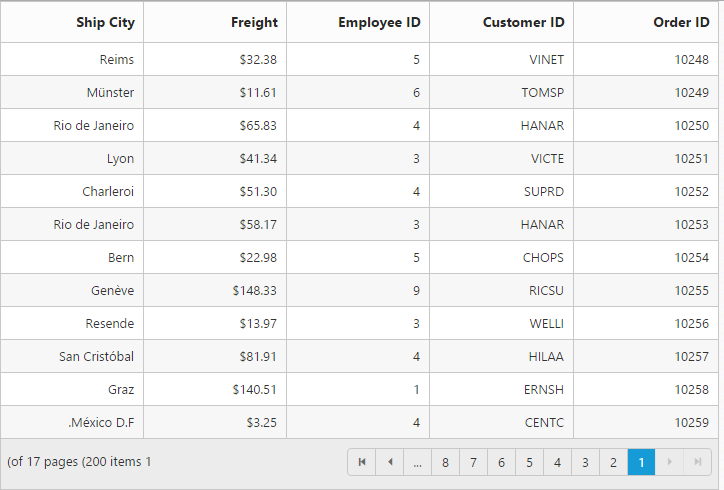

# Globalization and localization

## Localization

All text in Grid can be localized using `ej.Grid.locale` object. Please find the table with list of properties and its value in locale object.

<table>
<tr>
<td>
Locale key words   </td><td>
Text  </td></tr>
<tr>
<td>
EmptyRecord  </td><td>
No records to display  </td></tr>
<tr>
<td>
GroupDropArea  </td><td>
Drag a column header here to group its column  </td></tr>
<tr>
<td>
DeleteOperationAlert  </td><td>
No records selected for delete operation  </td></tr>
<tr>
<td>
EditOperationAlert  </td><td>
No records selected for edit operation  </td></tr>
<tr>
<td>
SaveButton  </td><td>
Save  </td></tr>
<tr>
<td>
OkButton  </td><td>
OK  </td></tr>
<tr>
<td>
CancelButton  </td><td>
Cancel  </td></tr>
<tr>
<td>
EditFormTitle  </td><td>
Details of  </td></tr>
<tr>
<td>
AddFormTitle  </td><td>
Add New Record  </td></tr>
<tr>
<td>
Notactionkeyalert  </td><td>
This Key-Combination is not available   </td></tr>
<tr>
<td>
Keyconfigalerttext  </td><td>
This Key-Combination has already been assigned to  </td></tr>
<tr>
<td>
GroupCaptionFormat  </td><td>
{{:headerText}}: {{:key}} - {{:count}} {{if count == 1 }} item {{else}} items {{/if}}  </td></tr>
<tr>
<td>
BatchSaveConfirm  </td><td>
Are you sure you want to save changes?  </td></tr>
<tr>
<td>
BatchSaveLostChanges  </td><td>
Unsaved changes will be lost. Are you sure you want to continue?  </td></tr>
<tr>
<td>
ConfirmDelete  </td><td>
Are you sure you want to Delete Record?  </td></tr>
<tr>
<td>
PagerInfo  </td><td>
{0} of {1} pages ({2} items)  </td></tr>
<tr>
<td>
FrozenColumnsViewAlert  </td><td>
Frozen columns should be in grid view area  </td></tr>
<tr>
<td>
FrozenColumnsScrollAlert  </td><td>
Enable allowScrolling while using frozen Columns  </td></tr>
<tr>
<td>
FrozenNotSupportedException  </td><td>
Frozen Columns and Rows are not supported for Grouping, Row Template, Detail Template, Hierarchy Grid and Batch Editing  </td></tr>
<tr>
<td>
Add  </td><td>
Add  </td></tr>
<tr>
<td>
Edit  </td><td>
Edit  </td></tr>
<tr>
<td>
Delete  </td><td>
Delete  </td></tr>
<tr>
<td>
Update  </td><td>
Update  </td></tr>
<tr>
<td>
Cancel  </td><td>
Cancel  </td></tr>
<tr>
<td>
Done  </td><td>
Done  </td></tr>
<tr>
<td>
Columns  </td><td>
Columns  </td></tr>
<tr>
<td>
PrintGrid  </td><td>
Print  </td></tr>
<tr>
<td>
ExcelExport  </td><td>
Excel Export  </td></tr>
<tr>
<td>
WordExport  </td><td>
Word Export  </td></tr>
<tr>
<td>
PdfExport  </td><td>
PDF Export  </td></tr>
<tr>
<td>
StringMenuOptions  </td><td>
[  {text: "StartsWith",value: "StartsWith"},  {text: "EndsWith",value: "EndsWith"},  {text: "Contains",value: "Contains"},  {text: "Equal",value: "Equal"},  {text: "NotEqual",value: "NotEqual"}  ]  </td></tr>
<tr>
<td>
NumberMenuOptions  </td><td>
[  {text: "LessThan",value: "LessThan"},  {text: "GreaterThan",value: "GreaterThan"},  {text: "LessThanOrEqual",value: "LessThanOrEqual"},  {text: "GreaterThanOrEqual",value: "GreaterThanOrEqual"},  {text: "Equal",value: "Equal"},  {text: "NotEqual",value: "NotEqual"}]  </td></tr>
<tr>
<td>
PredicateAnd  </td><td>
AND  </td></tr>
<tr>
<td>
PredicateOr  </td><td>
OR  </td></tr>
<tr>
<td>
Filter  </td><td>
Filter  </td></tr>
<tr>
<td>
FilterMenuCaption  </td><td>
Filter Value  </td></tr>
<tr>
<td>
FilterbarTitle  </td><td>
's filter bar cell  </td></tr>
<tr>
<td>
MatchCase  </td><td>
Match Case  </td></tr>
<tr>
<td>
Clear  </td><td>
Clear  </td></tr>
<tr>
<td>
ResponsiveFilter  </td><td>
Filter  </td></tr>
<tr>
<td>
ResponsiveSorting  </td><td>
Sort  </td></tr>
<tr>
<td>
Search  </td><td>
Search  </td></tr>
<tr>
<td>
DatePickerWaterMark  </td><td>
Select date  </td></tr>
<tr>
<td>
EmptyDataSource  </td><td>
DataSource must not be empty at initial load since columns are generated from dataSource in AutoGenerate Column Grid  </td></tr>
<tr>
<td>
True  </td><td>
True  </td></tr>
<tr>
<td>
False  </td><td>
False  </td></tr>
<tr>
<td>
UnGroup  </td><td>
Click here to ungroup  </td></tr>
<tr>
<td>
AddRecord  </td><td>
Add Record  </td></tr>
<tr>
<td>
EditRecord  </td><td>
Edit Record  </td></tr>
<tr>
<td>
DeleteRecord  </td><td>
Delete Record  </td></tr>
<tr>
<td>
Save  </td><td>
Save  </td></tr>
<tr>
<td>
Grouping  </td><td>
Grouping  </td></tr>
<tr>
<td>
Ungrouping  </td><td>
Ungrouping  </td></tr>
<tr>
<td>
SortInAscendingOrder  </td><td>
Sort In Ascending Order  </td></tr>
<tr>
<td>
SortInDescendingOrder  </td><td>
Sort In Descending Order  </td></tr>
<tr>
<td>
NextPage  </td><td>
Next Page  </td></tr>
<tr>
<td>
PreviousPage  </td><td>
Previous Page  </td></tr>
<tr>
<td>
FirstPage  </td><td>
First Page  </td></tr>
<tr>
<td>
LastPage  </td><td>
Last Page  </td></tr>
</table>





I> You need to change pager locale in `ej.Pager.locale` object.

## Excel-Filter Localization

All text in Grid can be localized using `ej.ExcelFilter.locale` object. Please find the table with list of properties and its value in locale object.

<table>
<tr>
<td>
Locale key words   </td><td>
Text  </td></tr>
<tr>
<td>
SortNoSmaller  </td><td>
Sort Smallest to Largest  </td></tr>
<tr>
<td>
SortNoLarger  </td><td>
Sort Largest to smallest  </td></tr>
<tr>
<td>
SortTextAscending  </td><td>
Sort A to Z  </td></tr>
<tr>
<td>
SortTextDescending  </td><td>
Sort Z to A  </td></tr>
<tr>
<td>
SortDateOldest  </td><td>
Sort By Oldest  </td></tr>
<tr>
<td>
SortDateNewest  </td><td>
Sort By Newest  </td></tr>
<tr>
<td>
SortByColor  </td><td>
Sort By Color  </td></tr>
<tr>
<td>
SortByCellColor  </td><td>
Sort By Cell Color  </td></tr>
<tr>
<td>
SortByFontColor:  </td><td>
Sort By Font Color:  </td></tr>
<tr>
<td>
FilterByColor  </td><td>
Filter By Color  </td></tr>
<tr>
<td>
SortColorOptions:  </td><td>
[{ id: 1, background:"#FFFFFF"}, {id: 2, background:"#5EABDA"}],  </td></tr>
<tr>
<td>
CustomSort  </td><td>
Custom Sort  </td></tr>
<tr>
<td>
FilterColorOptions  </td><td>
{ id: 1, background:"#FFFFFF"}, {id: 2, background:"#5EABDA"}],  </td></tr>
<tr>
<td>
FilterByCellColor  </td><td>
Filter By Cell Color  </td></tr>
<tr>
<td>
FilterByFontColor  </td><td>
Filter By Font Color  </td></tr>
<tr>
<td>
ClearFilter  </td><td>
Clear Filter  </td></tr>
<tr>
<td>
NumberFilter  </td><td>
Number Filter  </td></tr>
<tr>
<td>
TextFilter  </td><td>
Text Filter  </td></tr>
<tr>
<td>
DateFilter  </td><td>
Date Filter  </td></tr>
<tr>
<td>
StringMenuOptions  </td><td>
[  { text:"Equal",value:"equal"},  { text:"Not Equal", value:"notequal"},  { text:"Starts With",value:"startswith"},   { text:"Ends With",value:"endswith"},  { text:"Contains",value:"contains"},   {text:"Custom Filter", value:"customfilter"}],  </td></tr>
<tr>
<td>
NumberMenuOptions  </td><td>
[  {text:"Equal",value:"equal"},   {text:"Not Equal",value:"notequal"},   { text:"Less Than",value:"lessthan"},   {text:"Less Than Or Equal", value:"lessthanorequal"},   {text:"Greater Than",value:"greaterthan"},  { text:"Greater Than Or Equal", value:"greaterthanorequal"},   { text:"Between",value:"between"},  { text:"Custom Filter", value:"customfilter"}]  </td></tr>
<tr>
<td>
DateMenuOptions  </td><td>
[  { text:"Equal", value:"equal"}  , {text:"Not Equal",value:"notequal"},  {text:"Less Than",>value:"lessthan"},   {text:"Less Than Or Equal",value:"lessthanorequal"},   {text:"Greater Than",value:"greaterthan"},  {text:"Greater Than Or Equal", value:"greaterthanorequal"},   { text:"Between",value:"between"},  { text:"Custom Filter", value:"customfilter"}]  </td></tr>
<tr>
<td>
Top10MenuOptions  </td><td>
[{   text:"Top",   value:"top"  },  {  text:"Bottom",   value:"bottom"  }]  </td></tr>
<tr>
<td>
title  </td><td>
Custom Filter  </td></tr>
<tr>
<td>
PredicateOr  </td><td>
OR  </td></tr>
<tr>
<td>
Ok  </td><td>
Ok  </td></tr>
<tr>
<td>
MathCase  </td><td>
Match Case  </td></tr>
<tr>
<td>
Cancel  </td><td>
Cancel  </td></tr>
<tr>
<td>
NoResult  </td><td>
No Match Found  </td></tr>
<tr>
<td>
CheckBoxStatusMsg  </td><td>
Not all items showing  </td></tr>
<tr>
<td>
DatePickerWaterMark  </td><td>
Select date  </td></tr>
<tr>
<td>
True  </td><td>
True  </td></tr>
<tr>
<td>
False  </td><td>
False  </td></tr>
<tr>
<td>
Search  </td><td>
Search  </td></tr>
<tr>
<td>
DatePickerWaterMark  </td><td>
Select date  </td></tr>
<tr>
<td>
EmptyDataSource  </td><td>
DataSource must not be empty at initial load since columns are generated from dataSource in AutoGenerate Column Grid  </td></tr>
<tr>
<td>
True  </td><td>
True  </td></tr>
<tr>
<td>
False  </td><td>
False  </td></tr>
</table>
Please find the code





## Globalization

[`jQuery.globalize`](https://github.com/jquery/globalize/tree/v0.1.1) library is used to globalize numeric values in Grid control using [`format`](http://help.syncfusion.com/js/api/ejgrid#members:columns-format "format") property in [`columns`](http://help.syncfusion.com/js/api/ejgrid#members:columns "columns"). Globalize values will be automatically used when [`locale`](http://help.syncfusion.com/js/api/ejgrid#members:locale "locale") property is set with locale string value for example `en-US`.





I> In the above example, you need to use `globalize.culture.de-DE` script file to globalize values. 

 [localization](http://helpjs.syncfusion.com/js/localization) 

## Right to Left – RTL

By default, Grid render its text and layout from left to right. To customize Grid’s direction, you can change direction from LTR to RTL by using [`enableRTL`](http://help.syncfusion.com/js/api/ejgrid#members:enablertl "enableRTL") as true.





