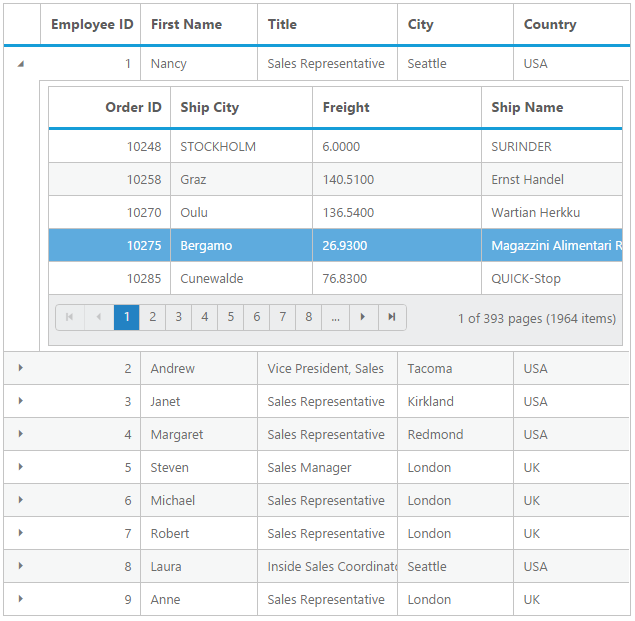

# Hierarchical Bindings

Hierarchical binding can be used to create the Grid with parent and child relation, this facilitate you to view the child records for a particular row by clicking on the Expander button present in first column of each grid row. This can be enabled by defining [`childGrid`](https://help.syncfusion.com/api/js/ejgrid#members:childgrid "childGrid") and `childGrid.queryString`. [`childGrid`](https://help.syncfusion.com/api/js/ejgrid#members:childgrid "childGrid") is to define options of child and `childGrid.queryString` is to define the relation between parent and child grid.

N> The Grid's responsive and exporting support is not applicable for Hierarchical binding.





## Expand or Collapse All Child

The Grid can able to expand and collapse all the [`childGrid`](https://help.syncfusion.com/api/js/ejgrid#members:childgrid "childGrid") through programmatically using [`expandAll`](https://help.syncfusion.com/api/js/ejgrid#methods:expandall "expandAll") and [`collapseAll`](https://help.syncfusion.com/api/js/ejgrid#methods:collapseall "collapseAll") method.


<button id="expand">expandAll</button>
<button id="collapse">collapseAll</button>



