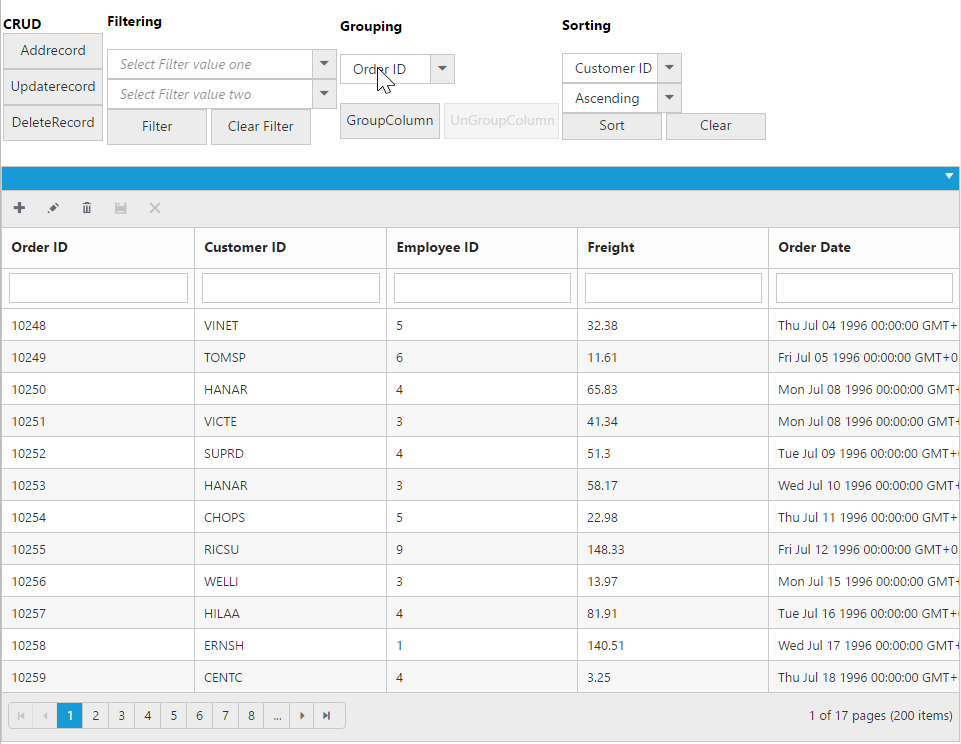

# How to

## Binding SignalR endpoint

Grid  supports SignalR features for live updates in record. Please find the below option to configure signalR with Grid. 

1) Before configure SignalR with ejGrid. You need to Setup SignalR configuration in Visual Studio project. For reference, please find the link.

N> Getting started with [SignalR](http://www.asp.net/signalr/overview/getting-started/tutorial-getting-started-with-signalr#setup "signalr") 

2) After configuration of SignalR, you have to create Hub for communication between different actions of grid. 


public class SignalHub: Hub

{

	public void modify(string action, string details)

	{

		Clients.All.modify(action, details);

	}

}



3) Implementation of SignalR communication with Grid through Hub.




## Copy data from Excel to Grid

Copy data from Excel to Grid is possible by converting Excel data to JSON data and then binding it to the Grid. Details are covered in this [blog](https://www.syncfusion.com/blogs/post/Copying-and-Pasting-Excel-Sheet-Data-to-Grid-ASPNET-MVC.aspx) post. 

## Prevent/Maintain persistence of properties

Grid actions can be persisted throughout by enabling the enablePersistence property of the Grid. However, we can maintain/prevent a grid action explicitly with the help of `addToPersist` and `ignoreOnPersist` methods respectively.


<a href="http://www.syncfusion.com">Navigate to another Page</a>
<button id="btn">Prevent/Maintain persistence</button>

    




The following output is displayed as a result of the above code example.

## Reset Model Collections

Grid provides different Methods such as [`clearSorting`](https://help.syncfusion.com/api/js/ejgrid#methods:clearsorting "clearSorting"), [`clearFiltering`](https://help.syncfusion.com/api/js/ejgrid#methods:clearfiltering "clearFiltering") for clearing the respective models [`filterSettings.filteredColumns`](https://help.syncfusion.com/api/js/ejgrid#members:filtersettings-filteredcolumns "filteredColumns") and [`sortSettings.sortedColumns`](https://help.syncfusion.com/api/js/ejgrid#members:sortsettings-sortedcolumns "sortedColumns"). To set all these models to default value, Grid provides a [`resetModelCollections`](https://help.syncfusion.com/api/js/ejgrid#methods:resetmodelcollections "resetModelCollections") method. 

`resetModelCollections` will clear the grouping, sorting and filtering and it will set the current page to first page. 




	<label>Methods</label>
	<select id="Methods" class="e-ddl" data-bind="value: field">
		<option value="default-Page" selected="selected">default-Page</option>
		<option value="clearSorting">clearSorting</option>
		<option value="clear-Grouping">clear-Grouping</option>
		<option value="clearFiltering">clearFiltering</option>
		<option value="resetModelCollections">resetModelCollections</option>
	</select>
    




    





The following output is displayed as a result of the above code example.

## Hierarchy Grid with different foreignKeyField in parent and child table

The `queryString` property is used to filter the childGrid data based on value in parent Grid data. But when the field name provided in `queryString` does not exists in Child Grid, then `foreignKeyField` property is used to filter the childGrid data. If the foreign key column name differs for parent and child grid then use `foreignKeyField` property of Grid.

The following code example explains the above behavior.



    
     
  
The following output is displayed as a result of the above code example.

## Display other Syncfusion controls in Grid columns

We can display the other Syncfusion controls using [`template`](https://help.syncfusion.com/api/js/ejgrid#members:columns-template "template") property of Grid columns and [`templateRefresh`](https://help.syncfusion.com/api/js/ejgrid#events:templaterefresh "templateRefresh") event of ejGrid control.




        

            

                
                

            

        

    

    







The following output is displayed as a result of the above code example.

## Perform Grid Actions on External button click

### CRUD operations

Using [`addRecord`](https://help.syncfusion.com/api/js/ejgrid#methods:addRecord “addRecord”) method of Grid, you can add a record to a Grid externally without using in-built toolbar add support. While using [`addRecord`](https://help.syncfusion.com/api/js/ejgrid#methods:addRecord “addRecord”) method it is necessary to set [`allowAdding`](https://help.syncfusion.com/api/js/ejgrid#members:allowAdding “allowAdding”) property as `true`.
Using [`deleteRecord`](https://help.syncfusion.com/api/js/ejgrid#methods:deleteRecord “deleteRecord”) method of Grid, you can delete a record to a Grid externally without using in-built toolbar delete support. While using [`deleteRecord`](https://help.syncfusion.com/api/js/ejgrid#methods:deleteRecord “deleteRecord”) method it is necessary to set [`allowDeleting`](https://help.syncfusion.com/api/js/ejgrid#members:allowDeleting “allowDeleting”) property as `true`.
Using [`updateRecord`](https://help.syncfusion.com/api/js/ejgrid#methods:updateRecord “updateRecord”) method of Grid, you can update a record to a Grid externally without using in-built toolbar update support. While using [`updateRecord`](https://help.syncfusion.com/api/js/ejgrid#methods:updateRecord “updateRecord”) method it is necessary to set [`allowEditing`](https://help.syncfusion.com/api/js/ejgrid#members:allowEditing “allowEditing”) property as `true`.

### Filtering

Using [`filterColumn`](https://help.syncfusion.com/api/js/ejgrid#methods:filterColumn “filterColumn”) method of Grid, you can filter the data in the Grid externally without using in-built filter support. While using [`filterColumn`](https://help.syncfusion.com/api/js/ejgrid#methods:filterColumn “filterColumn”) method it is necessary to set [`allowFiltering`](https://help.syncfusion.com/api/js/ejgrid#members:allowFiltering “allowFiltering”) property as `true`.

### Grouping

Using [`groupColumn`](https://help.syncfusion.com/api/js/ejgrid#methods:groupColumn “groupColumn”) and [`ungroupColumn`](https://help.syncfusion.com/api/js/ejgrid#methods:ungroupColumn “ungroupColumn”) method of Grid, you can group/ungroup the Grid externally without using in-built grouping support. While using [`groupColumn`](https://help.syncfusion.com/api/js/ejgrid#methods:groupcolumn “groupColumn”) and [`ungroupColumn`](https://help.syncfusion.com/api/js/ejgrid#methods:ungroupcolumn “ungroupColumn”) method it is necessary to set [`allowGrouping`](https://help.syncfusion.com/api/js/ejgrid#members:allowgrouping “allowGrouping”) property as `true`.

### Sorting

Using [`sortColumn`](https://help.syncfusion.com/api/js/ejgrid#methods:sortcolumn “sortColumn”) method of Grid, you can sort the Grid externally without using in-built sorting support. While using [`sortColumn`](https://help.syncfusion.com/api/js/ejgrid#methods:sortcolumn “sortColumn”) method it is necessary to set [`allowSorting`](https://help.syncfusion.com/api/js/ejgrid#members:allowsorting “allowSorting”) property as `true`.

The following code example explains the above behavior.



<table>
    <tr>
        <td><b>CRUD</b> <button id="AddRecord">Add record</button> <button id="UpdateRecord">Update record</button> <button id="DeleteRecord">DeleteRecord</button></td>
        <td><b>Filtering</b>  <input type="text" id="filterOne" /><input type="text" id="filterTwo" /><button id="filter">Filter</button> <button id="ClearFilter">Clear Filter</button></td>
        
<ul><li>10248</li><li>10249</li><li>10250</li><li>10251</li><li>10252</li></ul>

        
<ul><li>1</li><li>2</li><li>3</li><li>4</li><li>5</li></ul>

        <td><b>Grouping</b>  
            <select id="columnName" class="e-ddl" data-bind="value: field">
                <option value="OrderID" selected="selected">Order ID</option>
                <option value="CustomerID">Customer ID</option>
                <option value="Freight">Freight</option>
                <option value="ShipName">Ship Name</option>
                <option value="Verified">Verified</option>
            </select> 
            <button id="groupColumn">GroupColumn</button>
            <button id="unGroupColumn">UnGroupColumn</button>
        </td>
        <td><b>Sorting</b>  
            <select id="sortColumnName" class="e-ddl" style="width: 100px" data-bind="value: field">
                <option value="OrderID" selected="selected">Order ID</option>
                <option value="CustomerID">Customer ID</option>
                <option value="EmployeeID">Employee ID</option>
                <option value="Freight">Freight</option>
                <option value="OrderDate">Order Date</option>
            </select>
            <select id="directions" class="e-ddl" style="width: 100px" data-bind="value: field">
                <option value="ascending" selected="selected">Ascending</option>
                <option value="descending">Descending</option>
            </select>
            <button id="doSorting" style="width: 100px">Sort</button>
            <button id="clearSort" style="width: 100px">Clear</button>
        </td>
    </tr>
</table>








The following output is displayed as a result of the above code example.

## Getting Datasource of Grid in Sorted Order

Grid column can be sorted and after sorting, the datasource can be obtained in the same order using `sortBy` query and `executeLocal` method of DataManager.

The following code example describes the above behavior.




    

        

            

                

                    

                        <input type="button" id="Sort" value="Get Sorted Data" />
                    

                

            

        

        

            

        

    









N> This solution is applicable only for local data.

