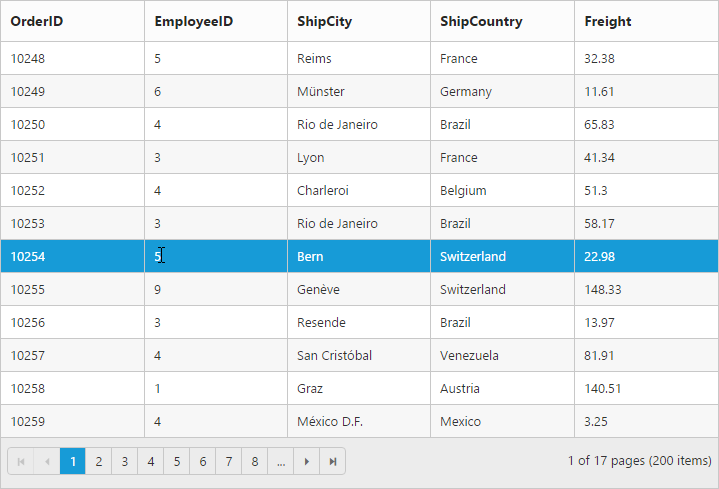
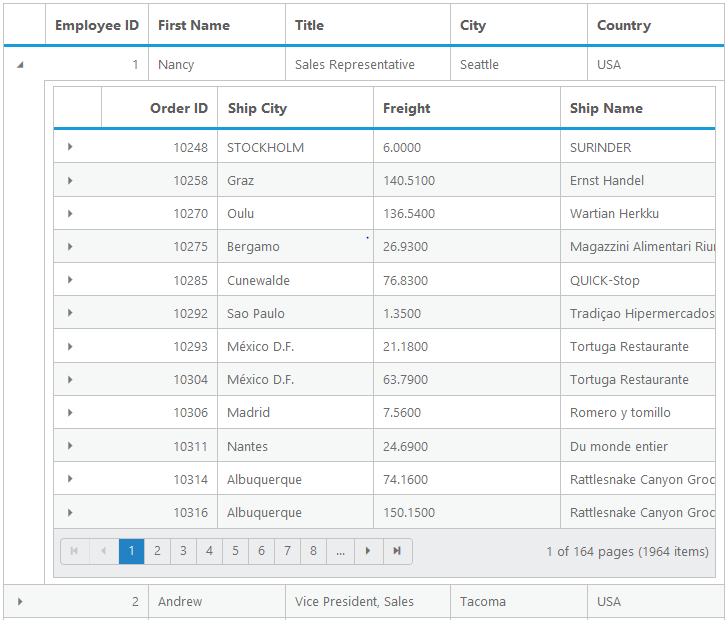
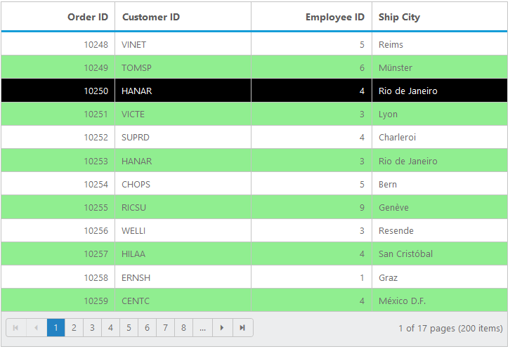
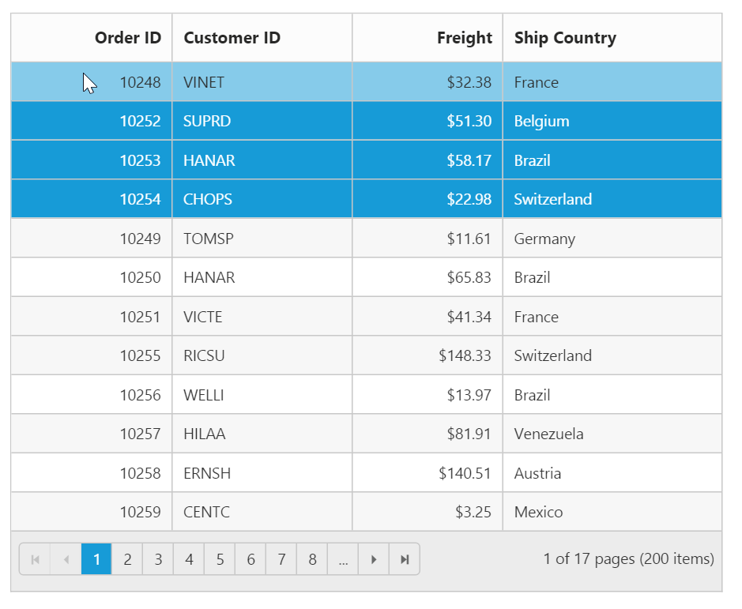
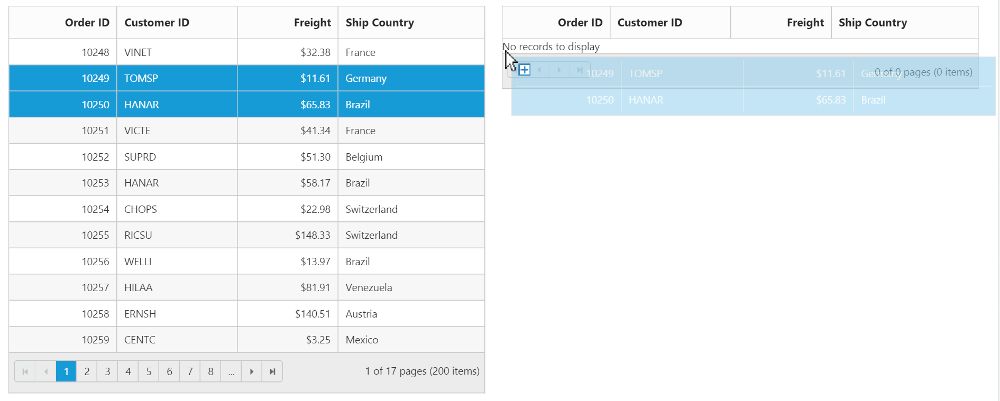
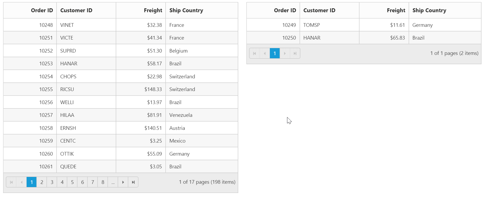
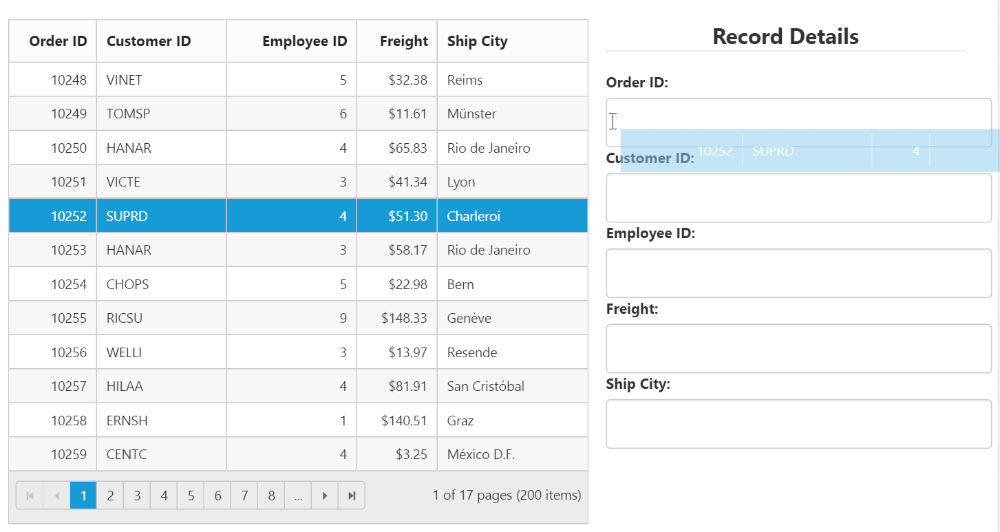
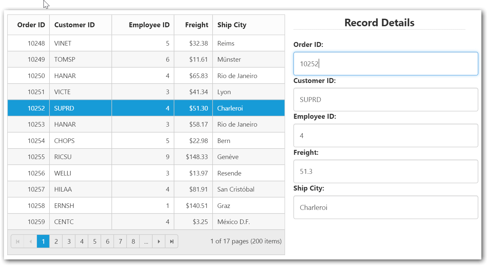

---
layout: post
title: Row with Grid widget for Syncfusion Essential JS
description: How to use and customize the grid row
platform: js
control: Grid
documentation: ug
api: /api/js/ejgrid
--- 
# Row

It represents the record details that are fetched from the datasource.

## Row Hover

You can see the mouse hovering effect on the corresponding grid rows using the [`enableRowHover`](https://help.syncfusion.com/api/js/ejgrid#members:enablerowhover "enableRowHover") property. By default, its value is `true`.

The following code example describes the above behavior.






$(function () {
	$("#Grid").ejGrid({
		// the datasource "window.gridData" is referred from 'http://js.syncfusion.com/demos/web/scripts/jsondata.min.js'
		dataSource : window.gridData,
		enableRowHover : true,
		allowPaging : true,
		columns : ["OrderID", "EmployeeID", "ShipCity", "ShipCountry", "Freight"]
	});
});


The following output is displayed as a result of the above code example.

By using the following methods, you can get the rows(tr element)of the Grid.

1.[`getRowByIndex`](https://help.syncfusion.com/api/js/ejgrid#methods:getrowbyindex "getRowByIndex")

2.[`getRows`](https://help.syncfusion.com/api/js/ejgrid#methods:getrows "getRows")

N> 1. While Hovering, the [`rowHover`](https://help.syncfusion.com/api/js/ejgrid#events:rowHover "rowHover") event get triggered.

## Details Template

It provides a detailed view /additional information about each row of the grid. You can render any type of JsRender template and assign the script template id in the [`detailsTemplate`](https://help.syncfusion.com/api/js/ejgrid#members:detailstemplate "detailsTemplate") property. And also you can change the HTML elements in detail template row into JavaScript controls using the [`detailsDataBound`](https://help.syncfusion.com/api/js/ejgrid#events:detailsdatabound "detailsDataBound") event.

On enabling details template, new column will be added in grid with an expander button in it and that can be expanded or collapsed to show or hide the underlying details of row respectively.

N> It's a standard way to enclose the template within the `script` tag with `type` as "text/x-jsrender".

The following code example describes the above behavior.






$(function () {
	$("#Grid").ejGrid({
		//The datasource "window.employeeView" is referred from 'http://js.syncfusion.com/demos/web/scripts/jsondata.min.js'
		dataSource : window.employeeView,
		detailsTemplate : "#tabGridContents",
		detailsDataBound : "detailGridData",
		columns : ["EmployeeID", "FirstName", "Title", "City", "Country"]
	});
});

function detailGridData(e) {
	// Here you can get the parent details from "data". EmployeeID is the unique column value in parent row.
	var filteredData = e.rowData["EmployeeID"];
	// the datasource "window.ordersView" is referred from 'http://js.syncfusion.com/demos/web/scripts/jsondata.min.js'
	var data = ej.DataManager(window.ordersView).executeLocal(ej.Query().where("EmployeeID", "equal", parseInt(filteredData), true).take(5)); // form the query to filter the detail row data by using EmployeeID column value.
	//detailsElement contains all the elements which are mentioned in the template.
	// Here the detailGrid element is changed as ejGrid control
	e.detailsElement.find("#detailGrid").ejGrid({
		dataSource : data,		
		columns : ["OrderID", "EmployeeID", "ShipCity", "ShipCountry", "Freight"]
	});
	// Here the element which has tabcontrol class is changed as ejTab control
	e.detailsElement.find(".tabcontrol").ejTab();
}


The following output is displayed as a result of the above code example.

By using [`getIndexByRow`](https://help.syncfusion.com/api/js/ejgrid#methods:getindexbyrow "getIndexByRow") you can get the row index of provided tr element and index value would not have considered detail row elements in grid content.

## Row Template

Row template enables you to set the customized look and behavior to all Grid rows. The [`rowTemplate`](https://help.syncfusion.com/api/js/ejgrid#members:rowtemplate "rowTemplate") property can be used to bind the `id` of HTML template.

The following code example describes the above behavior.






.photo img {
	width: 130px;
}
.photo, .details {
	border-color: #c4c4c4;
	border-style: solid;
}
.photo {
	border-width: 1px 0px 0px 0px;
}
.details {
	border-width: 1px 0px 0px 1px;
}
.details > table {
	width: 100%;
}
.CardHeader {
	font-weight: bolder;
}



$(function () {
	$("#Grid").ejGrid({
		//The datasource "window.employeeView" is referred from 'http://js.syncfusion.com/demos/web/scripts/jsondata.min.js'
		dataSource : ej.DataManager(window.employeeView).executeLocal(ej.Query().take(2)),
		rowTemplate : "#templateData", // row template
		columns : [
			{ headerText: "Photo", width: 30 },
			{ headerText: 'Employee Details', width: 70 }
		]
	});
});


The following output is displayed as a result of the above code example.

## Alternate row styling

Alternate row styling enhances the readability of Grid rows by setting different background color for every alternate row. You can enable the alternative row styling in Grid by using the [`enableAltRow`](https://help.syncfusion.com/api/js/ejgrid#members:enablealtrow "enableAltRow") property. 

By default, its value is `true`. The following code example describes how to turn off the alternate row behavior.






$(function () {
	$("#Grid").ejGrid({
		// the datasource "window.gridData" is referred from 'http://js.syncfusion.com/demos/web/scripts/jsondata.min.js'
		dataSource : window.gridData,
		allowPaging : true,
		enableAltRow : false,
		columns : ["OrderID", "EmployeeID", "ShipCity", "ShipCountry", "Freight"]
	});
});


The following output is displayed as a result of the above code example.

## Drag-and-Drop

The Grid rows can be reordered, dropped to another Grid or custom control by enabling the [`allowRowDragAndDrop`](https://help.syncfusion.com/api/js/ejgrid#members:allowrowdraganddrop "allowRowDragAndDrop") Grid property.

N> To enable selection of multiple rows by mouse dragging on Grid rows, the [`selectionType`](https://help.syncfusion.com/api/js/ejgrid#members:selectiontype "selectionType") property of Grid must be set to `multiple`.

### Reorder

By simply enabling the property [`allowRowDragAndDrop`](https://help.syncfusion.com/api/js/ejgrid#members:allowrowdraganddrop "allowRowDragAndDrop"), Grid rows can be reordered within the same Grid.

The following code example describes the above behavior.






$(function () {
                $("#Grid").ejGrid({
                    // the datasource "window.gridData" is referred from 'http://js.syncfusion.com/demos/web/scripts/jsondata.min.js' 
                    dataSource: window.gridData,
                    allowPaging: true,
                    allowRowDragAndDrop: true,
                    selectionType: "multiple",
                    columns: [
                                  { field: "OrderID", headerText: "Order ID", isPrimaryKey: true, textAlign: ej.TextAlign.Right, width: 80 },
                                  { field: "CustomerID", headerText: "Customer ID", width: 90 },
                                  { field: "Freight", headerText: "Freight", textAlign: ej.TextAlign.Right, width: 75, format: "{0:C}" },
                                  { field: "ShipCountry", headerText: "Ship Country", width: 110 }
                    ],
                });           
 });



The following output is displayed before reordering rows. 

{:Before Drop}

The following output is displayed after reordering rows.

{:After Drop}

### Grid-to-Grid

To drag and drop rows between two Grid, enable the Grid property [`allowRowDragAndDrop`](https://help.syncfusion.com/api/js/ejgrid#members:allowrowdraganddrop "allowRowDragAndDrop") and specify the target Grid ID in [`dropTargetID`](https://help.syncfusion.com/api/js/ejgrid#members:rowdropsettings-droptargetid "dropTargetID") property of the Grid [`rowDropSettings`](https://help.syncfusion.com/api/js/ejgrid#members:rowdropsettings "rowDropSettings").

The following code example describes the above behavior.






$(function () {
                $("#Grid").ejGrid({
                    / the datasource "window.gridData" is referred from 'http://js.syncfusion.com/demos/web/scripts/jsondata.min.js' 
                    dataSource: window.gridData,
                    allowPaging: true,
                    allowRowDragAndDrop: true,
                    selectionType: "multiple",
                    rowDropSettings: { dropTargetID: "#DestinationGrid" },
                    columns: [
                                  { field: "OrderID", headerText: "Order ID", isPrimaryKey: true, textAlign: ej.TextAlign.Right, width: 80 },
                                  { field: "CustomerID", headerText: "Customer ID", width: 90 },
                                  { field: "Freight", headerText: "Freight", textAlign: ej.TextAlign.Right, width: 75, format: "{0:C}" },
                                  { field: "ShipCountry", headerText: "Ship Country", width: 110 }
                    ],
                });
                $("#DestinationGrid").ejGrid({
                    dataSource: [],
                    allowPaging: true,
                    allowRowDragAndDrop: true,
                    rowDropSettings: { dropTargetID: "#Grid" },
                    selectionType: "multiple",
                    columns: [
                                  { field: "OrderID", headerText: "Order ID", isPrimaryKey: true, textAlign: ej.TextAlign.Right, width: 80 },
                                  { field: "CustomerID", headerText: "Customer ID", width: 90 },
                                  { field: "Freight", headerText: "Freight", textAlign: ej.TextAlign.Right, width: 75, format: "{0:C}" },
                                  { field: "ShipCountry", headerText: "Ship Country", width: 110 }
                    ],
                });
});



The following output is displayed before dropping Grid rows.

{:Before Drop}

The following output is displayed after dropping Grid rows.

{:After Drop}

You can re-order the rows in the Grid dynamically by using [`reorderRows`](https://help.syncfusion.com/api/js/ejgrid#methods:reorderrows "reorderRows") method.

N> 1. While Drag and Drop, the following events are triggered [`rowDrag`](https://help.syncfusion.com/api/js/ejgrid#events:rowdrag "rowDrag"), [`rowDrop`](https://help.syncfusion.com/api/js/ejgrid#events:rowdrop "rowDrop"), [`rowDragStart`](https://help.syncfusion.com/api/js/ejgrid#events:rowdragstart "rowDragStart")

### Grid-to-Custom control

You can also drag and drop Grid rows to any custom control. For instance, let it be a form.

Enable the Grid property [`allowRowDragAndDrop`](https://help.syncfusion.com/api/js/ejgrid#members:allowrowdraganddrop "allowRowDragAndDrop") and specify the target form element ID in [`dropTargetID`](https://help.syncfusion.com/api/js/ejgrid#members:rowdropsettings-droptargetid "dropTargetID") property of Grid [`rowDropSettings`](https://help.syncfusion.com/api/js/ejgrid#members:rowdropsettings "rowDropSettings").

The following code example describes the above behavior.



<form role="form" id="dropForm" style="width:98%">
                        <fieldset style="text-align:center; font-weight:700"><legend>Record Details</legend></fieldset>
                        

                            <label for="OrderID">Order ID:</label>
                            <input class="form-control" name="OrderID">
                        

                        

                            <label for="CustomerID">Customer ID:</label>
                            <input name="CustomerID" class="form-control">
                        

                        

                            <label for="EmployeeID">Employee ID:</label>
                            <input name="EmployeeID" class="form-control">
                        

                        

                            <label for="Freight">Freight:</label>
                            <input name="Freight" class="form-control">
                        

                        

                            <label for="ShipCity">Ship City:</label>
                            <input name="ShipCity" class="form-control">
                        

                         
                    </form>
                




$(function () {
            $("#Grid").ejGrid({
                // the datasource "window.gridData" is referred from 'http://js.syncfusion.com/demos/web/scripts/jsondata.min.js'            
                dataSource: ej.DataManager(window.gridData),
                allowPaging: true,
                allowRowDragAndDrop: true,
                rowDropSettings: { dropTargetID: "#dropForm" },
                rowDrop: "rowDropHandler",				
                columns: [
                              { field: "OrderID", headerText: "Order ID", isPrimaryKey: true, textAlign: ej.TextAlign.Right, width: 80 },
                              { field: "CustomerID", headerText: "Customer ID", width: 120 },
                              { field: "EmployeeID", headerText: "Employee ID", textAlign: ej.TextAlign.Right, width: 120 },
                              { field: "Freight", headerText: "Freight", textAlign: ej.TextAlign.Right, width: 75, format: "{0:C}" },
                              { field: "ShipCity", headerText: "Ship City", width: 140 }
                ],
            });
});
        function rowDropHandler(args) {
            for (var key in args.rowData[0]) {
                $('#dropForm input[name=' + key + ']').val(args.rowData[0][key]);
            }
        }


The following output is displayed before dropping the rows on Form.

{:Before Drop}

The following output is displayed after dropping the rows on Form.

{:After Drop}

N>  Also [`dragMapper`](https://help.syncfusion.com/api/js/ejgrid#members:rowdropsettings-dragmapper "dragMapper") and [`dropMapper`](https://help.syncfusion.com/api/js/ejgrid#members:rowdropsettings-dropmapper "dropMapper") property of the [`rowDropSettings`](https://help.syncfusion.com/api/js/ejgrid#members:rowdropsettings "rowDropSettings") helps in mapping server-side action when rows are dragged and dropped into the Grid.

N>  The default behavior of drag and drop between Grid or any other controls is as cut and paste. For copy and paste behavior specify the drag behavior in [`dragBehavior`](https://help.syncfusion.com/api/js/ejgrid#members:rowdropsettings-dragbehavior "dragBehavior") property of the [`rowDropSettings`](https://help.syncfusion.com/api/js/ejgrid#members:rowdropsettings "rowDropSettings")  as ej.Grid.DragBehavior.Copy.

