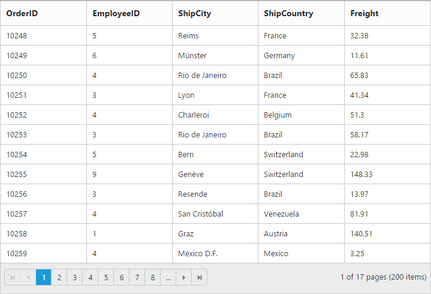

---
layout: post
title: Row
description: row
platform: js
control: Grid
documentation: ug
--- 

# Row

It represents the record details that are fetched from the datasource.

## Row Hover

You can see the mouse hovering effect on the corresponding grid rows using [`enableRowHover`](http://help.syncfusion.com/js/api/ejgrid#members:enablerowhover "enableRowHover") property. By default its value is `true`.

The following code example describes the above behavior.






$(function () {
	$("#Grid").ejGrid({
		// the datasource "window.gridData" is referred from 'http://js.syncfusion.com/demos/web/scripts/jsondata.min.js'
		dataSource : window.gridData,
		enableRowHover : true,
		allowPaging : true,
		columns : ["OrderID", "EmployeeID", "ShipCity", "ShipCountry", "Freight"]
	});
});


The following output is displayed as a result of the above code example.

## Details Template

It provides a detailed view /additional information about each row of the grid. You can render any type of JsRender template and assign the script template id in the [`detailsTemplate`](http://help.syncfusion.com/js/api/ejgrid#members:detailstemplate "detailsTemplate") property. And also you can change HTML elements in detail template row into JavaScript controls using [`detailsDataBound`](http://help.syncfusion.com/js/api/ejgrid#events:detailsdatabound "detailsDataBound") event.

On enabling details template, new column will be added in grid with an expander arrow in it and that can be expanded or collapsed to show or hide the underlying details row respectively.

N> It's a standard way to enclose the template within the `script` tag with `type` as "text/x-jsrender".

The following code example describes the above behavior.






$(function () {
	$("#Grid").ejGrid({
		//The datasource "window.employeeView" is referred from 'http://js.syncfusion.com/demos/web/scripts/jsondata.min.js'
		dataSource : window.employeeView,
		detailsTemplate : "#tabGridContents",
		detailsDataBound : "detailGridData",
		columns : ["EmployeeID", "FirstName", "Title", "City", "Country"]
	});
});

function detailGridData(e) {
	// Here you can get the parent details from "data". EmployeeID is the unique column value in parent row.
	var filteredData = e.data["EmployeeID"];
	// the datasource "window.ordersView" is referred from 'http://js.syncfusion.com/demos/web/scripts/jsondata.min.js'
	var data = ej.DataManager(window.ordersView).executeLocal(ej.Query().where("EmployeeID", "equal", parseInt(filteredData), true).take(5)); // form the query to filter the detail row data by using EmplooyeeID column value.
	//detailsElement contains all the elements which are mentioned in the template.
	// Here the detailGrid element is changed as ejGrid control
	e.detailsElement.find("#detailGrid").ejGrid({
		dataSource : data,		
		columns : ["OrderID", "EmployeeID", "ShipCity", "ShipCountry", "Freight"]
	});
	// Here the element which has tabcontrol class is changed as ejTab control
	e.detailsElement.find(".tabcontrol").ejTab();
}


The following output is displayed as a result of the above code example.

## Row Template

Row template enables you to set the customized look and behavior to grid all rows. [`rowTemplate`](http://help.syncfusion.com/js/api/ejgrid#members:rowtemplate "rowTemplate") property can be used bind the `id` of HTML template.

The following code example describes the above behavior.






.photo img {
	width: 130px;
}
.photo, .details {
	border-color: #c4c4c4;
	border-style: solid;
}
.photo {
	border-width: 1px 0px 0px 0px;
}
.details {
	border-width: 1px 0px 0px 1px;
}
.details > table {
	width: 100%;
}
.CardHeader {
	font-weight: bolder;
}



$(function () {
	$("#Grid").ejGrid({
		//The datasource "window.employeeView" is referred from 'http://js.syncfusion.com/demos/web/scripts/jsondata.min.js'
		dataSource : ej.DataManager(window.employeeView).executeLocal(ej.Query().take(2)),
		rowTemplate : "#templateData", // row template
		columns : [
			{ headerText: "Photo", width: 30 },
			{ headerText: 'Employee Details', width: 70 }
		]
	});
});


The following output is displayed as a result of the above code example.

## Alternate row styling

Alternate row styling enhances the readability of grid rows by setting different background color for every alternate row. You can enable the alternative row styling in grid by using [`enableAltRow`](http://help.syncfusion.com/js/api/ejgrid#members:enablealtrow "enableAltRow") property. 

By default its value is `true`, so the following code example describes the how to turn off alternate row behavior.






$(function () {
	$("#Grid").ejGrid({
		// the datasource "window.gridData" is referred from 'http://js.syncfusion.com/demos/web/scripts/jsondata.min.js'
		dataSource : window.gridData,
		allowPaging : true,
		enableAltRow : false,
		columns : ["OrderID", "EmployeeID", "ShipCity", "ShipCountry", "Freight"]
	});
});


The following output is displayed as a result of the above code example.

