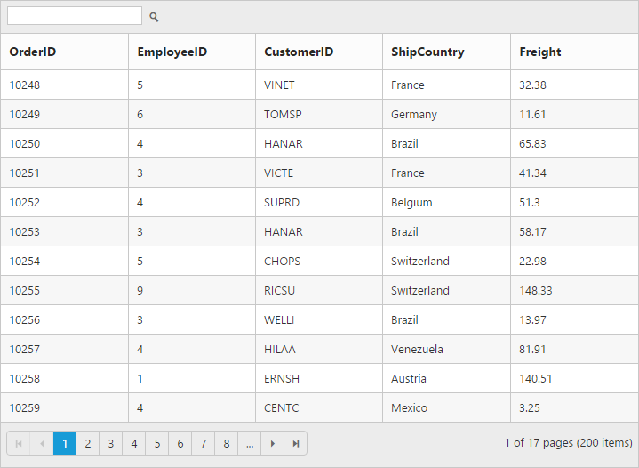
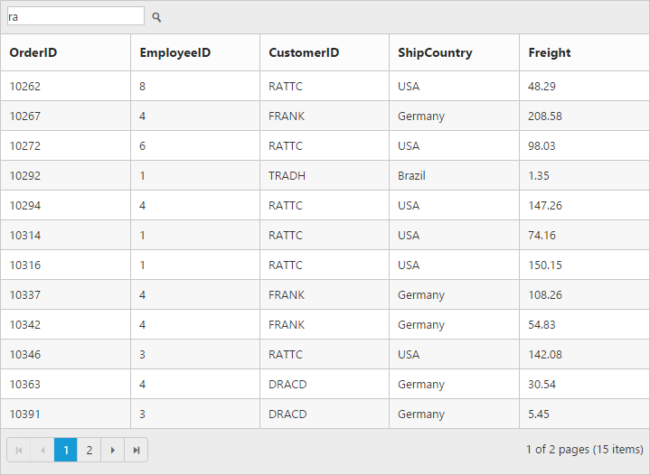

---
layout: post
title: Searching with Grid widget for Syncfusion Essential JS
description: How to enable search opition and its functionalities
platform: js
control: Grid
documentation: ug
api: /api/js/ejgrid
--- 
# Searching

The grid has an option to search its content using the JavaScript method [`search`](https://help.syncfusion.com/api/js/ejgrid#methods:search "search") with search key as parameter. Also, it provides an option to integrate Search text box in the grid toolbar, by adding `search` toolbar item in the [`toolbarSetting.toolbarItems`](https://help.syncfusion.com/api/js/ejgrid#members:toolbarsettings-toolbaritems "toolbarSetting.toolbarItems") property.

The following code example describes the above behavior.






$(function () {
	$("#Grid").ejGrid({
		toolbarSettings : { showToolbar : true, toolbarItems : ["search"] },
		//The datasource "window.gridData" is referred from 'http://js.syncfusion.com/demos/web/scripts/jsondata.min.js'
		dataSource : window.gridData,
		allowPaging : true,
		allowSearching : true,
		columns : ["OrderID", "EmployeeID", "CustomerID", "ShipCountry", "Freight"]
	});
});


The following output is displayed as a result of the above code example.

## Initial Searching

While initializing the grid, there is an option to display only the searched data in grid. To perform initial searching, define [`fields`](https://help.syncfusion.com/api/js/ejgrid#members:searchsettings-fields "fields") ,[`key`](https://help.syncfusion.com/api/js/ejgrid#members:searchsettings-key "key"), [`operator`](https://help.syncfusion.com/api/js/ejgrid#members:searchsettings-operator "operator") and [`ignoreCase`](https://help.syncfusion.com/api/js/ejgrid#members:searchsettings-ignorecase "ignoreCase") in the [`searchSettings`](https://help.syncfusion.com/api/js/ejGrid#members:searchsettings "searchSettings") property.

N> The `key` value must be passed as `string`.

The following code example describes the above behavior.






$(function () {
	$("#Grid").ejGrid({
		toolbarSettings : { showToolbar : true, toolbarItems : ["search"] },
		//The datasource "window.gridData" is referred from 'http://js.syncfusion.com/demos/web/scripts/jsondata.min.js'
		dataSource : window.gridData,
		allowPaging : true,
		allowSearching : true,
		searchSettings: { fields: ["CustomerID"], operator: "contains", key: "frank", ignoreCase: false },
		columns : ["OrderID", "EmployeeID", "CustomerID", "ShipCountry", "Freight"]
	});
});


The following output is displayed as a result of the above code example.

List of supported operators in searching.

<table>
<tr>
<td>
ej.FilterOperators.equal</td></tr>
<tr>
<td>
ej.FilterOperators.notEqual</td></tr>
<tr>
<td>
ej.FilterOperators.startsWith</td></tr>
<tr>
<td>
ej.FilterOperators.endsWith</td></tr>
<tr>
<td>
ej.FilterOperators.contains</td></tr>
</table>
