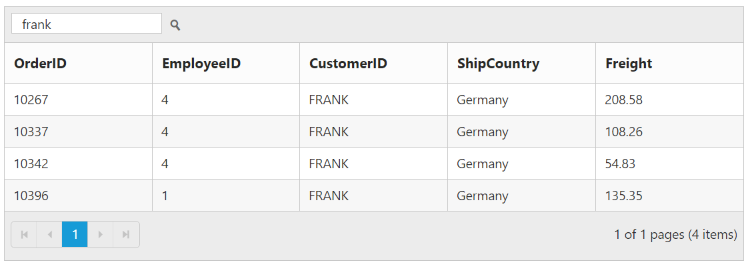

---
layout: post
title: Search
description: search
platform: js
control: Grid
documentation: ug
--- 

# Search

The grid has an option to search its content using the JavaScript method [`search`](http://help.syncfusion.com/js/api/ejgrid#methods:search "search") with search key as parameter. Also, it provides option to integrate Search text box in grid toolbar, by adding `search` toolbar item in [`toolbarSetting.toolbarItems`](http://help.syncfusion.com/js/api/ejgrid#members:toolbarsettings-toolbaritems "toolbarSetting.toolbarItems") property.

The following code example describes the above behavior.






$(function () {
	$("#Grid").ejGrid({
		toolbarSettings : { showToolbar : true, toolbarItems : ["search"] },
		//The datasource "window.gridData" is referred from 'http://js.syncfusion.com/demos/web/scripts/jsondata.min.js'
		dataSource : window.gridData,
		allowPaging : true,
		allowSearching : true,
		columns : ["OrderID", "EmployeeID", "CustomerID", "ShipCountry", "Freight"]
	});
});


The following output is displayed as a result of the above code example.

## Initial Searching

While initializing the grid, there is an option to display only the searched data in grid. To perform initial searching, define `fields`, `operator`, `key` and `ignoreCase` in `searchSettings` property.

N> `key` value must be passed as `string`.

The following code example describes the above behavior.






$(function () {
	$("#Grid").ejGrid({
		toolbarSettings : { showToolbar : true, toolbarItems : ["search"] },
		//The datasource "window.gridData" is referred from 'http://js.syncfusion.com/demos/web/scripts/jsondata.min.js'
		dataSource : window.gridData,
		allowPaging : true,
		allowSearching : true,
		searchSettings: { fields: ["CustomerID"], operator: "contains", key: "ra", ignoreCase: false },
		columns : ["OrderID", "EmployeeID", "CustomerID", "ShipCountry", "Freight"]
	});
});


The following output is displayed as a result of the above code example.

List of supported operators in searching.

<table>
<tr>
<td>
ej.FilterOperators.equal  </td></tr>
<tr>
<td>
ej.FilterOperators.notEqual  </td></tr>
<tr>
<td>
ej.FilterOperators.startsWith  </td></tr>
<tr>
<td>
ej.FilterOperators.endsWith  </td></tr>
<tr>
<td>
ej.FilterOperators.contains  </td></tr>
</table>
