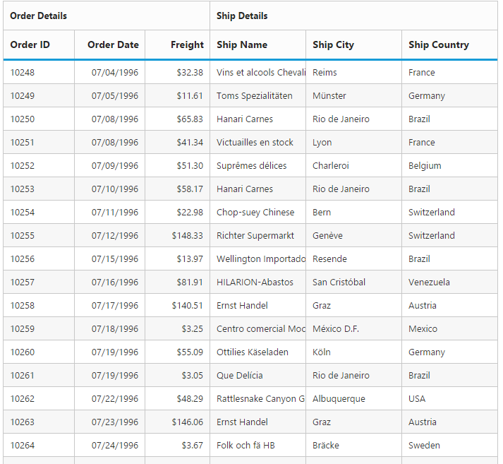

# Stacked Headers

The stacked headers helps you to group the logical columns in the Grid. It can be shown by setting the [`showStackedHeader`](https://help.syncfusion.com/api/js/ejgrid#members:showstackedheader "showStackedHeader") as `true` and by defining the [`stackedHeaderRows`](https://help.syncfusion.com/api/js/ejgrid#members:stackedheaderrows "stackedHeaderRows").

## Adding stacked header columns

To stack columns in stacked header, you need to define the [`column`](https://help.syncfusion.com/api/js/ejgrid#members:stackedheaderrows-stackedheadercolumns-column "column") property in the [`stackedHeaderColumns`](https://help.syncfusion.com/api/js/ejgrid#members:stackedheaderrows-stackedheadercolumns "stackedHeaderColumns") with field names of visible columns.

You can also define the [`cssClass`](https://help.syncfusion.com/api/js/ejgrid#members:stackedheaderrows-stackedheadercolumns-cssclass "cssClass"),  [`headerText `](https://help.syncfusion.com/api/js/ejgrid#members:stackedheaderrows-stackedheadercolumns-headertext  "headerText "), [`textAlign `](https://help.syncfusion.com/api/js/ejgrid#members:stackedheaderrows-stackedheadercolumns-textalign "textAlign  ") and [`tooltip `](https://help.syncfusion.com/api/js/ejgrid#members:stackedheaderrows-stackedheadercolumns-tooltip "tooltip ") properties in the [`stackedHeaderColumns`](https://help.syncfusion.com/api/js/ejgrid#members:stackedheaderrows-stackedheadercolumns "stackedHeaderColumns") .





