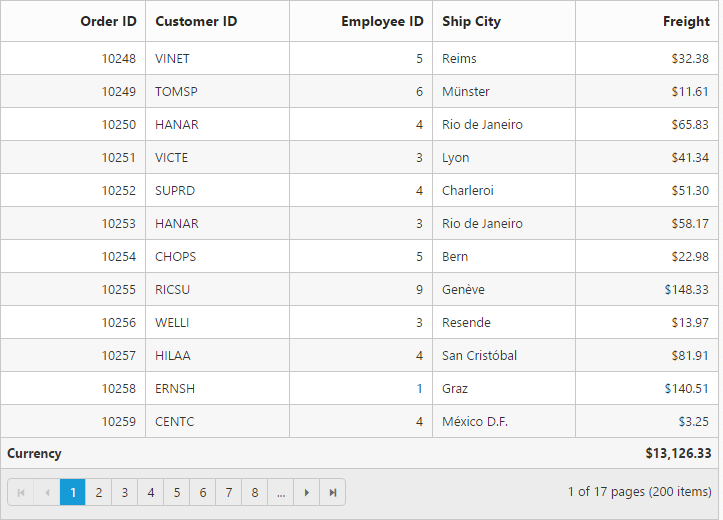
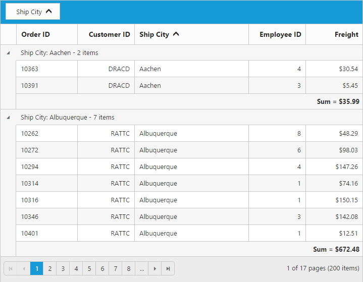
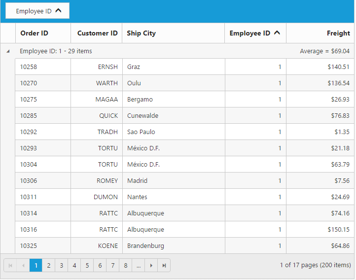

# Summary

Summary rows visibility can be controlled by the [`showSummary`](https://help.syncfusion.com/api/js/ejgrid#members:showsummary "showSummary") property and it can be added to grid by using the [`summaryRows`](https://help.syncfusion.com/api/js/ejgrid#members:summaryrows "summaryRows") array property. The following code example describes the above behavior.





N> [`dataMember`](https://help.syncfusion.com/api/js/ejgrid#members:summaryrows-summarycolumns-datamember "dataMember") denotes the aggregation column whereas the [`displayColumn`](https://help.syncfusion.com/api/js/ejgrid#members:summaryrows-summarycolumns-displaycolumn "displayColumn") denotes the value to be displayed column.

## Supported Aggregates 

Following are the supported list of [aggregates](https://help.syncfusion.com/js/datamanager/summary#) 

* Sum
* Average
* Maximum
* Minimum
* False Count
* True Count

### Sum, Average, Maximum and Minimum

Summaries with the [`Sum`](https://help.syncfusion.com/js/datamanager/summary#sum "sum"),[`Average`](https://help.syncfusion.com/js/datamanager/summary#avg "Average"),[`Maximum`](https://help.syncfusion.com/js/datamanager/summary#max "maximum") and [`Minimum`](https://help.syncfusion.com/js/datamanager/summary#min "min") aggregate can be defined by using the [`summaryType`](https://help.syncfusion.com/api/js/ejgrid#members:summaryrows-summarycolumns-summarytype "summaryType") in [`summaryColumns`](https://help.syncfusion.com/api/js/ejgrid#members:summaryrows-summarycolumns "summaryColumns") collections. These aggregate are used in `Number` column.





### True and False count 

Summaries with `True` and `False` count aggregate can be defined by using [`summaryType`](https://help.syncfusion.com/api/js/ejgrid#members:summaryrows-summarycolumns-summarytype "summaryType") [`summaryColumns`](https://help.syncfusion.com/api/js/ejgrid#members:summaryrows-summarycolumns "summaryColumns") collections. `True` and `False` count aggregates are used for Boolean columns.





## Custom Summary

Custom Summary can be used to create summary values based on your required custom logic and calculations. To enable Custom Summary, [`summaryType`](https://help.syncfusion.com/api/js/ejgrid#members:summaryrows-summarycolumns-summarytype "summaryType") should be [`custom`](https://help.syncfusion.com/js/grid/summary#custom-summary-by-string "custom") and [`customSummaryValue`](https://help.syncfusion.com/api/js/ejgrid#members:summaryrows-summarycolumns-customsummaryvalue "customSummaryValue") property need to define as function. In this property `value` function, you need to use Grid instance to access the `model.dataSource` and `model.currentViewData`. After the custom calculation, the returned value will be displayed in corresponding Summary cell.





## Prefix And Suffix

Summaries with Prefix and Suffix can be added using the [`summaryColumns.prefix`](https://help.syncfusion.com/api/js/ejgrid#members:summaryrows-summarycolumns-prefix "summaryColumns.prefix") and summaryColumn.suffix [`summaryColumns.suffix`](https://help.syncfusion.com/api/js/ejgrid#members:summaryrows-summarycolumns-suffix "summaryColumns.suffix").





## Title for Summary

Title name of any summary value can be change using [`title`](https://help.syncfusion.com/api/js/ejgrid#members:summaryrows-title "title") property of [`summaryColumns`](https://help.syncfusion.com/api/js/ejgrid#members:summaryrows-summarycolumns "summaryColumns"). Title displaying column can also be alter using the [`titleColumn`](https://help.syncfusion.com/api/js/ejgrid#members:summaryrows-titlecolumn "titleColumn").





## Group Summary

Group Summary is used to summarize values of a particular column based on group and it shows at bottom of each Group. To enable Group Summary for particular Group, you need to define the [`showTotalSummary`](https://help.syncfusion.com/api/js/ejgrid#members:summaryrows-showtotalsummary "showTotalSummary") as false.





W> Minimum one column should be grouped to show summary details.

## Group Caption Summary

To show summaries in each Group's Caption row, particular [summary row](https://help.syncfusion.com/api/js/ejgrid#members:summaryrows) should have the [`showTotalSummary`](https://help.syncfusion.com/api/js/ejgrid#members:summaryrows-showtotalsummary "showtotalsummary") as `false` and [`showCaptionSummary`](https://help.syncfusion.com/api/js/ejgrid#members:summaryrows-showcaptionsummary "showCaptionSummary") as `true`.





W> Minimum one column should be grouped to show summary details.

## Summary Template

Using the [`template`](https://help.syncfusion.com/api/js/ejgrid#members:summaryrows-summarycolumns-template "template") property of `summaryColumns` you can render any type of JsRender templates or customizing the summary value.

The following code example describes the above behavior.






$(function () {
	$("#Grid").ejGrid({
    	 dataSource: ej.DataManager(window.gridData).executeLocal(new ej.Query().take(5)),
         showSummary: true,
         summaryRows: [{ 
             title: "Average",
             summaryColumns: [{ 
                 summaryType: ej.Grid.SummaryType.Average, 
                 displayColumn: "Freight", 
                 dataMember: "Freight",  
                 template: "#templateData",
                 format: "{0:C2}"
             }]
          }],
         columns: [{ field: "OrderID" },{ field: "EmployeeID" },{ field: "Freight", format: "{0:C}" }]
	});
});



The following output is displayed as a result of the above code example.

## Format

To format Summary values, the [`format`](https://help.syncfusion.com/api/js/ejgrid#members:summaryrows-summarycolumns-format "format") property needs to be assigned in the [`summaryColumns`](https://help.syncfusion.com/api/js/ejgrid#members:summaryrows-summarycolumns "summaryColumns") collection object.  To know more about formatting options. Please refer to [**globalize.js**](https://github.com/jquery/globalize/tree/v0.1.1#)





