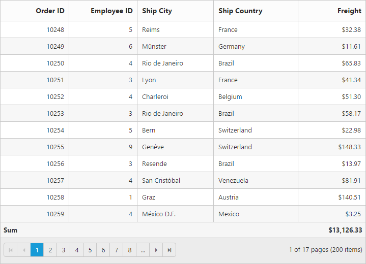

# Summary in JavaScript Grid

Summary rows visibility can be controlled by the [`showSummary`](https://help.syncfusion.com/api/js/ejgrid#members:showsummary "showSummary") property and it can be added to grid by using the [`summaryRows`](https://help.syncfusion.com/api/js/ejgrid#members:summaryrows "summaryRows") array property. The following code example describes the above behavior.





N> The [`dataMember`](https://help.syncfusion.com/api/js/ejgrid#members:summaryrows-summarycolumns-datamember "dataMember") denotes the aggregation column whereas the [`displayColumn`](https://help.syncfusion.com/api/js/ejgrid#members:summaryrows-summarycolumns-displaycolumn "displayColumn") denotes the column in which aggregation value will be displayed.

## Supported aggregates 

Following are the supported list of the [aggregates](https://help.syncfusion.com/js/datamanager/summary#) 

* Sum
* Average
* Maximum
* Minimum
* False Count
* True Count

### Sum, average, maximum and minimum

Summaries with the [`Sum`](https://help.syncfusion.com/js/datamanager/summary#sum "sum"), [`Average`](https://help.syncfusion.com/js/datamanager/summary#avg "Average"), [`Maximum`](https://help.syncfusion.com/js/datamanager/summary#max "maximum") and [`Minimum`](https://help.syncfusion.com/js/datamanager/summary#min "min") aggregate can be defined by using the [`summaryType`](https://help.syncfusion.com/api/js/ejgrid#members:summaryrows-summarycolumns-summarytype "summaryType") in [`summaryColumns`](https://help.syncfusion.com/api/js/ejgrid#members:summaryrows-summarycolumns "summaryColumns") collections. These aggregate are used in the `Number` column.





### True and False count 

Summaries with the `True` and `False` count aggregate can be defined by using the [`summaryType`](https://help.syncfusion.com/api/js/ejgrid#members:summaryrows-summarycolumns-summarytype "summaryType") and [`summaryColumns`](https://help.syncfusion.com/api/js/ejgrid#members:summaryrows-summarycolumns "summaryColumns") collections. The `True` and `False` count aggregates are used for boolean columns.





## Column footer customization by external action

We can customize the columns footer element by external action using the following methods,

1. [`getFooterTable`](https://help.syncfusion.com/api/js/ejgrid#methods:getfootertable "getFooterTable")
2. [`getFooterContent`](https://help.syncfusion.com/api/js/ejgrid#methods:getfootercontent "getFooterContent") 
3. [`getSummaryValues`](https://help.syncfusion.com/api/js/ejgrid#methods:getsummaryvalues "getSummaryValues") 

Here we have Changed the grid footer content, color and font-family to "green" and "fantasy" respectively by using the [`getFooterContent`](https://help.syncfusion.com/api/js/ejgrid#methods:getfootercontent "getFooterContent") and [`getFooterTable`](https://help.syncfusion.com/api/js/ejgrid#methods:getfootertable "getFooterTable") method and also we have displayed the summary value summary value in the alert message by using [`getSummaryValues`](https://help.syncfusion.com/api/js/ejgrid#methods:getsummaryvalues "getSummaryValues") method.

The following code example describes the above behavior.


<input id="change">




$("#change").ejButton({
    text: "Update Grid header",
    click: function(args){
         var obj = $("#Grid").ejGrid("instance");
         obj.getFooterContent().find("td.e-summaryrow").css("color","green");
         obj.getFooterTable().css("font-family","fantasy");
         var summaryCol = { summaryType: ej.Grid.SummaryType.Sum, displayColumn: "Freight", dataMember: "Freight" };// Get the calculated summary values of JSON data passed to it
         var value = obj.getSummaryValues(summaryCol, window.gridData).toFixed(2);
         alert( "summary cell with value "  +value + " has been customized with css"); 
    },
});
$(function () {
    $("#Grid").ejGrid({
                /// the datasource "window.gridData" is referred from jsondata.min.js
                dataSource: window.gridData,
                allowPaging: true,
                showSummary: true,
                pageSettings: { pageSize: 10 },
                summaryRows: [
                    { title: "Sum", summaryColumns: [{ summaryType: ej.Grid.SummaryType.Sum, displayColumn: "Freight", dataMember: "Freight", format: "{0:C2}" }] },
                             ],
                columns: [
                               { field: "OrderID", headerText: "Order ID", isPrimaryKey: true, textAlign: ej.TextAlign.Right, width: 80 },
                               { field: "EmployeeID", headerText: "Employee ID", editType: ej.Grid.EditingType.NumericEdit, textAlign: ej.TextAlign.Right, width: 80 },
                               { field: "Freight", headerText: "Freight", textAlign: ej.TextAlign.Right, width: 80, format: "{0:C}" }
                ]
            });
});


The following output is displayed as a result of the above code example.

## Custom summary

Custom summary can be used to create summary values based on your required custom logic and calculations. To enable custom summary, the [`summaryType`](https://help.syncfusion.com/api/js/ejgrid#members:summaryrows-summarycolumns-summarytype "summaryType") should be [`custom`](https://help.syncfusion.com/js/grid/summary#custom-summary-by-string "custom") and the [`customSummaryValue`](https://help.syncfusion.com/api/js/ejgrid#members:summaryrows-summarycolumns-customsummaryvalue "customSummaryValue") property need to define as function. In this property `value` function, you need to use the grid instance to access the `model.dataSource` and `model.currentViewData`. After the custom calculation, the returned value will be displayed in corresponding summary cell.





## Summary values with prefix and suffix

Summaries with prefix and suffix can be added using the [`summaryColumns.prefix`](https://help.syncfusion.com/api/js/ejgrid#members:summaryrows-summarycolumns-prefix "summaryColumns.prefix") and summaryColumn.suffix [`summaryColumns.suffix`](https://help.syncfusion.com/api/js/ejgrid#members:summaryrows-summarycolumns-suffix "summaryColumns.suffix").





## Title for summary

Title name of any summary value can be change using the [`title`](https://help.syncfusion.com/api/js/ejgrid#members:summaryrows-title "title") property of [`summaryColumns`](https://help.syncfusion.com/api/js/ejgrid#members:summaryrows-summarycolumns "summaryColumns"). Title displaying column can be altered by using the [`titleColumn`](https://help.syncfusion.com/api/js/ejgrid#members:summaryrows-titlecolumn "titleColumn").





## Group summary

Group summary is used to summarize values of a particular column based on group and it shows at bottom of the each group. To enable the group summary for particular group, you need to define the [`showTotalSummary`](https://help.syncfusion.com/api/js/ejgrid#members:summaryrows-showtotalsummary "showTotalSummary") as false.





W> Minimum one column should be grouped to show summary details.

## Group caption summary

To show summaries in each group's caption row, the particular [summary row](https://help.syncfusion.com/api/js/ejgrid#members:summaryrows) should have the [`showTotalSummary`](https://help.syncfusion.com/api/js/ejgrid#members:summaryrows-showtotalsummary "showtotalsummary") as `false` and the [`showCaptionSummary`](https://help.syncfusion.com/api/js/ejgrid#members:summaryrows-showcaptionsummary "showCaptionSummary") as `true`.





W> Minimum one column should be grouped to show the summary details.

## Summary template

Using the [`template`](https://help.syncfusion.com/api/js/ejgrid#members:summaryrows-summarycolumns-template "template") property of `summaryColumns` you can render any type of JsRender templates or customizing the summary value.

The following code example describes the above behavior.






$(function () {
	$("#Grid").ejGrid({
    	 dataSource: ej.DataManager(window.gridData).executeLocal(new ej.Query().take(5)),
         showSummary: true,
         summaryRows: [{ 
             title: "Average",
             summaryColumns: [{ 
                 summaryType: ej.Grid.SummaryType.Average, 
                 displayColumn: "Freight", 
                 dataMember: "Freight",  
                 template: "#templateData",
                 format: "{0:C2}"
             }]
          }],
         columns: [{ field: "OrderID" },{ field: "EmployeeID" },{ field: "Freight", format: "{0:C}" }]
	});
});



The following output is displayed as a result of the above code example.

## Format

To format summary values, the [`format`](https://help.syncfusion.com/api/js/ejgrid#members:summaryrows-summarycolumns-format "format") property needs to be assigned in the [`summaryColumns`](https://help.syncfusion.com/api/js/ejgrid#members:summaryrows-summarycolumns "summaryColumns") collection object.  To know more about formatting options. Please refer to the [**globalize.js**](https://github.com/jquery/globalize/tree/v0.1.1#)





