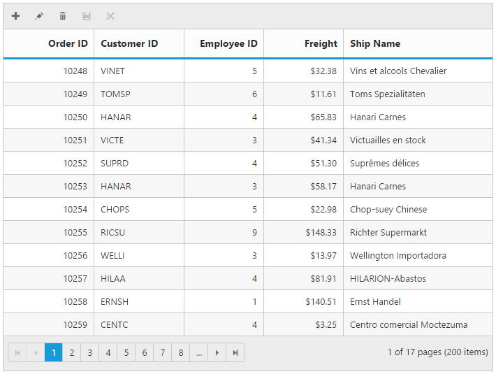
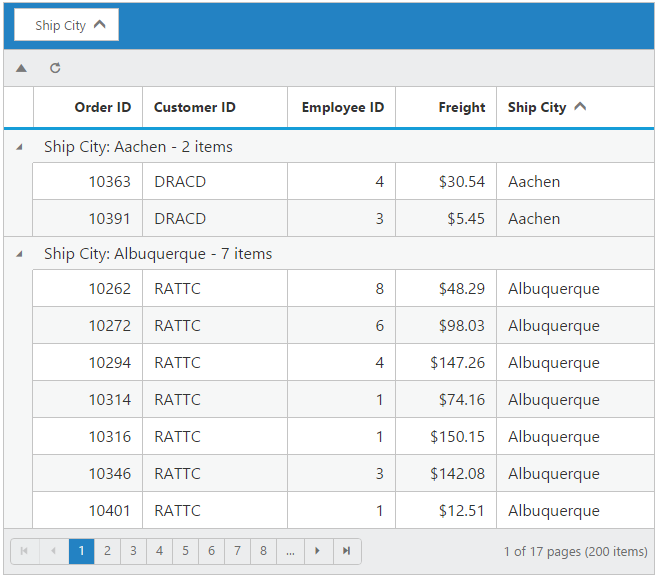

# Toolbar

Toolbar can be shown by setting the [`toolbarSettings.showToolbar`](https://help.syncfusion.com/api/js/ejgrid#members:toolbarsettings-showtoolbar "showToolbar") as true. To modify the toolbar behavior use [`toolbarSettings`](https://help.syncfusion.com/api/js/ejgrid#members:toolbarsettings "toolbarSettings") property. Toolbar has an option to add default items in the [`toolbarSettings.toolbarItems`](https://help.syncfusion.com/api/js/ejgrid#members:toolbarsettings-toolbaritems "toolbarItems") and customized items in the [`toolbarSettings.customToolbarItems`](https://help.syncfusion.com/api/js/ejgrid#members:toolbarsettings-customtoolbaritems "customToolbarItems").

## Default toolbar items

The following table shows default toolbar items and its action. 

<table>
<tr>
<th>
Default toolbar items.</th><th>
Action</th></tr>
<tr>
<td>
Add</td><td>
Add a new row.</td></tr>
<tr>
<td>
Edit</td><td>
Edit an existing.</td></tr>
<tr>
<td>
Delete</td><td>
Delete a row.</td></tr>
<tr>
<td>
Update</td><td>
Update edited or added row.</td></tr>
<tr>
<td>
Cancel</td><td>
Cancel edited or added row.</td></tr>
<tr>
<td>
Search</td><td>
Search text in records.</td></tr>
</table>





I> [`editSettings.allowAdding`](https://help.syncfusion.com/api/js/ejgrid#members:editsettings-allowadding "allowAdding"), [`editSettings.allowEditing`](https://help.syncfusion.com/api/js/ejgrid#members:editsettings-allowediting "allowEditing") and [`editSettings.allowDeleting`](https://help.syncfusion.com/api/js/ejgrid#members:editsettings-allowdeleting "allowdeleting") need to be enabled for add, delete, edit, save & cancel in [`toolbarItems`](https://help.syncfusion.com/api/js/ejgrid#members:toolbarsettings-toolbaritems "toolbaritems"). [`allowSearching`](https://help.syncfusion.com/api/js/ejgrid#members:allowsearching "allowsearching")` to be enabled while adding search in toolbar to perform search action.

## Custom toolbar items

The custom toolbar is used to create your own toolbar items in toolbar. It can be added by defining the [`toolbarSettings.customToolbarItems`](https://help.syncfusion.com/api/js/ejgrid#members:toolbarsettings-customtoolbaritems "customToolbarItems").  Actions for this customized toolbar is defined in the [`toolbarClick`](https://help.syncfusion.com/api/js/ejgrid#events:toolbarclick "toolbarclick") event.

To add custom toolbar item as template use [`templateID`](https://help.syncfusion.com/api/js/ejgrid#members:toolbarsettings-customtoolbaritems-templateid "templateID") property and also you can customize the toolbar tooltip by [`tooltip`](https://help.syncfusion.com/api/js/ejgrid#members:toolbarsettings-customtoolbaritems-tooltip "tooltip") property.





