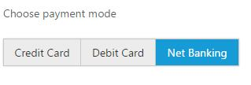
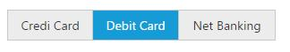

# Behavior Settings

GroupButton has some default behavior settings which helps you to perform more operation by Built-in selection.

## Different modes of button

GroupButton provides the different types of modes called check box mode, radio button mode. Setting a **groupButtonMode** property value to checkbox mode, we can perform the multiple actions in a single group. In this case, you can toggle the all the buttons state and perform the actions, since it all will behave as individual button in a group of button. 

Setting a ButtonMode to radio, we can perform the only single action with all related actions in a group of button.

** Checkbox Mode :** Here, multiple button can be selected, please check with the below use case for this mode.



        

            <ul>

                <li>

                    Daily

                </li>

                <li>

                    Weekly

                </li>

                <li>

                    Monthly

                </li>

            </ul>

        




    

            $("#groupButton").ejGroupButton({

                groupButtonMode: "checkbox",

                width: "215px"

            });

       


** Radio Button Mode:** Here, single button only can be selected, Please check with the below use case



        

            <ul>

                <li>

                    Credit Card

                </li>

                <li>

                    Debit Card

                </li>

                <li>

                    Net Banking

                </li>

            </ul>

        





        



## SelectedItemIndex

The state of the button can be changed by clicking on the button. Also the selection state of the button can be achieved by using **selectedItemIndex** API which is used to select the button items in GroupButton based on index. 

This property will accept the array values and its value will be differ based on current mode of Button. If the Button mode is “Radio”, then the selected items can have single value within the array, since we can select a single button only in this mode. Whereas for the “checkbox” mode, the selectedItemIndex can have the multiple values within an array, since multiple button can be in active state in this mode.

** Setting a selectedItemIndex for checkbox mode **



        

            <ul>

                <li>

                    Credit Card

                </li>

                <li>

                    Debit Card

                </li>

                <li>

                    Net Banking

                </li>

            </ul>

        



** Setting a selectedItemIndex for radio button mode**



        



## Select and deselect the button items using public method 

Button items in GroupButton can be selected or deselected using available public methods “**selectItem**, **deselectItem**”. These two methods will get the index of targeted button as argument. 

** Select the Button Items  **



        

            <ul>

                <li>

                    Credit Card

                </li>

                <li>

                    Debit Card

                </li>

                <li>

                    Net Banking

                </li>

            </ul>

        





        



** Deselect the Button Items **



        



**Select or deselect using id attribute ** 

You can select or deselect the button items based on id of the button items also. Please check with the below code example to know about the selection/deselection based on id attribute



        

            <ul>

                <li id="payment_option_1">

                    Credit Card

                </li>

                <li id="payment_option_2">

                    Debit Card

                </li>

                <li id="payment_option_3">

                    Net Banking

                </li>

            </ul>

        





        



