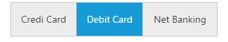
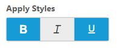
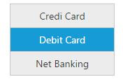
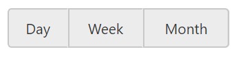
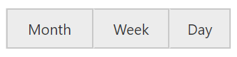

# Customization

## Size

GroupButton component size can be varied based on the Size property values. Size is the enum type API and it is has the following Built-in values

List of predefined button size

<table>
<tr>
<th>
Button Types  </th><th>
Description  </th></tr>
<tr>
<td>
Normal  </td><td>
Creates GroupButton with content size.  </td></tr>
<tr>
<td>
Mini  </td><td>
Creates GroupButton with Built-in mini size height, width specified.  </td></tr>
<tr>
<td>
Small  </td><td>
Creates GroupButton with Built-in small size height, width specified.  </td></tr>
<tr>
<td>
Medium  </td><td>
Creates GroupButton with Built-in medium size height, width specified.  </td></tr>
<tr>
<td>
Large  </td><td>
Creates GroupButton with Built-in large size height, width specified.  </td></tr>
</table>

## Set Dimension

By default GroupButton has standard height and width. You can change this height and width by using height and width property respectively. 



        



## ContentType

The content of the **Button** items in GroupButton can have a text and images. GroupButton provides the some predefined contentType options to easily customize the appearance of each button associated with GroupButton component without any complex CSS tricks. **GroupButton** items supports the following content types.

List of content types for button

<table>
<tr>
<th>
Content Types  </th><th>
Description  </th></tr>
<tr>
<td>
textOnly  </td><td>
Supports only for text content only.  </td></tr>
<tr>
<td>
imageOnly  </td><td>
Supports only for image content only  </td></tr>
<tr>
<td>
imageBoth  </td><td>
Supports image for both ends of the button.  </td></tr>
<tr>
<td>
textAndImage  </td><td>
Supports image with the text content.  </td></tr>
<tr>
<td>
imageTextImage  </td><td>
Supports image with both ends and middle in text.  </td></tr>
</table>

## Icons

GroupButton has the option to add the icons to button elements which enhance the appearance. Icons inside the button can be added easily using **prefixIcon** and **suffixIcon** fields with dataSource property. GroupButton control also supports the Built-in icon libraries. The ej.widgets.core.min.css contains definitions for important icons that can be used in buttons. You can get the details about available icons with that corresponding class from [here](https://help.syncfusion.com/js/icon/ej-icons). 

Simply you can use these Built-in icons by mentioning the icon class name as value in **prefixIcon** and **suffixIcon** property. You can use any font icons that are defined in ej.widgets.core.min.css. It avoids the complexity in specifying icon using sprite image and CSS.



        

            

            

        





        



## Orientation

GroupButton has two Built-in orientation support called vertical and horizontal orientations which defines the direction of rendered GroupButton component. You can set the value to this property as enum or string type.

 * ej.Orientation.Horizontal or “Horizontal”
 * ej.Orientation.Vertical or “Vertical”



        



## Rounded Corner

You can customize the shape of the **GroupButton** widget from regular rectangular shape to rounded rectangle shape using **showRoundedCorner** property that is set to **false** by default.

### Configure Rounded corner to GroupButton Text box

The following steps explain you to change the edges of the textbox to rounded corner.

In the **HTML** page, add a **&lt;input&gt;** element to configure **GroupButton** widget.



    

        <ul>
            <li>Day</li>
            <li>Week</li>
            <li>Month</li>
        </ul>
    





    // You can configure Rounded Corner  in GroupButton control as follows,
    $("#groupButton").ejGroupButton({
        showRoundedCorner: true
    });



The following screenshot illustrates a **GroupButton** when **showRoundedCorner** is set to “**true**”.

## RTL Support 

In some cases you need to use right-to-left alignment. You can give RTL support by using **enableRTL** property.**RTL** mode works when you use the **text** property in **GroupButton**.

The following steps explain the details about rendering the **GroupButton** with right-to-left alignment support. 
In the HTML page, add the following button elements to configure RadioButton widget.



    

        <ul>
            <li>Day</li>
            <li>Week</li>
            <li>Month</li>
        </ul>
    





    // Initializes the control in JavaScript
     $("#groupButton").ejGroupButton({
        enableRTL: true
    });



The following screenshot illustrates a **GroupButton** when **showRoundedCorner** is set to “**true**”.

## cssClass

The **cssClass** property of the groupbutton control allows an option to sets the specified class to GroupButton wrapper element, which allows for custom skinning option in ejGroupButton control.



    

        <ul>
            <li>Day</li>
            <li>Week</li>
            <li>Month</li>
        </ul>
    





    // Initializes the control in JavaScript
     cssClass:"e-btnColor"
    });



