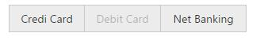

# Miscellaneous

## Show/Hide the items

Particular currently showing button items can be hidden. Also it provides the options to show the hidden button again. These functionalities can be achieved using **showItem** or **hideItem** method.

**Hide the Button item based on given index**



        



**Show the hidden Button item based on given index**



        



Also entire group button, can be hide/show using public methods hide(), show().

**Hide the entire GroupButton**



        



**Show the groupButton**



        



## Enable/Disable

Particular Items can be enabled/disabled using **enableItem**, **disableItem** methods. This takes the index of the button as the argument. 

Also entire GroupButton can be enabled or disabled using enable (), disable public method.



        



## Getting Index of given Element

By passing the jQuery element of the required button to **getIndex** public method, we can get the index of that passed button element.



        



## Getting state of given Button

You can get the selection state of required button by passing that button jQuery element to **isSelected** public method.



        



Also you can get the active / disabled state required button by passing that button jQuery element to **isDisabled** public method.



        



