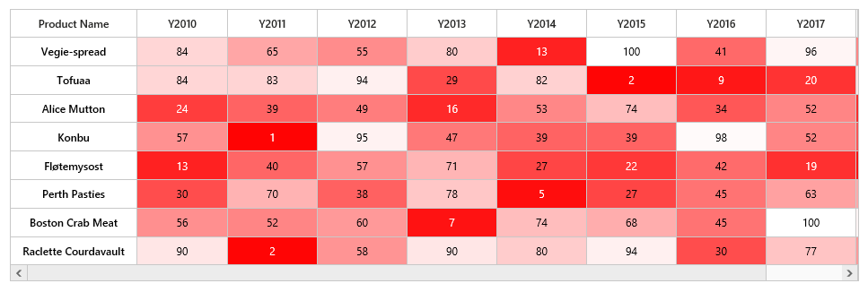

# Color Mapping

* Color mapping is used to indicate values as colors instead of numerical values. For example, if a HeatMap represents a data from 0 to 100. `ColorMapping` is used to specify a color for lower value and higher value. For any value between two values, a medium color will be automatically be chosen.

* The heatmap [colorMappingCollection](/api/js/ejheatmap#members:colormappingcollection "colorMappingCollection") [color](/api/js/ejheatmap#members:colormappingcollection-color "color") property is used to specify the color for starting range of heatmap datasource.

* The heatmap colorMappingCollection [value](/api/js/ejheatmap#members:colormappingcollection-value "value") property is used to specify the values for starting range of heatmap datasource.

In color mapping, when white color is set to value 0 and red color is set for value 30, as shown below.



var colorMappingCollection = [
    { value: 0, color: "#8ec8f8", label: { text: "0" } },
    { value: 100, color: "#0d47a1", label: { text: "100" } },
];

$("#heatmap").ejHeatMap({
    colorMappingCollection: colorMappingCollection
});



Resultant HeatMap will be as shown below.

 