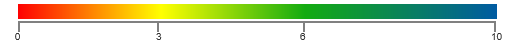

# Legend

Legend is a control used to summarize the range of colors in HeatMap. This gives visual guideline for mapping between value and color.

## Create Legend

* Legend can be created with color mapping as shown below.

* You can set size for heatmap legend using [width](/api/js/ejheatmaplegend#members:width "width") and [height](/api/js/ejheatmaplegend#members:height "height") properties.



var colorMappingCollection = [
    { value: 0, color: "#fe0002", label: { text: "Poor" } },
    { value: 3, color: "#ffff01", label: { text: "Average" } },
    { value: 6, color: "#13ab11", label: { text: "Good" } },
    { value: 10, color: "#005ba2 ", label: { text: "Excellent" } }
];

$("#heatmap_legend").ejHeatMapLegend({
    colorMappingCollection: colorMappingCollection,
    height: "50px",
    width: "75%"
});



Resultant legend will be like following image.

### colorMapping of HeatMapLegend

* The heatmap legend [colorMappingCollection](/api/js/ejheatmaplegend#members:colormappingcollection "colorMappingCollection") [color](/api/js/ejheatmaplegend#members:colormappingcollection-color "color") property is used to specify the color for starting range of heatmap datasource.

* The heatmap legend colorMappingCollection [value](/api/js/ejheatmaplegend#members:colormappingcollection-value "value") property is used to specify the values for starting range of heatmap datasource.

* You can place a text for heatmap legend using [label](/api/js/ejheatmaplegend#members:colormappingcollection-label "label") [text](/api/js/ejheatmaplegend#members:colormappingcollection-label-text "text") property and text can be customized with [bold](/api/js/ejheatmaplegend#members:colormappingcollection-label-bold "bold"), [italic](/api/js/ejheatmaplegend#members:colormappingcollection-label-italic "italic"), , [textDecoration](/api/js/ejheatmaplegend#members:colormappingcollection-label-textdecoration "textDecoration"), [fontSize](/api/js/ejheatmaplegend#members:colormappingcollection-label-fontsize "fontSize"), [fontFamily](/api/js/ejheatmaplegend#members:colormappingcollection-label-fontfamily "fontFamily") and [fontColor](/api/js/ejheatmaplegend#members:colormappingcollection-label-fontcolor "fontColor") properties.

* The heatmap legend [showLabel](/api/js/ejheatmaplegend#members:showlabel "showLabel") property is used to show/hide the label.

### Responsive

The heatmap legend control has support for the responsive behavior based on client browser’s width and height. To enable responsive, [isResponsive](/api/js/ejheatmaplegend#members:isresponsive "isResponsive") property should be set as true.
 
## Legend Mode

There are two type of [legendMode](/api/js/ejheatmaplegend#members:legendmode "legendMode").

### Gradient:

 

$("#heatmap_legend").ejHeatMapLegend({
    colorMappingCollection: colorMappingCollection,
    height: "50px",
    width: "75%",
    legendMode: ej.HeatMap.LegendMode.Gradient   
});
        


### List:

 

$("#heatmap_legend").ejHeatMapLegend({
    colorMappingCollection: colorMappingCollection,
    height: "50px",
    width: "75%",
    legendMode: ej.HeatMap.LegendMode.List   
});
        


## Orientation

There are 2 types of [orientation](/api/js/ejheatmaplegend#members:orientation "orientation") available for legend and its applicable for both Gradient and List Mode.

* Horizontal
* Vertical

### Horizontal:

 

$("#heatmap_legend").ejHeatMapLegend({
    colorMappingCollection: colorMappingCollection,
    height: "50px",
    width: "75%",
    legendMode: ej.HeatMap.LegendMode.List   
});
        


### Vertical:

 

$("#heatmap_legend").ejHeatMapLegend({
    colorMappingCollection: colorMappingCollection,
    height: "550px",
    width: "100px",
    orientation: ej.HeatMap.LegendOrientation.Vertical,
    legendMode: ej.HeatMap.LegendMode.List
});
        


