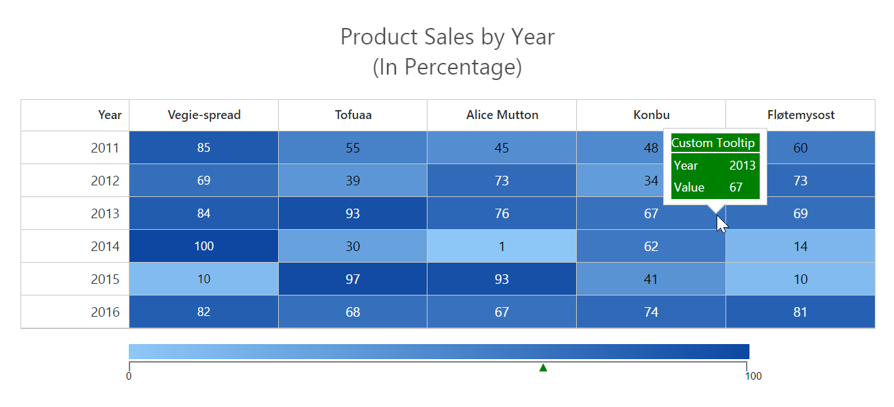

# Tooltip

* HeatMap provides support to show tooltip when mouse hovers over any rows/columns.

* To show/hide the tooltip of heatmap, use [enableTooltip](/api/js/ejheatmap#members:enabletooltip "enableTooltip") property.

* To show tooltip on mouse over, the [tooltipSettings](/api/js/ejheatmap#members:tooltipsettings "tooltipSettings") property of model needs to be set with the tooltipSettings [templateId](/api/js/ejheatmap#members:tooltipsettings-templateid "templateId") and [position](/api/js/ejheatmap#members:tooltipsettings-position "position").

* The [trigger](/api/js/ejheatmap#members:tooltipsettings-trigger "trigger") property specify the event action to showcase the tooltip. 

### Animation Effects

Determines the type of effect that takes place when showing/hiding the tooltip.

We can specify the [effect](/api/js/ejheatmap#members:tooltipsettings-animation-effect "effect") and the [speed](/api/js/ejheatmap#members:tooltipsettings-animation-speed "speed") for the animation using [animation](/api/js/ejheatmap#members:tooltipsettings-animation "animation") property.

### position

* The position object defines various attributes of the Tooltip position, including the element it is positioned in relation to, and how the position is adjusted within the defined container.

* The [associate](/api/js/ejheatmap#members:tooltipsettings-associate "associate") property is used to position the tooltip in relation with the target element.It can also be set to ‘mouse’ or the window, or an absolute x/y position on the page. 

* The [target](/api/js/ejheatmap#members:tooltipsettings-position-target "target") property is used to position the tooltip based on the associate property. You can position the tooltip at current mouse position when associate property set as `mouseenter`. It also possible to place the tooltip relation to the window when associate property set as `window` and can set target [horizontal](/api/js/ejheatmap#members:tooltipsettings-position-target-horizontal "horizontal") and [vertical](/api/js/ejheatmap#members:tooltipsettings-position-target-vertical "vertical") properties to position tooltip horizontal/vertical.

* To enable the arrow in tooltip, use [isBalloon](/api/js/ejheatmap#members:tooltipsettings-isballoon "isBalloon") property.

* To set the arrow position against popup, use [stem](/api/js/ejheatmap#members:tooltipsettings-position-stem "stem") [horizontal](/api/js/ejheatmap#members:tooltipsettings-position-stem-horizontal "horizontal") and [vertical](/api/js/ejheatmap#members:tooltipsettings-position-stem-vertical "vertical") property.

Please refer to the below code example which shows how to use tooltip in heatmap.



<!--Define tooltip template-->





$("#heatmap").ejHeatMap({
    //Defines mouse over tooltip
    toolTipSettings: {
        templateId:"mouseovertoolTipId",
        associate:"mouseFollow",
        position: {
            stem: { horizontal: "left", vertical: "top" }
            };
         }
    });
            


