<table>
<tr>
<td>

 
e-shrink
</td>
<td>

 
e-enlarge
</td>
<td>

 
e-key
</td>
<td>

 
e-list
</td>
<td>
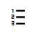
 
e-list-numbered
</td>
</tr>
<tr>
<td>
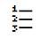
 
e-list-numbered_01
</td>
<td>

 
e-indent
</td>
<td>

 
e-indent_01
</td>
<td>

 
e-outdent
</td>
<td>

 
e-outdent_01
 
</td>
</tr>
<tr>
<td>

 
e-close
 
</td>
<td>

 
e-close_01
</td>
<td>

 
e-undo
</td>
<td>

 
e-undo_01
</td>
<td>
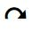
 
e-redo
</td>
</tr>
<tr>
<td>

 
e-redo_01
</td>
<td>

 
e-video
 
</td>
<td>

 
e-video_01
</td>
<td>

 
e-cross-circle
</td>
<td>

 
e-clean-brush
</td>
</tr>
<tr>
<td>
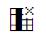
 
e-delete-column
</td>
<td>
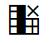
 
e-delete-column_01

</td>
<td>
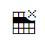
 
e-delete-row
</td>
<td>
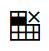
 
e-delete-row_01
</td>
<td>
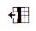
 
e-insert-column-left
</td>
</tr>
<tr>
<td>
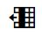
 
e-insert-column-left_01
</td>
<td>
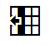
 
e-insert-column-left_02

</td>
<td>
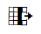
 
e-insert-column-right
</td>
<td>
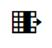
 
e-insert-column-right_01

</td>
<td>
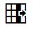
 
e-insert-column-right_02
</td>
</tr>
<tr>
<td>
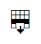
 
e-insert-row-below

</td>
<td>
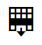
 
e-insert-row-below_01

</td>
<td>
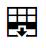
 
e-insert-row-below_02
</td>
<td>
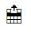
 
e-insert-row-above
</td>
<td>
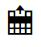
 
e-insert-row-above_01
</td>
</tr>
<tr>
<td>
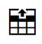
 
e-insert-row-above_02

</td>
<td>
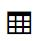
 
e-table
</td>
<td>
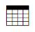
 
e-table_01
</td>
<td>
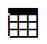
 
e-table_02
</td>
<td>
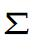
 
e-sigma
</td>
</tr>
<tr>
<td>
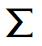
 
e-sigma_01
</td>
<td>
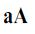
 
e-uppercase
</td>
<td>

 
e-uppercase_01
</td>
<td>

 
e-lowercase
</td>
<td>

 
e-lowercase_01
</td>
</tr>
<tr>
<td>

 
e-background-color

</td>
<td>
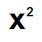
 
e-superscript
</td>
<td>
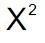
 
e-superscript_01
</td>
<td>
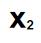
 
e-subscript
</td>
<td>
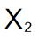
 
e-subscript_01
</td>
</tr>
<tr>
<td>

 
e-restore

</td>
<td>
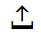
 
e-upload

</td>
<td>

 
e-download
</td>
<td>

 
e-save
</td>
<td>

 
e-save_01
</td>
</tr>
<tr>
<td>
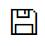
 
e-save_02
</td>

<td>

 
e-mail/e-message
</td>

<td>

 
e-arrowhead-right
</td>

<td>
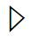
 
e-arrowhead-right_01
</td>

<td>

 
e-arrowhead-left
</td>
</tr>

<tr>
<td>
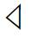
 
e-arrowhead-left_01
</td>

<td>
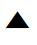
 
e-arrowhead-up
</td>

<td>

 
e-arrowhead-down
</td>

<td>

 
e-arrow-sans-right
</td>

<td>
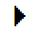
 
e-arrow-sans-right_01
</td>
</tr>

<tr>
<td>

 
e-arrow-sans-left
</td>

<td>

 
e-arrow-sans-left_01
</td>

<td>
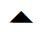
 
e-arrow-sans-up
</td>

<td>

 
e-arrow-sans-down
</td>

<td>

 
e-datetime
</td>
</tr>

<tr>
<td>

 
e-datetime_01
</td>

<td>

 
e-calendar
</td>

<td>

 
e-calendar_01
</td>

<td>

 
e-calendar-plus
</td>

<td>

 
e-calendar-edit
</td>
</tr>

<tr>
<td>

 
e-chevron-right
</td>

<td>

 
e-chevron-right_01
</td>

<td>

 
e-chevron-right_02
</td>

<td>

 
e-chevron-left
</td>

<td>

 
e-chevron-left_01
</td>
</tr>

<tr>
<td>

 
e-chevron-left_02
</td>

<td>
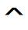
 
e-chevron-up
</td>

<td>

 
e-chevron-up_01
</td>

<td>

 
e-chevron-down
</td>

<td>

 
e-chevron-down_01
</td>
</tr>

<tr>
<td>

 
e-chevron-circle-right
</td>

<td>

 
e-chevron-circle-left
</td>

<td>

 
e-font
</td>

<td>

 
e-strikethrough
</td>

<td>

 
e-strikethrough_01
</td>
</tr>

<tr>
<td>

 
e-bold
</td>

<td>

 
e-bold_01
</td>

<td>

 
e-italic
</td>

<td>
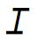
 
e-italic_01
</td>

<td>
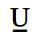
 
e-underline
</td>
</tr>

<tr>
<td>

 
e-underline_01
</td>

<td>

 
e-reply
</td>

<td>

 
e-forward
</td>

<td>

 
e-export
</td>

<td>

 
e-user
</td>
</tr>

<tr>
<td>

 
e-clipboard
</td>

<td>

 
e-home
</td>

<td>

 
e-clear
</td>

<td>

 
e-resize-handle
</td>

<td>

 
e-link
</td>
</tr>

<tr>
<td>

 
e-link_01
</td>

<td>

 
e-unlink
</td>

<td>
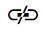
 
e-unlink_01
</td>

<td>

 
e-external-link
</td>

<td>

 
e-external-link_01
</td>
</tr>

<tr>
<td>

 
e-clock
</td>

<td>

 
e-settings
</td>

<td>
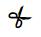
 
e-cut
</td>

<td>
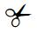
 
e-cut_01
</td>

<td>

 
e-copy
</td>
</tr>

<tr>
<td>

 
e-copy_01
</td>

<td>

 
e-copy_02
</td>

<td>

 
e-paste
</td>

<td>

 
e-paste_01
</td>

<td>

 
e-star
</td>
</tr>

<tr>
<td>

 
e-pointer
</td>

<td>

 
e-sortdirect
</td>

<td>

 
e-shoppingcart
</td>

<td>

 
e-shoppingcart_01
</td>

<td>

 
e-cursor
</td>
</tr>

<tr>
<td>

 
e-warning
</td>

<td>

 
e-zoom-out
</td>

<td>

 
e-zoom-out_01
</td>

<td>

 
e-zoom-out_02
</td>

<td>

 
e-zoom-in
</td>
</tr>

<tr>
<td>

 
e-zoom-in_01
</td>

<td>
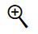
 
e-zoom-in_02
</td>

<td>

 
e-arrow-circle-left
</td>

<td>

 
e-arrow-circle-left_01
</td>

<td>

 
e-arrow-circle-left_02
</td>
</tr>

<tr>
<td>

 
e-arrow-circle-right
</td>

<td>

 
e-arrow-circle-right_01
</td>

<td>

 
e-arrow-circle-right_02
</td>

<td>

 
e-arrow-circle-up
</td>

<td>

 
e-arrow-circle-down
</td>
</tr>

<tr>
<td>

 
e-edit
</td>

<td>

 
e-edit_01
</td>

<td>

 
e-edit_02
</td>

<td>

 
e-edit_03
</td>

<td>

 
e-edit_04
</td>
</tr>

<tr>
<td>

 
e-edit_05
</td>

<td>

 
e-notification
</td>

<td>

 
e-notification_01
</td>

<td>

 
e-info
</td>

<td>

 
e-smiley
</td>
</tr>

<tr>
<td>

 
e-checkmark
</td>

<td>

 
e-checkmark_01
</td>

<td>

 
e-media-play
</td>

<td>

 
e-media-pause
</td>

<td>

 
e-media-eject
</td>
</tr>

<tr>
<td>

 
e-media-next
</td>

<td>

 
e-media-previous
</td>

<td>

 
e-media-forward
</td>

<td>

 
e-media-forward_01
</td>

<td>
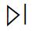
 
e-media-forward_02
</td>
</tr>

<tr>
<td>

 
e-media-forward_03
</td>

<td>

 
e-media-forward_04
</td>

<td>

 
e-media-backward
</td>

<td>

 
e-media-backward_01
</td>

<td>
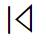
 
e-media-backward_02
</td>
</tr>

<tr>
<td>

 
e-media-backward_03
</td>

<td>

 
e-media-backward_04
</td>

<td>

 
e-play-circle
</td>

<td>
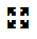
 
e-full-screen-expand
</td>

<td>

 
e-full-screen-expand_01
</td>
</tr>

<tr>
<td>
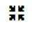
 
e-fullscreen-collapse
</td>

<td>

 
e-fullscreen-collapse_01
</td>

<td>

 
e-bullets
</td>

<td>

 
e-bullets_01
</td>

<td>

 
e-filter
</td>
</tr>

<tr>
<td>

 
e-filter_01
</td>

<td>

 
e-filternone
</td>

<td>

 
e-filternone_01
</td>

<td>

 
e-filter-settings
</td>

<td>

 
e-align-right
</td>
</tr>

<tr>
<td>

 
e-align-right_01
</td>

<td>

 
e-align-left
</td>

<td>

 
e-align-left_01
</td>

<td>

 
e-align-justify
</td>

<td>

 
e-align-justify_01
</td>

</tr>

<tr>
<td>

 
e-align-center
</td>

<td>

 
e-align-center_01
</td>

<td>

 
e-align-none
</td>

<td>

 
e-search
</td>

<td>
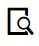
 
e-search_01
</td>
</tr>

<tr>
<td>

 
e-image
</td>

<td>

 
e-image_01
</td>

<td>

 
e-plus
</td>

<td>

 
e-plus_02
</td>

<td>

 
e-minus
</td>
</tr>

<tr>
<td>

 
e-minus_01
</td>

<td>

 
e-code
</td>

<td>
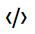
 
e-code_01
</td>

<td>

 
e-code-hexagon
</td>

<td>

 
e-file-code
</td>
</tr>

<tr>
<td>

 
e-file-html
</td>

<td>
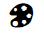
 
e-palette
</td>

<td>

 
e-reload
</td>

<td>

 
e-delete
</td>

<td>

 
e-delete_01
</td>
</tr>

<tr>
<td>

 
e-delete_02
</td>

<td>

 
e-delete_03
</td>

<td>

 
e-delete_04
</td>

<td>

 
e-delete_05
</td>

<td>

 
e-pin
</td>
</tr>

<tr>
<td>

 
e-unpin
</td>

<td>

 
e-stop
</td>

<td>

 
e-power-cord
</td>

<td>

 
e-fullborders
</td>

<td>

 
e-3d
</td>
</tr>

<tr>
<td>

 
e-file-excel
</td>

<td>

 
e-file-text
</td>

<td>

 
e-file-text_01
</td>

<td>

 
e-file-mdx
</td>

<td>

 
e-file-empty
</td>
</tr>

<tr>
<td>

 
e-file-list
</td>

<td>

 
e-file-delete_01
</td>

<td>

 
e-file-settings
</td>

<td>

 
e-circle-square
</td>

<td>

 
e-diagonal-square
</td>
</tr>

<tr>
<td>

 
e-hexagon-square
</td>

<td>

 
e-pentagon-square
</td>

<td>

 
e-globe
</td>

<td>

 
e-globe_01
</td>

<td>

 
e-vertical-barchart
</td>
</tr>

<tr>
<td>

 
e-vertical-barchart_01
</td>

<td>

 
e-horizontal-barchart
</td>

<td>

 
e-horizontal-barchart_01
</td>

<td>

 
e-pie-chart
</td>

<td>

 
e-triangle
</td>
</tr>

<tr>
<td>

 
e-inverted-triangle
</td>

<td>

 
e-pyramid
</td>

<td>

 
e-inverted-pyramid
</td>

<td>

 
e-comments
</td>

<td>

 
e-folder
</td>
</tr>

<tr>
<td>

 
e-folder_01
</td>

<td>

 
e-folder-open
</td>

<td>

 
e-folder-open_01
</td>

<td>

 
e-folder-add
</td>

<td>

 
e-signal
</td>
</tr>

<tr>
<td>

 
e-sort-alpha-desc
</td>

<td>

 
e-sort-alpha-desc_01
</td>

<td>

 
e-sort-alpha-asc
</td>

<td>

 
e-sort-alpha-asc_01
</td>

<td>

 
e-print
</td>
</tr>

<tr>
<td>

 
e-print_01
</td>

<td>

 
e-print_02
</td>

<td>

 
e-print_03
</td>

<td>

 
e-word
</td>

<td>

 
e-word_01
</td>
</tr>

<tr>
<td>

 
e-word-export
</td>

<td>

 
e-pdf
</td>

<td>

 
e-pdf_01
</td>

<td>

 
e-pdf-export
</td>

<td>

 
e-excel
</td>
</tr>

<tr>
<td>

 
e-excel_01
</td>

<td>

 
e-excel-export
</td>

<td>

 
e-powerpoint-export
</td>

<td>

 
e-ie
</td>

<td>

 
e-exit
</td>
</tr>

<tr>
<td>

 
e-document
</td>

<td>

 
e-documents
</td>

<td>

 
e-question
</td>

<td>

 
e-film
</td>

<td>

 
e-volume-up
</td>
</tr>

<tr>
<td>

 
e-circle-one
</td>

<td>

 
e-circle-two
</td>

<td>

 
e-circle-three
</td>

<td>

 
e-circle-four
</td>

<td>

 
e-arrow-right
</td>
</tr>

<tr>
<td>

 
e-arrow-left
</td>

<td>

 
e-arrow-left_01
</td>

<td>

 
e-arrow-up
</td>

<td>

 
e-arrow-down
</td>

<td>

 
e-arrow-down_01
</td>
</tr>

<tr>
<td>

 
e-sync
</td>

<td>

 
e-sync-disabled
</td>

<td>

 
e-paperclip
</td>

<td>

 
e-paperclip_01
</td>

<td>

 
e-circle
</td>
</tr>

<tr>
<td>

 
e-circle_01
</td>

<td>

 
e-th-list
</td>

<td>

 
e-th-large
</td>

<td>

 
e-th
</td>

<td>

 
e-th-small
</td>
</tr>

<tr>
<td>

 
e-view-details
</td>

<td>

 
e-file-resize-four-direction
</td>

<td>

 
e-file-resize-horizontal
</td>

<td>

</td>
<td>

</td>
</tr>
</table>
