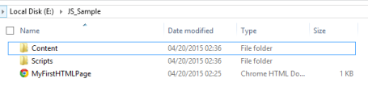
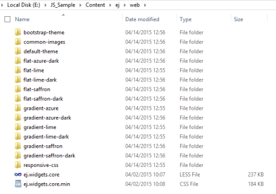
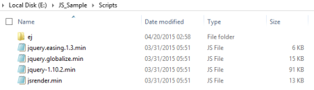
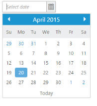
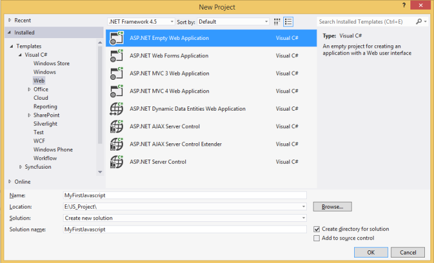
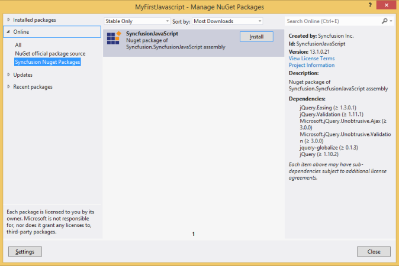
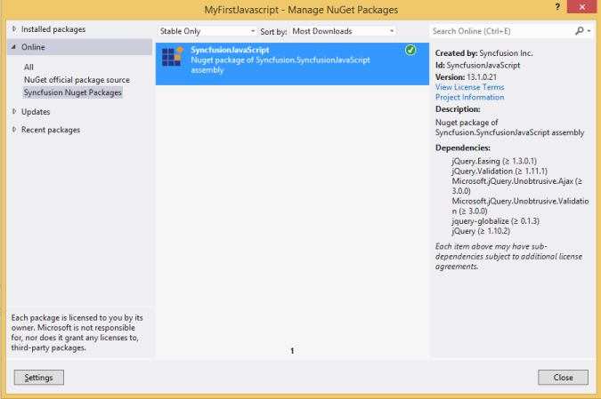
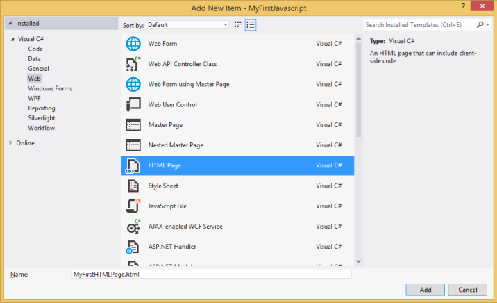

## Control Initialization

The Syncfusion controls can be initialized by using either of the following ways,

* Manual reference of Scripts and Stylesheets in a HTML page.

* Using Syncfusion Nuget Package in Visual Studio for Scripts and Stylesheet reference.

* Using CDN link for Script and Stylesheet reference.

### Manual reference of Scripts and Stylesheets in a HTML page

While using the manual reference method, the user needs to maintain their HTML page (where we usually place our control definition code) and also the required scripts & stylesheets in a common folder structure.

#### HTML file creation

* Create a basic HTML file as shown below and place it in a separate folder in any of your System location.



<!DOCTYPE html>
  <html xmlns="http://www.w3.org/1999/xhtml">
       <head>
          <title>My first HTML page</title>
       </head>
       <body>    
       </body>
  </html>



* For example, if you have created a folder named **JS_Sample** and placed the above HTML file into it, then create two new folders **Scripts** and **Content** under that root folder **JS_Sample** to maintain the scripts and stylesheets respectively as shown below,

{:.image }

    Sample folder containing the Scripts & Content folder
{:.caption }

#### Adding the required Stylesheets into Content folder

Navigating to the below specified location, you can find all the required web related theme folders – which you need to copy entirely to the **Content** folder of your application – so as to render the Syncfusion controls properly with its unique style and theme,

<table>
<tr>
<td>
<b>(installed location)</b>\Syncfusion\Essential Studio\13.1.0.21\JavaScript\assets\css\web
</td>
</tr>
<tr>
<td>
<b>For example,</b> If you have installed the Essential Studio package within <b>C:\Program Files (x86)</b>, then navigate to the below location,
 
<b>C:\Program Files (x86)</b>\Syncfusion\Essential Studio\13.1.0.21\JavaScript\assets\css\web
</td>
</tr>
</table>

Create a first level sub-folder named **ej** within the **Content** folder. Now again create another sub-folder namely **web** within the **ej** folder and place all the copied files into it as shown below,

{:.image }

    Stylesheet files copied into the Content folder of the Sample Project
{:.caption }

> _**Note: The common-images folder is needed to be copied into your application mandatorily, as it includes all the common font icons and other images required for the control to render.**_

Now, Include the specific theme reference to your HTML file by referring the appropriate **ej.web.all.min.css** file from a particular theme folder (here, we have referred the **default-theme**), within the head section as shown below,



<!DOCTYPE html>
<html xmlns="http://www.w3.org/1999/xhtml">
    <head>
        <title>My first HTML page</title>

        <link href="Content/ej/web/default-theme/ej.web.all.min.css" rel="stylesheet" />

    </head>

    <body>    
    </body>

</html>



> _**Note: In the above highlighted location of the code, you can simply use any of the 13 available themes.**_

#### Adding the required JavaScript files

Adding and referring the required JavaScript files into your HTML file plays an important role, without which the Syncfusion controls cannot be created. It requires the following mandatory common script files,

* jquery-1.10.2.min.js 

* jquery.easing.1.3.min.js

* jquery.globalize.min.js

* jsrender.min.js

Navigating to the below specified location, you can find the above specified 4 dependency external script files which you need to copy and paste it into the **Scripts** folder of your application,

<table>
<tr>
<td>
<b>(installed location)</b>\ Syncfusion\Essential Studio\13.1.0.21\JavaScript\assets\external 
</td>
</tr>
<tr>
<td>
<b>For example,</b> If you have installed the Essential Studio package within <b>C:\Program Files (x86)</b>, then navigate to the below location,
 
<b>C:\Program Files (x86)</b>\Syncfusion\Essential Studio\13.1.0.21\JavaScript\assets\external
</td>
</tr>
</table>

Apart from the above common scripts, it is also necessary to refer the **ej.web.all.min.js** file, which contains all the JavaScript components script in a minified format.

Navigate to the below specified location and copy the **ej.web.all.min.js** file, which needs to be then pasted onto the **ej** sub-folder (create a new sub-folder **ej** under **Scripts** folder) within the **Scripts** folder.

<table>
<tr>
<td>
<b>(installed location)</b>\ Syncfusion\Essential Studio\13.1.0.21\JavaScript\assets\scripts\web
</td>
</tr>
<tr>
<td>
     
<b>For example,</b> If you have installed the Essential Studio package within <b>C:\Program Files (x86)</b>, then navigate to the below location,
 
<b>C:\Program Files (x86)</b>\Syncfusion\Essential Studio\13.1.0.21\JavaScript\assets\scripts\web
</td>
</tr>
</table>

{:.image }

    Script files copied into the Sample Project
{:.caption }

Now, include the reference to it in your HTML page within the head section as shown below,



<!DOCTYPE html>
<html xmlns="http://www.w3.org/1999/xhtml">
  <head>
    <title>My first HTML page</title>
    <link href="Content/ej/web/default-theme/ej.web.all.min.css" rel="stylesheet" />
    
    
    
    
    
  </head>
  <body>    
  </body>
</html>



> _**Note: The order of the reference to the script files made in the above section should be maintained in the same manner as mentioned above.**_

#### Adding Syncfusion Widget into your HTML page

To add any of our Syncfusion JavaScript widgets into your HTML page, 

* Add the **&lt;input&gt;** element within the **&lt;body&gt;** section, which acts as a container for **ejDatePicker** widget to render and then initialize the **ejDatePicker** widget within the script section as shown below,



<!DOCTYPE html>
<html xmlns="http://www.w3.org/1999/xhtml">
    <head>
        <title>My first HTML page</title>
        <link href="Content/ej/web/default-theme/ej.web.all.min.css" rel="stylesheet" />
        
        
        
        
        
    </head>
    <body>     
        <!--Container for ejDatePicker widget-->
        <input id="startDate" type="text" /> 

        
    </body>
</html>



* Open your HTML page in any of the web browser and the screen will display the DatePicker widget as shown below,

{:.image }

    DatePicker widget displayed on the web browser
{:.caption }

### Using Syncfusion Nuget Package in Visual Studio for Scripts and Stylesheet reference

Using the Nuget Package method in Visual Studio automates the process of copying the required Script files and Stylesheets directly into your application.

Start the Visual Studio. Create a new ASP.NET Empty Web Application or ASP.NET Empty Website from **File** -> **New** -> **Project/Website** and save it with a meaningful name****as below (we have used the ASP.NET Empty Web application here),

{:.image }

    Visual Studio -> New Project Window
{:.caption }

#### Configuring and Installing Nuget into your project

To add the required scripts and css files automatically into your Project (Configure the **Syncfusion Nuget Package for JavaScript** in Visual Studio initially, before proceeding with the following installation procedure).

* Right click on your project in the Solution explorer and select **Manage Nuget Packages** options from the sub-menu that pop-up on the screen. In the **Manage Nuget Packages** dialog, select the **Syncfusion Nuget Packages** within the **Online** tab, which will display the list of available packages in it, as shown below.

{:.image }

    Manage Nuget Packages pop-up
{:.caption }

* You need to install the **SyncfusionJavaScript** package shown in the above image just by clicking the **install** button. The below image depicts that the Nuget Packages for **JavaScript** has been successfully installed into your project.

{:.image }

    Manage Nuget Packages pop-up
{:.caption }

#### Adding HTML page in your application

Right click on your Project in Solution Explorer. Select **Add** -> **New Item** -> **HTML Page** and add it to your application. The blank HTML page will get added to your application.

{:.image }

    Add New Item pop-up
{:.caption }

#### Adding reference to the required Stylesheets

Since the stylesheets are automatically loaded into the **Content** folder of your application, include the specific theme reference to the newly created HTML file by referring the appropriate **ej.web.all.min.css** file from a particular theme folder (here, we have referred the **default-theme** and you can use whatever theme you need in the below highlighted code), within the head section as shown below,



<!DOCTYPE html>
<html xmlns="http://www.w3.org/1999/xhtml">
    <head>
        <title>My first HTML page</title>
        <link href="Content/ej/web/default-theme/ej.web.all.min.css" rel="stylesheet" />
    </head>
    <body>    
    </body>
</html>



#### Adding reference to the required JavaScript files

It is mandatory to include the reference to the required JavaScript files in your HTML page, so as to render the Syncfusion controls properly as shown below,



    <!DOCTYPE html>
<html xmlns="http://www.w3.org/1999/xhtml">
<head>
    <title>My first HTML page</title>
    <link href="Content/ej/web/default-theme/ej.web.all.min.css" rel="stylesheet" />
    
    
    
    
    
</head>
<body>    
</body>
</html>



> _**Note: The order of the reference to the script files made in the above section should be maintained in the same manner as mentioned above.**_

#### Adding Syncfusion Widget into your HTML page

Finally, to add the Syncfusion datepicker widget into the HTML page, refer the same steps mentioned here in the manual method. 

### Using CDN link for Script and Stylesheet reference 

With this method, you can skip the process of copying and pasting the required Script and StyleSheets into your application and can directly provide the cdn link references for it.

#### HTML file creation

* Create a basic HTML file and directly refer all the required cdn links for the Script and Stylesheets within the &lt;head&gt; section as shown below, - For other cdn links, refer the CDN section in the introduction part.

* Here, we have referred the cdn link of **default-theme**. Likewise, any of the 13 available themes can be referred in the below highlighted code, as per the user needs.



<!DOCTYPE html>
<html xmlns="http://www.w3.org/1999/xhtml">
    <head>
        <title>My first HTML page</title>
        <link href="http://cdn.syncfusion.com/13.1.0.21/js/web/default-theme/ej.web.all.min.css" rel="stylesheet" />
        
        
        
        
         
    </head>
    <body>    
    </body>
</html>



#### Adding Syncfusion Widget into your HTML page

Add the **&lt;input&gt;** element within the **&lt;body&gt;** section, which acts as a container for **ejDatePicker** widget to render and then initialize the **ejDatePicker** widget within the script section as shown below,



<!DOCTYPE html>
<html xmlns="http://www.w3.org/1999/xhtml">
    <head>
        <title>My first HTML page</title>
        <link href="http://cdn.syncfusion.com/13.1.0.21/js/web/default-theme/ej.web.all.min.css" rel="stylesheet" />
        
        
        
        
         
    </head>
    <body>     
        <!--Container for ejDatePicker widget-->
        <input id="startDate" type="text" /> 

        
    </body>
</html>



Open your HTML page in any of the web browser and the screen will display the DatePicker widget as shown below,

{:.image }

    DatePicker widget displayed on the web browser
{:.caption }

The **DatePicker** control is rendered with its default appearance now. You can then use its various available properties to set its value and also make use of its available events to trigger when necessary.

